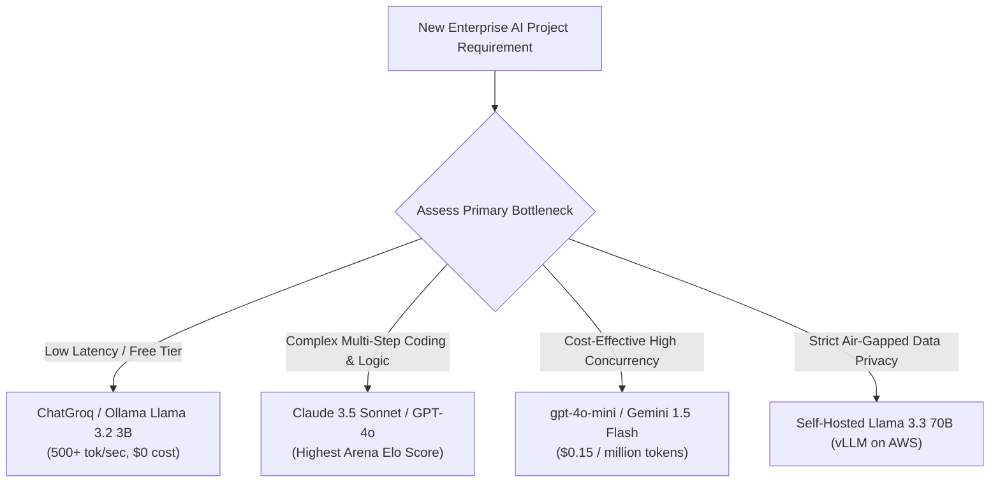

# Benchmarks & Leaderboards: MMLU, GSM8K, Chatbot Arena & Model Selection

<div className="video-card" style={{border: '1px solid #30363d', borderRadius: '8px', padding: '16px', marginBottom: '24px', background: 'rgba(56, 139, 253, 0.05)'}}>
  <div style={{display: 'flex', gap: '16px', flexWrap: 'wrap', alignItems: 'center'}}>
    <div><strong>Curators:</strong> Nitish Singh (CampusX)</div>
    <div><strong>Module:</strong> Module 6: LLM Evaluation & Observability</div>
    <div><strong>Focus:</strong> Beginner to Production</div>
  </div>
</div>

## 🎯 What You'll Learn
- Understand standard industry benchmarks: MMLU (knowledge), GSM8K (math), HumanEval (coding).
- Evaluate crowdsourced human preference leaderboards like LMSYS Chatbot Arena.
- Select the right model balancing quality, speed, context window, and price.

---

## 💡 Concept & Architecture

Every week, a new foundation model claims to be *'state of the art'*. How do AI engineers separate marketing hype from real-world performance?

### Core Academic Benchmarks:
- **MMLU (Massive Multitask Language Understanding):** Tests general knowledge across 57 academic subjects (medicine, law, history, math).
- **GSM8K (Grade School Math 8K):** Tests multi-step mathematical reasoning and logic.
- **HumanEval:** Tests Python code generation pass rates.

### The Gold Standard: LMSYS Chatbot Arena
Academic benchmarks suffer from **data contamination** (models accidentally memorizing benchmark questions during training). 
**LMSYS Chatbot Arena** uses blind, crowdsourced human A/B testing: users prompt two anonymous models side-by-side, vote on the better answer, and models are ranked using the **Elo rating system** (the same system used in chess).

### System Architecture & Data Flow



---

## 💻 Step-by-Step Code Walkthrough

Below is the complete implementation broken down into digestible parts so you can understand every line.

### Part 1: Step 1: Calculating Token Cost Projections in Python

```python
def calculate_monthly_llm_cost(
    daily_queries: int,
    avg_input_tokens: int,
    avg_output_tokens: int,
    input_cost_per_million: float,
    output_cost_per_million: float
) -> float:
    """Estimate monthly cloud LLM API expenditure."""
    daily_input_tokens = daily_queries * avg_input_tokens
    daily_output_tokens = daily_queries * avg_output_tokens
    
    monthly_input_cost = (daily_input_tokens * 30 / 1_000_000) * input_cost_per_million
    monthly_output_cost = (daily_output_tokens * 30 / 1_000_000) * output_cost_per_million
    
    return round(monthly_input_cost + monthly_output_cost, 2)

# Compare GPT-4o vs GPT-4o-mini at 100,000 queries per day
# Average RAG query: 1,200 input tokens (prompt + chunks), 200 output tokens
queries = 100_000

cost_flagship = calculate_monthly_llm_cost(
    queries, 1200, 200,
    input_cost_per_million=2.50,   # GPT-4o price
    output_cost_per_million=10.00
)

cost_mini = calculate_monthly_llm_cost(
    queries, 1200, 200,
    input_cost_per_million=0.15,   # GPT-4o-mini price
    output_cost_per_million=0.60
)

print(f"Flagship Model Monthly Cost: ${cost_flagship:,.2f}")
print(f"Mini Model Monthly Cost:     ${cost_mini:,.2f}")
print(f"Monthly Savings with Mini:   ${cost_flagship - cost_mini:,.2f} (94% cheaper!)")
```

#### 🔍 In-Depth Explanation:
Cost modeling is essential. At high scale, using lightweight models for routine tasks saves thousands of dollars per month.

---

## ⚠️ Beginner Tips & Best Practices

:::tip Use LMSYS Arena Elo as Your Primary Guide
When choosing a model, trust LMSYS Chatbot Arena rankings over self-reported vendor benchmark charts. Arena Elo reflects real-world human satisfaction.
:::

:::warning Beware of Benchmark Saturation
Many older benchmarks (like MMLU) are near 90%+ saturation. For advanced agentic reasoning, evaluate on newer hard benchmarks like GPQA or SWE-bench.
:::

---

## 📝 Key Takeaways & Summary

- Academic benchmarks (MMLU, GSM8K) measure specific foundational reasoning skills.
- LMSYS Chatbot Arena measures blind crowdsourced human preference using Elo ratings.
- Model selection requires balancing task complexity, latency, and token cost economics.

