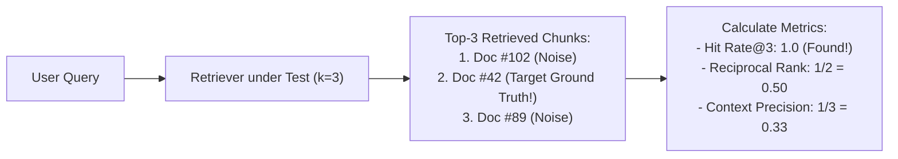

# Testing & Evaluating RAG Retrievers (Hit Rate, MRR, Context Precision)

<div className="video-card" style={{border: '1px solid #30363d', borderRadius: '8px', padding: '16px', marginBottom: '24px', background: 'rgba(56, 139, 253, 0.05)'}}>
  <div style={{display: 'flex', gap: '16px', flexWrap: 'wrap', alignItems: 'center'}}>
    <div><strong>Curators:</strong> Nitish Singh (CampusX)</div>
    <div><strong>Module:</strong> Module 6: LLM Evaluation & Observability</div>
    <div><strong>Focus:</strong> Beginner to Production</div>
  </div>
</div>

## 🎯 What You'll Learn
- Understand why retriever performance must be measured independently from the LLM generator.
- Master key information retrieval metrics: Hit Rate@K and Mean Reciprocal Rank (MRR).
- Measure Context Precision and Context Recall using Ragas concepts.

---

## 💡 Concept & Architecture

If a RAG system provides an incorrect answer, there are two possible culprits:
1. **The Retriever Failed:** The vector store fetched irrelevant chunks, so the model never saw the answer.
2. **The Generator Failed:** The retriever fetched the correct chunk, but the model hallucinated or ignored it.

To diagnose issues accurately, you **must evaluate the Retriever in isolation**!

### Core Retriever Metrics:
- **Hit Rate@K:** Does the correct document appear anywhere in the top-K retrieved results? (Binary: 1 or 0).
- **Mean Reciprocal Rank (MRR):** Where in the ranking did the correct document appear? If it was rank 1, score = 1.0. If rank 2, score = 0.5. If rank 4, score = 0.25.
- **Context Precision:** What percentage of the retrieved chunks were actually relevant to the question? (High precision = low token waste).

### System Architecture & Data Flow



---

## 💻 Step-by-Step Code Walkthrough

Below is the complete implementation broken down into digestible parts so you can understand every line.

### Part 1: Step 1: Implementing Hit Rate and MRR in Python

```python
def evaluate_retriever_ranking(test_cases: list) -> dict:
    """
    Calculate Hit Rate@K and Mean Reciprocal Rank (MRR) across a test suite.
    Each case has: 'expected_id' and 'retrieved_ids' (ordered list).
    """
    hits = 0
    reciprocal_ranks = []
    
    for case in test_cases:
        target = case["expected_id"]
        retrieved = case["retrieved_ids"]
        
        if target in retrieved:
            hits += 1
            rank = retrieved.index(target) + 1  # 1-based index
            reciprocal_ranks.append(1.0 / rank)
        else:
            reciprocal_ranks.append(0.0)
            
    hit_rate = hits / len(test_cases)
    mrr = sum(reciprocal_ranks) / len(test_cases)
    
    return {
        "total_queries": len(test_cases),
        "hit_rate": round(hit_rate, 4),
        "mean_reciprocal_rank": round(mrr, 4)
    }

# Sample test cases evaluating vector search accuracy
eval_suite = [
    {"expected_id": "doc-A", "retrieved_ids": ["doc-A", "doc-B", "doc-C"]}, # Rank 1 -> RR = 1.0
    {"expected_id": "doc-D", "retrieved_ids": ["doc-X", "doc-D", "doc-Y"]}, # Rank 2 -> RR = 0.5
    {"expected_id": "doc-Z", "retrieved_ids": ["doc-1", "doc-2", "doc-3"]}, # Miss   -> RR = 0.0
]

metrics = evaluate_retriever_ranking(eval_suite)
print("Retriever Evaluation Metrics:", metrics)
# Output: Hit Rate = 0.6667 (2/3), MRR = 0.5000 ((1.0 + 0.5 + 0) / 3)
```

#### 🔍 In-Depth Explanation:
These two foundational information retrieval metrics allow you to benchmark chunking strategies, embedding models, and top-K settings quantitatively.

---

## ⚠️ Beginner Tips & Best Practices

:::tip Aim for MRR > 0.70
In enterprise RAG systems, target an MRR of at least 0.70. This ensures the target document is almost always ranked in position 1 or 2.
:::

:::warning High K Decreases Context Precision
Increasing `k=10` improves Hit Rate, but drastically reduces Context Precision. More irrelevant chunks dilute the context and increase generation latency.
:::

---

## 📝 Key Takeaways & Summary

- Retriever testing must be decoupled from LLM generator testing.
- Hit Rate@K measures retrieval success; MRR measures ranking quality.
- Optimizing retriever performance directly cures 90% of RAG failure modes.

