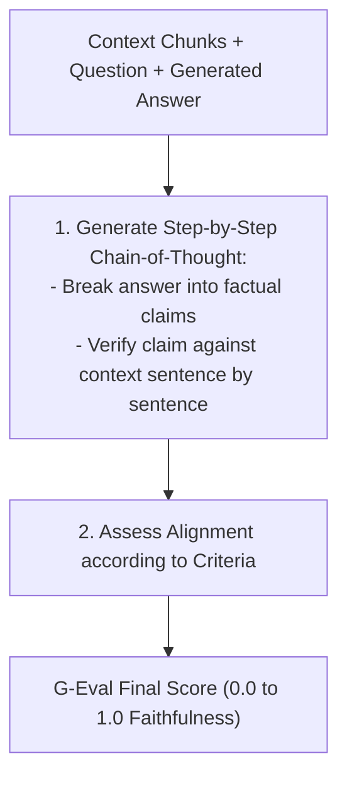

# Evaluating RAG Generators & Mastering G-Eval

<div className="video-card" style={{border: '1px solid #30363d', borderRadius: '8px', padding: '16px', marginBottom: '24px', background: 'rgba(56, 139, 253, 0.05)'}}>
  <div style={{display: 'flex', gap: '16px', flexWrap: 'wrap', alignItems: 'center'}}>
    <div><strong>Curators:</strong> Nitish Singh (CampusX)</div>
    <div><strong>Module:</strong> Module 6: LLM Evaluation & Observability</div>
    <div><strong>Focus:</strong> Beginner to Production</div>
  </div>
</div>

## 🎯 What You'll Learn
- Measure Generator performance using Answer Faithfulness (groundedness) and Answer Relevance.
- Understand the G-Eval framework: step-by-step reasoning (Chain-of-Thought) followed by probability-weighted scoring.
- Implement an automated G-Eval faithfulness evaluator.

---

## 💡 Concept & Architecture

Once you have verified that the retriever fetches the right documents, how do you evaluate the **Generator**?

The two primary generator metrics:
1. **Faithfulness (Groundedness):** Is every factual claim in the answer backed by the retrieved context? (Prevents hallucinations).
2. **Answer Relevance:** Does the answer directly address what the user asked, without extraneous tangents?

### What is G-Eval?
Developed by Microsoft and researchers, **G-Eval** is a state-of-the-art evaluation framework using LLMs:
- Instead of asking the model for a single score, G-Eval first generates a **step-by-step Chain-of-Thought critique**.
- It inspects token log probabilities to calculate a continuous, deterministic score.
- It achieves a **0.514 Spearman correlation** with human judgments, outperforming all traditional metrics!

### System Architecture & Data Flow



---

## 💻 Step-by-Step Code Walkthrough

Below is the complete implementation broken down into digestible parts so you can understand every line.

### Part 1: Step 1: Implementing a G-Eval Faithfulness Evaluator

```python
from pydantic import BaseModel, Field
from langchain_core.prompts import ChatPromptTemplate
from langchain_openai import ChatOpenAI
from typing import List

class ClaimVerification(BaseModel):
    claim_text: str = Field(..., description="Extracted factual assertion from answer")
    supported_by_context: bool = Field(..., description="True if verified by context, False if hallucinated")
    context_citation: str = Field(..., description="Exact quote from context supporting the claim")

class GEvalFaithfulnessReport(BaseModel):
    chain_of_thought: str = Field(..., description="Step-by-step reasoning evaluating the answer")
    claims: List[ClaimVerification]
    faithfulness_score: float = Field(..., ge=0.0, le=1.0, description="Percentage of claims supported (0.0 to 1.0)")

geval_prompt = ChatPromptTemplate.from_template("""You are a strict factual auditor implementing G-Eval.
Follow this procedure:
1. Deconstruct the Candidate Answer into discrete factual claims.
2. For each claim, verify if it is directly supported by a quotation from the Context.
3. Calculate faithfulness_score = (supported claims) / (total claims).

Context:
{context}

Candidate Answer:
{answer}
""")

geval_evaluator = geval_prompt | ChatOpenAI(model="gpt-4o", temperature=0.0).with_structured_output(GEvalFaithfulnessReport)

context_sample = """
The Apollo 11 mission landed on the Moon on July 20, 1969.
Commander Neil Armstrong and lunar module pilot Buzz Aldrin were on board.
"""

candidate_answer = "Neil Armstrong and Buzz Aldrin landed on the Moon in July 1969, and Michael Collins walked with them."

report = geval_evaluator.invoke({"context": context_sample, "answer": candidate_answer})
print(f"Faithfulness Score: {report.faithfulness_score:.2f}")
print("Chain of Thought:", report.chain_of_thought)
for c in report.claims:
    print(f" - Claim: '{c.claim_text}' -> Supported: {c.supported_by_context}")
```

#### 🔍 In-Depth Explanation:
G-Eval decomposes the answer into claims and verifies each claim against the context. The unsupported claim ('Michael Collins walked with them') is caught and lowers the score.

---

## ⚠️ Beginner Tips & Best Practices

:::tip Always Require Quotes for Support
Requiring the evaluator to provide the `context_citation` quote prevents the evaluator itself from hallucinating that a claim was supported.
:::

:::warning Enforce Strict Scoring Thresholds
In production healthcare or financial applications, demand a Faithfulness score of 1.0 (100%). Any score below 1.0 indicates a hallucinated claim that should be blocked.
:::

---

## 📝 Key Takeaways & Summary

- Generator evaluation measures Faithfulness (factual grounding) and Answer Relevance.
- G-Eval uses Chain-of-Thought decomposition to achieve high correlation with human experts.
- Claim-level verification isolates exact hallucinated phrases for easy debugging.

