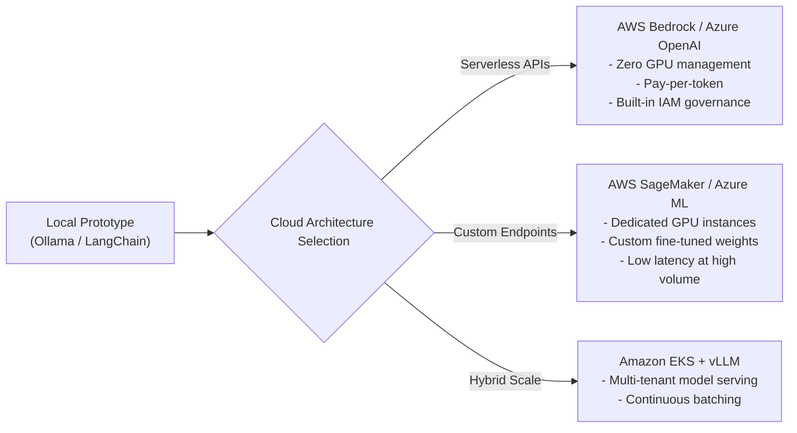

# 📹 Starting Generative AI On Cloud New Series- AWS And Azure

<div className="video-card" style={{border: '1px solid #30363d', borderRadius: '8px', padding: '16px', marginBottom: '24px', background: 'rgba(56, 139, 253, 0.05)'}}>
  <div style={{display: 'flex', gap: '16px', flexWrap: 'wrap'}}>
    <div><strong>Instructor:</strong> Krish Naik</div>
    <div><strong>Duration:</strong> 516</div>
    <div><strong>Course:</strong> Module 7: Cloud AI & LoRA Fine-Tuning</div>
    <div><strong>Watch Link:</strong> <a href="https://www.youtube.com/watch?v=2WOa4_3Bgtw" target="_blank" rel="noopener noreferrer">YouTube Lecture ↗</a></div>
  </div>
</div>

## 📌 Executive Summary

Transitioning Generative AI applications from local developer laptops to hyperscaler cloud environments (AWS, Azure, GCP) requires mastering managed foundation model APIs, serverless orchestration, secure VPC networking, and cost governance.

This roadmap covers cloud architectures for enterprise GenAI: comparing managed serverless model platforms (AWS Bedrock, Azure OpenAI) with dedicated infrastructure (SageMaker, Kubernetes vLLM clusters).

---

## 🏗️ System Architecture & Execution Flow



---

## 📖 Core Concepts & Technical Deep Dive

### 1. Serverless Model Services vs Dedicated Infrastructure
- **Serverless (AWS Bedrock, Azure OpenAI):** Best for variable traffic, fast time-to-market, and prototyping. You pay strictly for input/output tokens with zero idle instance costs.
- **Dedicated GPU Endpoints (AWS SageMaker):** Best for sustained high-throughput workloads (>50 requests/sec), custom fine-tuned LoRA adapters, or proprietary architectures. Pay an hourly rate per GPU instance (e.g. `ml.g5.2xlarge`).

### 2. Enterprise Cloud AI Pillars
1. **IAM & Role-Based Access Control:** Restricting foundation model access through IAM policies and service roles.
2. **Private VPC Endpoints (AWS PrivateLink):** Keeping inference traffic off the public internet.
3. **Data Protection & Encryption:** KMS-managed encryption keys for vector stores and document embeddings.

---

## 💻 Production Implementation

```python
import boto3
import json

# Initializing AWS Bedrock Runtime Client
bedrock = boto3.client(service_name="bedrock-runtime", region_name="us-east-1")

def invoke_claude_on_bedrock(prompt: str) -> str:
    payload = {
        "anthropic_version": "bedrock-2023-05-31",
        "max_tokens": 512,
        "messages": [
            {"role": "user", "content": prompt}
        ],
        "temperature": 0.2
    }
    
    response = bedrock.invoke_model(
        modelId="anthropic.claude-3-haiku-20240307-v1:0",
        body=json.dumps(payload),
        contentType="application/json",
        accept="application/json"
    )
    
    result = json.loads(response["body"].read())
    return result["content"][0]["text"]

print("Bedrock invocation helper initialized.")
```

---

## ⚙️ Production Gotchas & Best Practices

:::tip Use Serverless Bedrock for Initial Deployments
Avoid provisioning costly `ml.g5` or `ml.p4` instances during development. AWS Bedrock provides enterprise Claude 3.5 and Llama 3 models without paying for idle GPU hours.
:::

:::warning Enable Cost Allocation Tags
Always tag every cloud GenAI resource (`Project: GenAI-Support`, `CostCenter: 1042`). Foundation model API spend can escalate rapidly without per-team cost attribution.
:::

---

## 📊 Architectural Reference & Comparison

| Cloud Pattern | Service | Pricing Model | Operational Overhead | Best Suited For |
| :--- | :--- | :--- | :--- | :--- |
| **Serverless Foundation** | AWS Bedrock | Pay per 1M tokens | Minimal | Variable traffic, prototyping, managed LLMs |
| **Managed Endpoints** | AWS SageMaker | Hourly instance fee | Moderate | Fine-tuned weights, sustained heavy traffic |
| **Containerized Cluster** | Amazon EKS + vLLM | Compute + Node fees | High | Massive scale, multi-model shared clusters |

---

## 📚 Key Takeaways & Enterprise Checklist

- [ ] **Architecture Verification:** Ensure your design addresses latency, decoupled interfaces, and strict data validation contracts.
- [ ] **Deterministic Testing:** Run unit tests and golden dataset evaluations before shipping changes to staging or production.
- [ ] **Security & Observability:** Enforce input/output guardrails, scrub sensitive credentials/PII, and capture distributed traces.
- [ ] **Scalability & Sizing:** Calibrate model parameters, context limits, and compute instance requirements against projected request concurrency.
