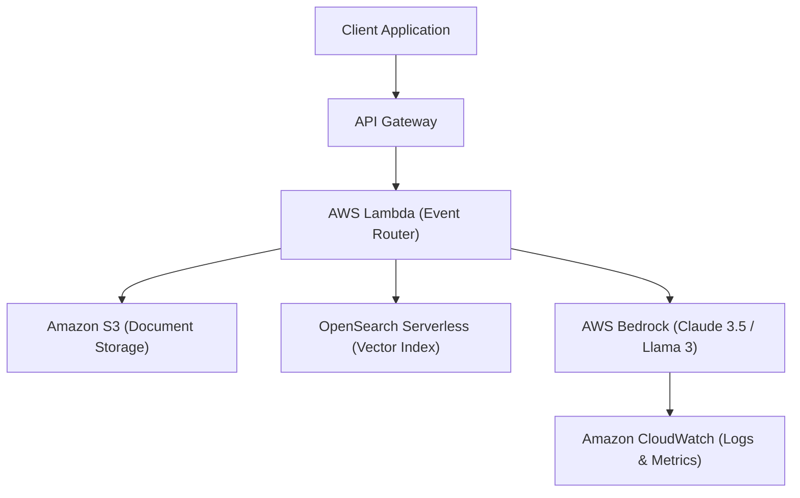

# 📹 Important Playlist To Cover For Learning Generative AI On AWS And Azure Cloud

<div className="video-card" style={{border: '1px solid #30363d', borderRadius: '8px', padding: '16px', marginBottom: '24px', background: 'rgba(56, 139, 253, 0.05)'}}>
  <div style={{display: 'flex', gap: '16px', flexWrap: 'wrap'}}>
    <div><strong>Instructor:</strong> Krish Naik</div>
    <div><strong>Duration:</strong> 520</div>
    <div><strong>Course:</strong> Module 7: Cloud AI & LoRA Fine-Tuning</div>
    <div><strong>Watch Link:</strong> <a href="https://www.youtube.com/watch?v=MbS6uMvuXyQ" target="_blank" rel="noopener noreferrer">YouTube Lecture ↗</a></div>
  </div>
</div>

## 📌 Executive Summary

Building production AI applications on AWS involves weaving together managed compute, storage, orchestration, and security services into an enterprise-grade pipeline.

This lesson surveys the core AWS Generative AI ecosystem: Bedrock (foundation models), OpenSearch Serverless (vector database), S3 (raw documents), Lambda (serverless compute), and CloudWatch (telemetry).

---

## 🏗️ System Architecture & Execution Flow



---

## 📖 Core Concepts & Technical Deep Dive

### 1. Amazon Bedrock: Unified Model Gateway
Single API accessing leading foundation models: Anthropic Claude, Meta Llama 3, Mistral Large, Amazon Titan, and Cohere Command. Features native knowledge bases, guardrails, and agentic workflows.

### 2. OpenSearch Serverless Vector Engine
Managed vector database supporting k-NN (k-nearest neighbors) vector search with HNSW and IVF algorithms. Scales compute and storage independently without manual shard rebalancing.

### 3. AWS Lambda & Event-Driven Ingestion
Process incoming PDFs dropped into Amazon S3 buckets via S3 Event Notifications: triggering text chunking, embedding generation with Titan Embeddings, and ingestion into OpenSearch.

---

## 💻 Production Implementation

```python
import boto3

# AWS Boto3 Bedrock Client Example
bedrock_client = boto3.client("bedrock", region_name="us-east-1")

# List available foundation models
def list_available_models():
    response = bedrock_client.list_foundation_models()
    return [m["modelId"] for m in response["modelSummaries"] if "TEXT" in m.get("outputModalities", [])]

print("AWS Bedrock foundation model discovery script configured.")
```

---

## ⚙️ Production Gotchas & Best Practices

:::tip OpenSearch Serverless OCU Sizing
OpenSearch Serverless charges based on OpenSearch Compute Units (OCUs). Set minimum OCU limits to 1 during development to prevent unexpected baseline compute charges.
:::

:::warning Regional Model Availability
Not all Bedrock models are available in every AWS region. Verify model availability (e.g. `us-east-1`, `us-west-2`, `eu-west-1`) before architecting your deployment.
:::

---

## 📊 Architectural Reference & Comparison

| AWS Service | Role in GenAI Stack | Serverless? | Key Alternative |
| :--- | :--- | :--- | :--- |
| **AWS Bedrock** | Foundation model inference | Yes | Azure OpenAI Service |
| **Amazon S3** | Document lake & raw training data | Yes | Google Cloud Storage |
| **OpenSearch Serverless** | Vector storage & similarity search | Yes | Pinecone, Chroma, Qdrant |
| **AWS Lambda** | Ingestion pipeline & API handling | Yes | AWS Fargate (Containers) |
| **CloudWatch** | Logging, latency, & token alerts | Yes | Datadog, Prometheus |

---

## 📚 Key Takeaways & Enterprise Checklist

- [ ] **Architecture Verification:** Ensure your design addresses latency, decoupled interfaces, and strict data validation contracts.
- [ ] **Deterministic Testing:** Run unit tests and golden dataset evaluations before shipping changes to staging or production.
- [ ] **Security & Observability:** Enforce input/output guardrails, scrub sensitive credentials/PII, and capture distributed traces.
- [ ] **Scalability & Sizing:** Calibrate model parameters, context limits, and compute instance requirements against projected request concurrency.
