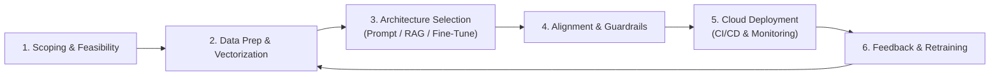

# 📹 Generative AI Project Lifecycle-GENAI On Cloud

<div className="video-card" style={{border: '1px solid #30363d', borderRadius: '8px', padding: '16px', marginBottom: '24px', background: 'rgba(56, 139, 253, 0.05)'}}>
  <div style={{display: 'flex', gap: '16px', flexWrap: 'wrap'}}>
    <div><strong>Instructor:</strong> Krish Naik</div>
    <div><strong>Duration:</strong> 657</div>
    <div><strong>Course:</strong> Module 7: Cloud AI & LoRA Fine-Tuning</div>
    <div><strong>Watch Link:</strong> <a href="https://www.youtube.com/watch?v=mnRPmB547G0" target="_blank" rel="noopener noreferrer">YouTube Lecture ↗</a></div>
  </div>
</div>

## 📌 Executive Summary

The enterprise Generative AI project lifecycle spans six systematic stages: Problem Scoping & ROI Assessment, Data Collection & Preparation, Model Selection & Prototyping, Prompt Engineering & RAG Augmentation, Fine-Tuning & Alignment, and Production Deployment with Continuous LLMOps.

This lesson establishes the lifecycle methodology required to deliver production GenAI software on schedule and within budget.

---

## 🏗️ System Architecture & Execution Flow



---

## 📖 Core Concepts & Technical Deep Dive

### 1. Stage 1: Problem Scoping
- Can this problem be solved with traditional deterministic software? (If yes, do not use LLMs).
- Define measurable business metrics: deflection rate, latency SLA, accuracy threshold, and maximum permissible cost per transaction.

### 2. Stage 2: The Decision Hierarchy (Prompt vs RAG vs Fine-Tuning)
- **Prompt Engineering:** Fast, low cost. Test feasibility first.
- **RAG:** Dynamic knowledge, factual grounding, zero weight modifications.
- **Fine-Tuning:** Teaching a model *style, domain vocabulary, or formatting*, NOT injecting facts.

### 3. Stage 3: Operational LLMOps
Once deployed, continuous monitoring tracks token costs, latency distribution, hallucination frequency, and data drift.

---

## 💻 Production Implementation

```python
def evaluate_genai_approach(needs_realtime_data: bool, needs_domain_style: bool, budget_high: bool) -> str:
    if needs_realtime_data and not needs_domain_style:
        return "RAG Architecture: Retrieve real-time data from vector database."
    elif needs_domain_style and not needs_realtime_data:
        return "Fine-Tuning (LoRA): Adapt model style and specialized terminology."
    elif needs_realtime_data and needs_domain_style:
        return "Hybrid: LoRA Fine-Tuned Model paired with RAG Retrieval Pipeline."
    else:
        return "Few-Shot Prompt Engineering with Frontier Model."

print(evaluate_genai_approach(needs_realtime_data=True, needs_domain_style=False, budget_high=False))
```

---

## ⚙️ Production Gotchas & Best Practices

:::tip Never Fine-Tune for Knowledge Retrieval
Fine-tuning models to memorize facts leads to catastrophic forgetting and ungrounded hallucinations. Always use RAG for factual knowledge retrieval and fine-tuning for behavioral alignment.
:::

:::warning Fail Fast in Stage 1
If a prompt engineering prototype cannot achieve 60% accuracy on basic domain queries, fine-tuning will rarely rescue the project. Re-evaluate task definition.
:::

---

## 📊 Architectural Reference & Comparison

| Lifecycle Stage | Primary Deliverable | Typical Duration | Major Risk |
| :--- | :--- | :--- | :--- |
| **1. Scoping** | Technical Specification & ROI Model | 1-2 weeks | Selecting an ill-suited GenAI use case |
| **2. Data Prep** | Cleaned, chunked, embedded datasets | 2-4 weeks | Poor text quality, noisy PDF extraction |
| **3. Prototyping** | Working RAG / Prompt pipeline | 1-2 weeks | Over-engineering before validation |
| **4. Alignment** | Safety guardrails & eval suite | 2 weeks | Uncaught prompt injection, jailbreaks |
| **5. Production** | Serverless cloud deployment | 1-2 weeks | Sudden API rate-limiting or latency spikes |

---

## 📚 Key Takeaways & Enterprise Checklist

- [ ] **Architecture Verification:** Ensure your design addresses latency, decoupled interfaces, and strict data validation contracts.
- [ ] **Deterministic Testing:** Run unit tests and golden dataset evaluations before shipping changes to staging or production.
- [ ] **Security & Observability:** Enforce input/output guardrails, scrub sensitive credentials/PII, and capture distributed traces.
- [ ] **Scalability & Sizing:** Calibrate model parameters, context limits, and compute instance requirements against projected request concurrency.
