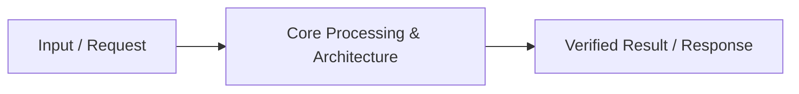

# 📹 Generative AI Project Lifecycle-GENAI On Cloud

<div className="video-card" style={{border: '1px solid #30363d', borderRadius: '8px', padding: '16px', marginBottom: '24px', background: 'rgba(56, 139, 253, 0.05)'}}>
  <div style={{display: 'flex', gap: '16px', flexWrap: 'wrap'}}>
    <div><strong>Instructor:</strong> Krish Naik (Krish Naik)</div>
    <div><strong>Duration:</strong> 10m 57s</div>
    <div><strong>Playlist:</strong> Generative AI on AWS (Krish Naik)</div>
    <div><strong>Watch Link:</strong> <a href="https://www.youtube.com/watch?v=mnRPmB547G0" target="_blank" rel="noopener noreferrer">YouTube Lecture ↗</a></div>
  </div>
</div>

## 📌 Executive Summary & Learning Objectives

This lecture covers **Generative AI Project Lifecycle-GENAI On Cloud**, focusing on production implementations, edge cases, and industry standards:
- Core intuition, architecture, and underlying mechanisms.
- Key differences between theoretical research implementations and scalable enterprise patterns.
- Concrete Python walkthroughs, error recovery, and performance optimization.

---

## 🏗️ Architecture & Conceptual Workflow



---

## 📖 Core Concepts & Technical Deep Dive

### 1. Architectural Foundations
In modern production AI engineering, **Generative AI Project Lifecycle-GENAI On Cloud** is essential for ensuring reliability, low latency, and deterministic outcomes. As AI systems evolve from naive prompt-in / completion-out scripts into distributed systems, engineers must handle:
- **State management & consistency:** Ensuring intermediate states and tool invocations are tracked.
- **Error boundaries & recovery:** Graceful degradation when external LLMs or vector stores encounter rate limits or network partitions.
- **Resource utilization & cost efficiency:** Caching common queries and reducing unnecessary foundation model token expenditure.

### 2. Operational Considerations
- **Latency Optimization:** Pre-computing embeddings, utilizing asynchronous non-blocking event loops, and streaming tokens via Server-Sent Events (SSE).
- **Security & Sandboxing:** Validating inputs before ingestion, sanitizing LLM outputs, and isolating tool execution environments.

---

## 💻 Production Implementation Walkthrough

```python
# Production Implementation Blueprint
def run_production_pipeline():
    print("Executing production pipeline...")

if __name__ == "__main__":
    run_production_pipeline()
```

---

## 💡 Production Best Practices & Tips

:::tip Production Deployment Guideline
When deploying Generative AI Project Lifecycle-GENAI On Cloud in enterprise environments, always configure automated retries with exponential backoff and telemetry tracing (such as OpenTelemetry or LangSmith).
:::

:::warning Common Failure Modes
Watch out for state contamination across concurrent requests. Ensure each session or user interaction uses an isolated thread ID or execution context.
:::

---

## 🎯 Key Takeaways & Quick Reference

| Dimension | Production Standard | Pitfall to Avoid |
| :--- | :--- | :--- |
| **Execution** | Async / Non-blocking with timeouts | Synchronous blocking calls in event loops |
| **Data Validation** | Strict Pydantic v2 schemas | Untyped dictionary access |
| **Monitoring** | Distributed tracing & latency percentiles | Relying only on standard console logs |

## ⏱️ Lecture Timeline & Key Topics

| Timestamp | Key Topic / Concept Discussed |
| :--- | :--- |
| **00:00:00** | hello all my name is Kish naak and... |
| **00:02:50** | choosing... |
| **00:05:38** | probably do for going forward okay so... |
| **00:08:22** | and deploy... |
| **00:10:56** | bye-bye... |


---

---

## 📜 Complete Lecture Transcript (English)

> **Language:** English | **Source:** `03 - The Era of 1-bit LLMs-All Large Language Models are in 1.58 Bits.en.srt` | **Total Segments:** 9 | **Word Count:** ~3,036 words

<details>
<summary><b>Click to expand full chronological transcript (9 timestamped intervals)</b></summary>

#### ⏱️ [00:00 ➔ 00:02]

hello all my name is krishak and welcome to my YouTube channel so guys uh one of the most interesting thing in the field of data science or generative AI is that the kind of research that is currently happening right every day you'll be seeing some new things that are actually happening which is very much beneficial for the entire Community who are working with llm models uh specifically today I saw this amazing research paper where it is written as era of 1 bit llm so I'll be going to talk about this particular research paper and what exactly one bit llm is and how it is far more advantageous when compared to those 32bit or 16bit llms models okay so everything I'll be discussing about one important thing that I also want to make sure that you learn from this particular video is that how do you read a research paper what are the important points that you should definitely highlight while reading a research paper and how you should definit and one thing is that you cannot directly understand just by reading it you really need to have some basic knowledge and without that particular basic knowledge it will be very diff difficult to understand so if you're following my tutorials I always make sure that whenever I make my videos right I definitely watch or see all the research papers and then with respect to that I simplify the those Concepts and try to explain it to you so let's go ahead and understand about this one bit llm now guys uh if you remember in my previous video we have already discussed about quation right so quation was covered now with respect to quantisation what we were doing is that let's say I have a model which is called as Lama 2 which is an open source model let's say this model is 7 billion having 7 billion parameters when we say 7 billion parameters I'm talking about weights okay now obviously if I have a system where I don't have very high configuration not I have resource constraint I have limited amount of Ram or gpus what we specifically do we perform quantisation and we convert this Lama 2 model which is probably in FP 32bit and we try to convert this into int 8bit okay

#### ⏱️ [00:02 ➔ 00:04]

int 8 which is nothing but 8 Bits right now when we are once we are doing this specific process what is basically happening is that the model size is getting decreased right and because of that we will be able to load it and we'll be able to perform any task along with this we can also perform fine tuning with the help of Laura and CLA right so I hope you know this Laura and CLA I've already discussed in my previous video please just go click on my uh click on my channel otherwise just go ahead and see in the description I've been providing that particular links with respect to fine tuning now with the help of LA and cl we can perform the fine tuning okay now the question is that what is this one bit llm right as I said that with the help of quantisation we will try to convert this into 32 to 16 bit or it can be 8 bit right but converting this into a one bit that can be again uh if you're trying if you now just by seeing this right if you are able to convert this into one bit that basically means we will never be having any resource constraint right resource constraint yes with limited Ram with limited GPU with limited storage we can probably perform everything from fine tuning to inferencing right so inferencing can also be performed right and this is what is so amazing about this and this is I I don't know like what is going to happen just in some days because once this is probably gone right now we just have the research paper once this implementation gets started trust me it will be quite amazing for the entire Community who are working with llm models okay so this was just a brief idea about this one now let's go ahead and discuss what is 1 bit llm okay and when we say to be precise when we say that all large language models it is basically in 1.58 bits okay why it is 1.58 we'll discuss about it and there are many points that needs to be discussed uh along with me please make sure that you watch this video till the end because I'm going to read over here because this will also give you an idea that how you should probably go ahead and read the research paper so let me quickly uh go ahead and clear this

#### ⏱️ [00:04 ➔ 00:06]

let's see whether it'll getting cleared or not okay so over here okay clear is basically happening um okay I will just rub it okay now let's go ahead and discuss about this and let's read some of the important information that is present over here okay and trust me guys read along with me then only you'll be able to understand how you can read the research paper okay now what exactly this one bit llm model is um in this work we introduce a onebit llm variant namely bit net okay so bit net is the llm model name one bit llm model name and then where every single parameter or weight of the llm is Turner right now it is not floating 62 bit or sorry 32bit or 16 bit it is Turner Turner basically means it has only three values it can have only three values weights it can be minus1 0 or 1 one okay it matches the full Precision Transformer M with the same model size and training tokens in terms of perplexity perplexity basically means so with respect to any query that I ask and endtoend task performance right while being significantly more coste effective in performance of latent memory throughput and energy consumption so obviously at the end of the day all the llm model will specifically have this kind of constraint right which are specifically with huge uh number of parameters let's say 7 billion 170 billion right right and if you're just using this three numbers Min -1 0 1 you'll be able to understand why I'm saying that because of this tary values right you'll be seeing how abundance the performance improves okay so furthermore uh so here you can probably see all this points uh Laten memory throughput and energy consump uh consumption uh energy consumption can be with respect to inferencing with respect to fine tuning and all okay now let's understand how this

#### ⏱️ [00:06 ➔ 00:08]

operators how this values will be basically used okay this is also important so with respect to this what I am actually going to do I am going to make sure that to explain you I take the right thing okay so let's understand this okay understand guys whenever we talk about parameters these are my weights okay these are my weights let's see so these are my weights okay and these are my weights so let's consider that my initial Transformer llm weights is this one okay now by when we say 1 bit llm we are going to convert all these values and replace them with either of these three values minus one 0 comma 1 okay so that is the reason that you see over here all these weights is being getting converted into something like this okay minus1 0 or 1 only that three parameters is is there okay and this is what we basically say as bitnet B 1.58 okay and this is also called as parito Improvement how this is basically happening I will talk about it okay just give me some time there will be some kind of quantization getting applied here also okay quantization getting applied over here okay to convert these values to this okay now let's understand one very important thing okay and this is the most important thing what will happen if you convert this values to this see with respect to any fine-tuning or forward propagation backward propagation what exactly happens the model weights the model weights over here is basically getting multiplied by the inputs and then we get the output right yes additionally we add a bias so it's okay we don't include a bias right now over here just to show it to you so over here this let's consider that this is my floating Point 16 number so every number will get multiplied by the input

#### ⏱️ [00:08 ➔ 00:10]

right and then what will happen is that after that all the it's it's just like this right summation of I equal to 1 to n w of x + B right so this is what is the operation that is basically happening whenever we do the forward propagation Whenever there is an updation of weight that basically means we are doing the summation of weights and the input right so once we are doing this and then we are doing the sumission okay but if we have all these weights in the form of -1 1 0 then what will happen is that over here you'll be seeing that multiplication operation will not be you know that much valuable right so over here first of all we are doing multiplication then addition but over here we are just doing addition no multiplication because any number it will be multiplied by 0 is z only any number that is multiplied by one is one only any number that is multiplied by minus1 is minus1 only so over here the main thing is that your add addition operation is only happening addition operation is only Happening Now obviously if you only need to do addition operation then what will happen your GPU will not be requiring that much GPU also so your GPU will also get reduced why why this operation takes more GPU because multiple multiplication needs to happen right with respect to different different weights right then addition of all those values needs to happen because in the forward propagation this is what is the equation that specifically happens right we multiply the weights with the inputs and then we do the sumission and then finally we add the bias right so this is the most important thing so here you'll be able to understand with floating 16 right all the numbers is first of all multiplied by the inputs and then the sumission is done but here your values are with respect to Turner that is min -1 0 1 so here multiplication is already skipped because 1 into x0 is x0 only right it is a simple multiplication right and that much resources will not be required for simplistic multiplication so here

#### ⏱️ [00:10 ➔ 00:12]

maximum to maximum only addition will be required right so I hope you're able to understand because of this technique of Paro Improvement because of this technique of Paro Improvement you'll be able to see that what we are able to achieve right and obviously when we are able to achieve this the GPU will be required less when we are doing the fine-tuning or training right so I hope you have got this as an complete idea and you have understood right why we specifically do this how it is done how this transformation is done so here you can probably see that it provides a Paro solutions to reduce inferencing cost latency throughput and energy of llm while maintaining the model performance the new computation Paradigm of Paradigm of bitnet 1.58 calls for Action to design new hardware optimization for 1bit llm right I know guys this is more of a research paper so I'm reading and I'm telling you each and everything and also explaining you the concept I know this can be a little bit of boring but trust me you need to understand in this specific way okay now let's talk more about this and we will have highlighted main main things in this green color okay these models have demonstrated remarkable performance in a wide range of natural language processing tasks like llm models but their increasing size has posed challenges for deployment and raised concern about the environmental and economic impact due to high energy consumption obviously this is the problem with llms that are already available one approach to address the challenges to use post trining quantization to create low bit models for inferencing I've already discussed about this quantization Laura clora everything this technique reduces the Precision of weights and activation significantly reducing the memory and computational requirement of llm the trend has been to move from 16 bit to lower bit such as 4bit variant this is what is basically happening with respect

#### ⏱️ [00:12 ➔ 00:14]

to llm models right this is with llm okay this is with llm so here I'll write llm models now let's see with the help of one bit architecture one bit model architecture what we can solve so recent work on one bit model architecture such as bitnet presents a promising direction from reducing the cost of llm while maintaining the performance vanina llms vanila llms are in 16bit flow flating values and the bulk of L LM is matrix multiplication therefore the major computation cost comes from floating Point addition and multiplication operation I said you just now on top of it right in contract the matrix multiplication of bit net only involves integer addition because anything multiplied by one is one uh anything multiplied by one is that same number anything multiplied by minus one is that same number with a negative sign anything multiplied by 0 is obviously zero right so as the fun FAL limit to compute performance in many chips is power this energy saving can be translated into faster computation now this is the most important thing right and here you can clearly see the things that I've highlighted right I hope you get an idea how good this one bit llm can be okay then you can still read about it here we are going to just use terally values like Min -1 0 1 and obviously because of this zero your 58 bit is basically increasing there are two major advantages of using this also it is written over here see further more bitnet oh my God why this is getting highlighted like okay furthermore bitnet offers two additional Advantage first its modeling capacity is stronger due to explicit support for feature filtering how feature filtering happen because anything multiplied by Zer will be zero onina right made possible by the inclusion of zero in the model weight which can significantly improve the performance of 1 bit llm

#### ⏱️ [00:14 ➔ 00:16]

secondly our experiment shows can match full Precision Baseline in terms of this end to end task performance starting from a 3B size okay now most of the things that you are able to see right now let's discuss about one more important thing uh that is how this transformation is happening how this number are getting converted to this it is just by using the simple mathematical equation or this quantization function okay Quant qu ization function quantization function okay and this quantization function is called as absolute mean quation and this is the formula that is basically used by which all the numbers are basically getting converted to only this three values okay 0 1 okay 1 0 1 okay just by applying this particular formula okay so in uh and there is also one more change with respect to the Transformer it replaces nn. linear with bit linear okay so this bit linear I think uh you'll be able to see that it trained from scratch with 1.58 bit weights and 8 bit Activation so this is what it is basically done with respect to the initial training okay so most of the thing I have actually discussed over here uh let's talk about the performance so over here you'll be able to see that uh the Llama model of 700 million parameters bitnet will also have 7 million parameters but here you see the memory is in decreasing right over here 2.08 1.18 12.33 is getting reduced to 8.96 and then this PPL is basically 12.87 so over here you can see that how it is getting reduced now similarly when the billion of parameters are basically increasing right let's say with Lama is 1.3 billion right the parameter will be same but memory again 1.14 is required 97 11.29 right and similarly over here also you'll be able to see the same

#### ⏱️ [00:16 ➔ 00:17]

thing is basically happening so memory is decreasing latency is also decreasing for the inferencing purpose perfect and uh one more parameter that you'll be able to see with respect to model size and latency right model size so the the blue color is basically the Llama model OKAY the orange color is basically one bit llm models you'll be able to see how much huge latency difference is there similarly with respect to this how much huge memory differences there right to save this kind of models so uh this is just the research paper that has come up recently but uh I'm really really happy to see this because in the future many things is going to happen so again I would like to welcome you all to the era of 1 bit llm models and now you'll also be able to use this onebit llm model soon I think first of all hugging face will only come and try to implement all these things where you can also easily create your application using gender AI so I hope you like this part video if you like it please make sure that you subscribe my channel press the Bell notification icon I'll see you in the next video have a great day thank you one all take care bye-bye

</details>
