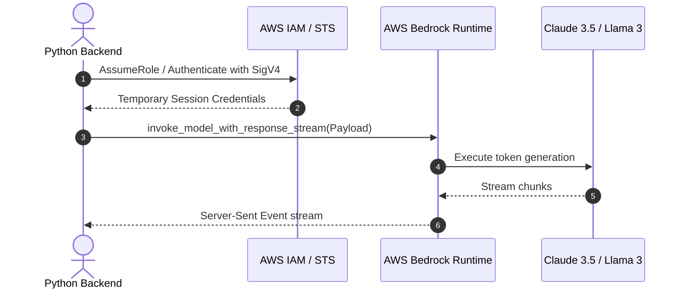

# 📹 Generative AI On AWS-Getting Started With First Project- Problem Statement With Demo

<div className="video-card" style={{border: '1px solid #30363d', borderRadius: '8px', padding: '16px', marginBottom: '24px', background: 'rgba(56, 139, 253, 0.05)'}}>
  <div style={{display: 'flex', gap: '16px', flexWrap: 'wrap'}}>
    <div><strong>Instructor:</strong> Krish Naik</div>
    <div><strong>Duration:</strong> 647</div>
    <div><strong>Course:</strong> Module 7: Cloud AI & LoRA Fine-Tuning</div>
    <div><strong>Watch Link:</strong> <a href="https://www.youtube.com/watch?v=MoG_8V_b_8A" target="_blank" rel="noopener noreferrer">YouTube Lecture ↗</a></div>
  </div>
</div>

## 📌 Executive Summary

AWS Bedrock provides serverless API access to leading foundation models with enterprise privacy, IAM identity integration, and built-in governance. Customer data passed through Bedrock is never used to train provider base models.

This lesson covers configuring AWS credentials, IAM policies for Bedrock access, calling foundation models via the Boto3 SDK, and handling streaming responses.

---

## 🏗️ System Architecture & Execution Flow



---

## 📖 Core Concepts & Technical Deep Dive

### 1. Security & Data Isolation in Bedrock
- All requests are encrypted in transit (TLS 1.3) and at rest (AWS KMS).
- Your prompts and outputs remain within your designated AWS region and Virtual Private Cloud (VPC).
- Zero data sharing: Anthropic, Meta, and Cohere receive zero access to customer logs.

### 2. SigV4 Authentication & Boto3 SDK
Bedrock requests require standard AWS Signature Version 4 (SigV4) headers. The `boto3` client manages signing, retries, and endpoint resolution automatically.

---

## 💻 Production Implementation

```python
import boto3
import json

def stream_bedrock_response(prompt_text: str):
    client = boto3.client("bedrock-runtime", region_name="us-east-1")
    
    payload = {
        "anthropic_version": "bedrock-2023-05-31",
        "max_tokens": 300,
        "messages": [{"role": "user", "content": prompt_text}],
        "temperature": 0.1
    }
    
    response = client.invoke_model_with_response_stream(
        modelId="anthropic.claude-3-haiku-20240307-v1:0",
        body=json.dumps(payload)
    )
    
    for event in response.get("body"):
        chunk = json.loads(event["chunk"]["bytes"].decode())
        if chunk.get("type") == "content_block_delta":
            text = chunk["delta"].get("text", "")
            print(text, end="", flush=True)

print("Streaming helper defined.")
```

---

## ⚙️ Production Gotchas & Best Practices

:::tip Request Model Access First
In new AWS accounts, foundation models are locked by default. Navigate to the AWS Console -> Amazon Bedrock -> "Model access" to enable Claude, Llama, and Titan access before making API calls.
:::

:::warning Payload Schema Divergence
Each model provider on Bedrock requires its own specific JSON payload schema (e.g. Anthropic expects `anthropic_version` and `messages`; Titan expects `inputText`). Use LangChain's `ChatBedrock` to abstract payload discrepancies.
:::

---

## 📊 Architectural Reference & Comparison

| Model Provider | Supported Models on Bedrock | Primary Strengths |
| :--- | :--- | :--- |
| **Anthropic** | Claude 3.5 Sonnet, Claude 3 Haiku, Opus | High-level reasoning, code, complex analysis |
| **Meta** | Llama 3.1 8B, 70B, 405B | Open-weights, cost-effective high throughput |
| **Mistral AI** | Mistral Large, Mistral 7B | Multi-lingual, concise structured extraction |
| **Amazon** | Titan Text Premier, Titan Multimodal | Native integration, cost-effective embeddings |

---

## 📚 Key Takeaways & Enterprise Checklist

- [ ] **Architecture Verification:** Ensure your design addresses latency, decoupled interfaces, and strict data validation contracts.
- [ ] **Deterministic Testing:** Run unit tests and golden dataset evaluations before shipping changes to staging or production.
- [ ] **Security & Observability:** Enforce input/output guardrails, scrub sensitive credentials/PII, and capture distributed traces.
- [ ] **Scalability & Sizing:** Calibrate model parameters, context limits, and compute instance requirements against projected request concurrency.
