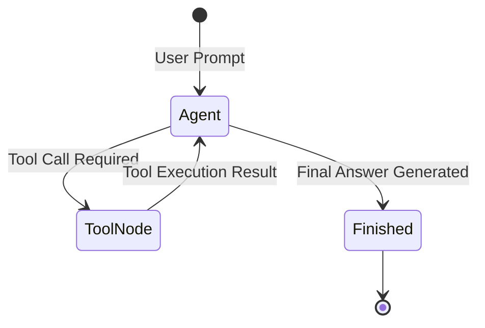

# 📹 #1 Generative AI On AWS-Getting Started With First Project- Problem Statement With Demo

<div className="video-card" style={{border: '1px solid #30363d', borderRadius: '8px', padding: '16px', marginBottom: '24px', background: 'rgba(56, 139, 253, 0.05)'}}>
  <div style={{display: 'flex', gap: '16px', flexWrap: 'wrap'}}>
    <div><strong>Instructor:</strong> Krish Naik (Krish Naik)</div>
    <div><strong>Duration:</strong> 10m 47s</div>
    <div><strong>Playlist:</strong> Generative AI on AWS (Krish Naik)</div>
    <div><strong>Watch Link:</strong> <a href="https://www.youtube.com/watch?v=MoG_8V_b_8A" target="_blank" rel="noopener noreferrer">YouTube Lecture ↗</a></div>
  </div>
</div>

## 📌 Executive Summary & Learning Objectives

This lecture covers **#1 Generative AI On AWS-Getting Started With First Project- Problem Statement With Demo**, focusing on production implementations, edge cases, and industry standards:
- Core intuition, architecture, and underlying mechanisms.
- Key differences between theoretical research implementations and scalable enterprise patterns.
- Concrete Python walkthroughs, error recovery, and performance optimization.

---

## 🏗️ Architecture & Conceptual Workflow



---

## 📖 Core Concepts & Technical Deep Dive

### 1. Architectural Foundations
In modern production AI engineering, **#1 Generative AI On AWS-Getting Started With First Project- Problem Statement With Demo** is essential for ensuring reliability, low latency, and deterministic outcomes. As AI systems evolve from naive prompt-in / completion-out scripts into distributed systems, engineers must handle:
- **State management & consistency:** Ensuring intermediate states and tool invocations are tracked.
- **Error boundaries & recovery:** Graceful degradation when external LLMs or vector stores encounter rate limits or network partitions.
- **Resource utilization & cost efficiency:** Caching common queries and reducing unnecessary foundation model token expenditure.

### 2. Operational Considerations
- **Latency Optimization:** Pre-computing embeddings, utilizing asynchronous non-blocking event loops, and streaming tokens via Server-Sent Events (SSE).
- **Security & Sandboxing:** Validating inputs before ingestion, sanitizing LLM outputs, and isolating tool execution environments.

---

## 💻 Production Implementation Walkthrough

```python
from typing import TypedDict, Annotated, List
from langgraph.graph import StateGraph, END
import operator

# 1. Define State Schema
class AgentState(TypedDict):
    messages: Annotated[List[str], operator.add]
    next_step: str

# 2. Define Node Functions
def analyze_input(state: AgentState):
    print("Analyzing query...")
    return {"messages": ["Query analyzed."], "next_step": "generate"}

def generate_response(state: AgentState):
    print("Generating response...")
    return {"messages": ["Final response generated."], "next_step": "end"}

# 3. Build StateGraph
workflow = StateGraph(AgentState)
workflow.add_node("analyze", analyze_input)
workflow.add_node("generate", generate_response)

workflow.set_entry_point("analyze")
workflow.add_edge("analyze", "generate")
workflow.add_edge("generate", END)

app = workflow.compile()
output = app.invoke({"messages": ["Hello Agent"], "next_step": ""})
print(output)
```

---

## 💡 Production Best Practices & Tips

:::tip Production Deployment Guideline
When deploying #1 Generative AI On AWS-Getting Started With First Project- Problem Statement With Demo in enterprise environments, always configure automated retries with exponential backoff and telemetry tracing (such as OpenTelemetry or LangSmith).
:::

:::warning Common Failure Modes
Watch out for state contamination across concurrent requests. Ensure each session or user interaction uses an isolated thread ID or execution context.
:::

---

## 🎯 Key Takeaways & Quick Reference

| Dimension | Production Standard | Pitfall to Avoid |
| :--- | :--- | :--- |
| **Execution** | Async / Non-blocking with timeouts | Synchronous blocking calls in event loops |
| **Data Validation** | Strict Pydantic v2 schemas | Untyped dictionary access |
| **Monitoring** | Distributed tracing & latency percentiles | Relying only on standard console logs |

## ⏱️ Lecture Timeline & Key Topics

| Timestamp | Key Topic / Concept Discussed |
| :--- | :--- |
| **00:00:00** | hello all my name is krishak and welcome... |
| **00:02:45** | make you understand how to probably... |
| **00:05:36** | give any number of request that you... |
| **00:08:07** | techniques with respect to the API will... |
| **00:10:44** | you and all take care bye-bye... |


---

---

## 📜 Complete Lecture Transcript (English)

> **Language:** English | **Source:** `04 - Simplify LLMOps & Build LLM Pipeline in Minutes.en-orig.srt` | **Total Segments:** 12 | **Word Count:** ~4,360 words

<details>
<summary><b>Click to expand full chronological transcript (12 timestamped intervals)</b></summary>

#### ⏱️ [00:00 ➔ 00:02]

hello all my name is krishak and welcome to my YouTube channel so guys yet another amazing video for everyone of you out there in this particular video we are going to discuss about llm Ops along with that we'll be building llm pipelines in minutes without writing any code right so if you're already following my playlist in Lang chain Lama index uh we have created so many amazing projects by using different different models like Google Gman Pro open AI we've used open source models like Lama 2 mrol and many more things right and there we created some amazing end to end projects where we have also used Vector embeddings uh we have used Vector databases like cassendra data Stacks we have used databases like uh you know uh specifically Vector databases we have specifically used like pine cone chroma DB and all these things we used we solved some amazing projects right now one challenge that I probably see in while you're building an LM application there is a dependency of of lot many different different tools okay let's say that I'm specifically using a model let's say I'm using open Ai and I also want to integrate my llm app with external sources it can be documents it can be Google search API it can be Wikipedia search API so for all this kind of work I really need to integrate with different different apis Al together I need to have an environment key created everywhere let's say with respect to Google search API let's say if I want to use Vector iding I need to have a separate key stored for the vector databases uh like chroma DB pine cone if I want to probably integrate with cassendra DB in data Stacks I need to have different different connection points now this is always a challenge when you are creating a project from scratch because here to create this entire llm pipeline it will definitely take a lot of time along with that you really need to manage all the the

#### ⏱️ [00:02 ➔ 00:04]

configuration now here in this video I'm going to talk about this amazing platform which is called as Vex vext and here we will be simplifying this entire llm Ops along with that we'll be building llm pipelines without writing any code so here you have almost every feature if you want to probably implement application L document Q&A Vector embedding is integrated over here if you're dependent on any external sources like Wikipedia or CF uh if you're uh dependent on Google search everything is available over here so you don't have to probably save all the configuration or create all the apis just with one API you can actually build this entire llm Pipeline and use that specific API in your chat uh chat B in your llm application anywhere that you specifically want to use now let us go ahead and let us see that how things will probably go ahead in this you can also start completely for free so I will just go ahead and log in over here so I have already logged in so here you can see with my my email ID I've already logged in I'll show you step by step how you can probably perform all these things right please make sure that you watch this video till the end and amazing platform alog together at the end of the day I should be able to explain you and teach you many more things as we go ahead right so quickly let's say I will go ahead and log in so once it is logged in and then we will go ahead and see to it let's see I will go ahead and log in in this way so once we login over here so you here you can see that you'll be able to see a dashboard okay once you probably login now after you log in all you have to do is that go and towards this AI project section okay if you have not logged in you have to sign up in this specific platform now what I will do is that I will go ahead and create a AI project so let me go ahead and create an AI project and I will name this AI project to

#### ⏱️ [00:04 ➔ 00:06]

something else let's say I will write uh document Q&A something I can write up to you okay so whatever application let's say I will say rag system right so I I'm actually trying to create this I will enable this also make sure that you enable this then only your application will probably get started now in this entire pipeline initially you'll be able to see two important section one is query and one is output okay so query basically means an event that starts the flow now this will be super important guys because a person who does not know much coding can also probably use this and create its own application right entire llm application with llm Ops right and you can also build the entire pipeline very simple you don't even require a developer over here now here you have query here you have output output basically means whatever is the final response that you will probably get now in between this there is a plus sign over here if I click on the plus sign I have all these options right so let me zoom in so that you will be able to see to it okay so over here you'll be able to see once I click on Plus in here you have an option to add an action so first you can add a generate response generate response basically means a response from a specific llm model you can also add data sets let's say you want to implement a document Q&A or a system over here then you can add your own data set along with that you also have an option where you can execute a function like this or smart function now what is this exactly smart function I will go ahead and explain you okay now let me do one thing let me first of all add this searge data set let's say that I have some multiple PDF file I want to probably create a document Q&A or it can be a retrieval augmentation generation right that kind of rag system we can we want to create so for this I will go ahead and add a data set over here let's go ahead and create a dat data set let's

#### ⏱️ [00:06 ➔ 00:08]

say this data set I will say these are nothing but research papers okay so I will go ahead and create this research paper now inside this research paper what I will do I will go ahead and add the data set itself right so over here you'll be seeing you'll be having multiple option you can upload a plane text you can upload a file you can upload a p caller you can even uh use Google Drive any file that is available in the Google Drive that also you can add in notion in Confluence so still many more options are probably coming up uh as I said said for people who is not much familiar with respect to coding in LM they can specifically use this now let me go ahead and let me upload a file now over here I'll click on upload a file and then I will go ahead and upload one file over here let's say this is one of the research paper um uh we'll try to see what this research paper is all about and I'll click on upload okay so this one PDF has got uploaded this is one of the research paper on PFT P basically means that Laura and CLA configuration the fine-tuning spe specifically that we use in llm models right so that research paper we have added so I will go ahead and click on ADD resource okay now as soon as I click on ad Source you'll be able to see that this PDF file will get uploaded over here let me see that okay let me say that I have more files to be added over here so I will go ahead and click on ADD source and let me go ahead and upload one more file so now uh there is one more research paper that is available over here I'll write attention attention is all you need okay so I will go ahead and click it over here so this is another search paper that was available uh attention is all you need uh that is something related to Transformers so I will also go ahead and upload this particular file okay so as soon as I upload it you will be seeing that I have added the source so inside this particular data set that is research paper I have this two uh two PDF files okay the research papers itself and I can have any number of research papers because people will again say hey Krish can we just only add one or we can add any number you can add any number but the maximum maimum PDF size should be 5

#### ⏱️ [00:08 ➔ 00:10]

MB okay so this is there I've added it now let me go back to my project now inside my project the rack system that I had actually created right now I just have this two flows right my l in my llm pipeline now I'll go ahead and add something called as search data set so as soon as I add this search data set you will be able to see that it will give me an option to select the data set right whatever I have uploaded so over there you'll be able to see that I have my data set called as research paper so I'll add it over over here okay now you can see both this specific file has got added right now once this is getting added there is uh in the right corner right you'll be able to see there there is a button in the right corner which is called as save I will go ahead and click on Save okay so once I click on save that basically means this injection the data injection that is specifically required is now available inside the search data set okay so over here you'll be able to see this search data set because I want to implement RG system or it can be a document Q&A I can probably ask any question it should be able to give me the response so inside this this particular data has got added but internally what the system is doing it is already creating that entire embeddings that is specifically required internally if it is requiring any Vector store it is creating all those things okay now this is done so this in to is my data injection step now coming to the next step here let me go ahead and generate a response because here what I will do I'll create an I'll add an llm model okay now any question that I specifically ask to my data set it should be able to give me the answer and summarize that answer using this llm whatever llm I'm selecting over here so generate a response you basically select over here and you have multiple options of selecting different different models now see it is also providing all these models uh Azure open GPT 3.5 Azure opening GPD 4 anthropic Cloud instant anthropic Cloud Google Pro Beta And in

#### ⏱️ [00:10 ➔ 00:12]

the future so many different different models are coming like llama 2 and all are also coming okay and the best thing about this model is that they have they have hosted this particular model in their cloud and they are providing it as a service to you now let's go ahead and select anyone so let's say I will go ahead and select Azure open AI gp4 okay now here you can see it is it is showing the next field as purpose so in short here you'll write your prompt like how you want this particular model to prompt to behave so I'll say you are a helpful assistant who please answer please answer the questions based on the context okay so this is what is my prompt I've written it over here now there is also one more option which is called as Behavior any additional thing that you really need to give on top of that particular prompt you can give it over here let's say over here one example is the behavior of this AI application be as specific as possible be very helpful and assist user something any any additional prompt that you really want to right right now I'm not giving anything so let me quickly um or let me just give one okay so that uh I'll say B helpful as much as much as possible okay so this is done so now what I will do I will go ahead and save this okay so on the bottom right corner you'll be able to see a save button so I'm going to save this now this is my entire llm application right so any quy that it will go it'll go and probably search in this particular data set and then it'll give me a response Now quickly to check this whether it is working absolutely fine or not here there is an option of playground okay now in this playground I will go ahead and ask all my questions that I want see two research paper that I had added I will talk about both those research paper one is PFT for uh one

#### ⏱️ [00:12 ➔ 00:14]

research paper was something for this parameter efficient transfer learning and one research paper was attention is all you need so here I will go ahead and ask the question what is parameter efficient transfer learning okay so I will go ahead and click on send now let's see whether we'll be able to see the response or not so in short what is happening now any query that I'm giving first of all it'll go and search from this particular data set which is already in the vector embedding format and then whatever information is going to come based on on the prom it is going to get summarized by this llm model and finally we going to see the output result and understand one thing is that based on the context whatever context it is available or whatever context we are able to retrieve from this particular data set that response we will specifically get it okay till we get the response I will just go ahead and search for some more questions over here okay let's see um experiments uh let's say I will go ahead and ask in distantiation for the Transformer Network now here you can see I've got the response parameter efficient transform refers to the method used in machine learning and specifically natural language processing that allows for the transfer of knowledge and here you are specifically getting your entire answer okay let me just go ahead and let me talk about what is attention is all you need okay so because that research paper also I have added okay please summarize okay so I've given this and here I will go ahead and click on send now the best thing is that the same functionality I can integrate with any chat Bots that I specifically want let's say in telegram channel in WhatsApp channel in any channel as such that option also I'll show now again I've got it so attention is all you need is a semi research paper by Ashish bashwani and colleagues so perfectly we are able to get it okay so any Q&A with respect to the data set you will be able to get it now here you see that you do not have to write much line of code right and it was very simple just by drag and drop adding the feature adding

#### ⏱️ [00:14 ➔ 00:16]

the data set everything you are able to do it okay now let me go ahead and add one more function let's say that I'm going to add a smart function okay see execute a function basically means here you will get some options to write to probably do basic maths uh Wikipedia search Google search Rive like let's say you want to ask queries from this particular um you know RF where all the research paper are uploaded you can use this okay so you can specifically use any of this activation function one more if you want to go ahead with is something called as smart function now inside this smart function you can add multiple functions Al together so let's say that I want to do a Google search so I will say over here you can see in the description it allows users to perform searches on the Google let's say I want to also go ahead and use RF if I want to also go ahead and use wik Wikipedia I can actually use over here so let's say that I'm adding all this smart function over here and for right now what I will do is that from my first flow I will remove this search data set because I don't want to use data set right so let's say uh I'm using in this particular way now let me go ahead and quickly search in this playground so if I go ahead and write what is machine learning okay so if I press enter you'll be able to see that now it is going to do the Google search and it is going to give me the specific answer okay so and for the first time once you set it for the first request it will take some time but from the upcoming request will become very smooth so here you can see machine learning is a branch of artificial intelligence and all so let's say I will go ahead and write who is crish naak so here if I go ahead and click on send here also you can probably see that if it is using the right API Google search API it should be able to give me the answer uh about myself okay so krishn is a YouTuber and data scientist known for his educational

#### ⏱️ [00:16 ➔ 00:18]

content on machine learning so all the answers are perfectly coming up right now this is what is the most amazing thing about this but again that question will come Krish what is the use of all these things you know you are saying that we can do all these things in a specific platform but how to probably do this in the coding because I want to use this entire functionality Implement in my chatbot okay so let me talk about that okay so if you go ahead and click on the outut so here is what is the most important thing here you'll be able to see that you get the HTTP request and you can also get the entire post request right so once you probably get this post request inside this post request you just need to set the API key and then by using whatever payload like whatever is the question you need to include it over here and then by hitting this particular URL and this channel token you can probably see this should be unique some unique name okay so here I will show you okay I'll give you the code also how you can actually hit the post request with the help of Python programming language now what I will do first of all I require an API key right so if in order to create an API key what I will do I will go ahead and click over here and here you can see I will go ahead and click create an API key so let's say I go ahead and write test uh this is my AI project or the rack system and this will be my API key okay please make sure that you save the API key so I'll copy this API key I'll paste it over here okay so this is my API key now what I will do I will go back to my AI project okay I'll go back to my AI project I will take the code the post request okay now see this this entire pipeline I just require one API and with that I can do a post I can do a get and all the functionality I'll do I don't have to even worry about the vector embeddings I don't have to worry about the apis of search Google search or RC or Wikipedia I don't have to worry about it all I'll be worried about this

#### ⏱️ [00:18 ➔ 00:20]

specific API itself right so what I will do the same Cur post request that you'll be seeing I have written this in a normal python code okay so here is the entire python code here you can see uh this is my API key so API key I'll just update it this is my older API key that I had actually tried it out but don't use this API key it'll be of no use because I'll be deleting it and then here I will write the query what is machine learning then I'll set the headers of content type of application Json the same thing see over here content type is application Json API key I need to set it up and then the payload which will have my query okay so I will go over here so API key I have set it to API key whatever API key is there my query is what is machine learning and this is my entire data payload all I did I took that curl post I just searched in the chat GPT and it gave me this entire code okay then this is My URL and instead of that catch token I'm writing Krishna 06 a unique value you can put it anything over here and then I'm doing request. poost with this URL with this Json data and headers is equal to headers okay and I'm printing the response. text again see the code it is very simple I'm setting the API key this is my query this is my headers this is my data I'm just setting it up whatever is the post request and now let me go ahead and execute it now if I go ahead and execute it the best thing will be that see I will write python test. py I've asked the question what is machine learning okay now here you'll be able to see that I will be getting that entire okay text it shows unauthorized okay let's see what is the error um okay I have not saved this one it's okay no worries I not saved it so that is the reason now I will be able to see the response cannot match app with endpoint perfect so still this is not matching because I had already tried it out previously so let me do one thing let me call copy this again and then you'll be

#### ⏱️ [00:20 ➔ 00:22]

able to see it okay so I will copy this entire URL and the channel token will be almost same okay so from catch I'm pasting it over here so I'll remove this I think it is dollar catch uh this catch should get removed and this will be my dollar Channel token perfect now let's see okay now it should run what is is machine learning and now I think I should be able to get the answer okay so let's wait for the first time it will take time but after that I think it will work absolutely fine so this is done but at the end of the day you can see that it's a simple python code you know a post python code and how you really want to use it from the front end point of view it is up to you you can specifically use it but this is my Endo this this is called as an endpoint this is my API key the API key is basically getting appended over here so now here you can see that I'm getting the response machine learning is a subfield of artificial intelligence that involves the creation of algorithm so and so everything is there now this simple post I can include it in any API that I specifically want okay that is the most amazing thing so coding wise you can now see you don't have much dependency now one more thing that I really want to show there is something called as app directory you can also connect with Google Drive Confluence jaier slack teams so all these things are coming soon later on you can also work directly with llms and bring your own llm to the platform here you have a AWS s maker Bedrock hugging face it is also having this entire support so I hope you like this particular video this was about how you can actually create or build llm pipelines without writing a single line of code which is quite amazing specifically seniors managers leads I think you should definitely go ahead and use this is not a kind of promotion but this

#### ⏱️ [00:22 ➔ 00:22]

is something that I really found very interesting and you should all know about this so I hope you like this particular video this was it from my side I'll see you in the next video have a great day thank you wonder all take care bye-bye

</details>
