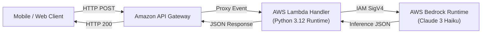

# 📹 Complete End To End Generative AI Project On AWS Using AWS Bedrock And AWS Lambda

<div className="video-card" style={{border: '1px solid #30363d', borderRadius: '8px', padding: '16px', marginBottom: '24px', background: 'rgba(56, 139, 253, 0.05)'}}>
  <div style={{display: 'flex', gap: '16px', flexWrap: 'wrap'}}>
    <div><strong>Instructor:</strong> Krish Naik</div>
    <div><strong>Duration:</strong> 3276</div>
    <div><strong>Course:</strong> Module 7: Cloud AI & LoRA Fine-Tuning</div>
    <div><strong>Watch Link:</strong> <a href="https://www.youtube.com/watch?v=3OP39y4dO_Y" target="_blank" rel="noopener noreferrer">YouTube Lecture ↗</a></div>
  </div>
</div>

## 📌 Executive Summary

Deploying serverless AI applications combining AWS Lambda and AWS Bedrock provides infinite elastic scalability with zero ongoing idle server costs.

This lesson details creating an event-driven AWS Lambda microservice that invokes Bedrock models, parses responses, and returns structured API responses behind Amazon API Gateway.

---

## 🏗️ System Architecture & Execution Flow



---

## 📖 Core Concepts & Technical Deep Dive

### 1. Serverless Execution Lifecycle
1. API Gateway receives client request with JSON body.
2. API Gateway passes event payload to AWS Lambda execution context.
3. Lambda parses request, validates input, calls AWS Bedrock `invoke_model`.
4. Bedrock executes inference and returns generation payload.
5. Lambda formats HTTP response with CORS headers and status code.

### 2. Managing Lambda Timeouts and Cold Starts
- **Timeout Configuration:** Default Lambda timeout (3 seconds) is insufficient for LLM generation. Set timeout to 30-60 seconds.
- **Memory Allocation:** Allocate 512MB to 1024MB memory; CPU performance scales proportionally with memory in AWS Lambda, speeding up JSON processing and TLS negotiation.

---

## 💻 Production Implementation

```python
import json
import boto3
import os

bedrock = boto3.client("bedrock-runtime")

def lambda_handler(event, context):
    try:
        body = json.loads(event.get("body", "{}"))
        user_prompt = body.get("prompt", "Hello AWS Bedrock")
        
        payload = {
            "anthropic_version": "bedrock-2023-05-31",
            "max_tokens": 256,
            "messages": [{"role": "user", "content": user_prompt}]
        }
        
        response = bedrock.invoke_model(
            modelId=os.environ.get("BEDROCK_MODEL_ID", "anthropic.claude-3-haiku-20240307-v1:0"),
            body=json.dumps(payload)
        )
        
        res_body = json.loads(response["body"].read())
        answer = res_body["content"][0]["text"]
        
        return {
            "statusCode": 200,
            "headers": {"Content-Type": "application/json", "Access-Control-Allow-Origin": "*"},
            "body": json.dumps({"answer": answer})
        }
    except Exception as e:
        return {
            "statusCode": 500,
            "body": json.dumps({"error": str(e)})
        }
```

---

## ⚙️ Production Gotchas & Best Practices

:::tip Client Reuse Outside Handler
Initialize `boto3.client('bedrock-runtime')` outside the `lambda_handler` function. Warm Lambda execution containers will reuse the open TLS socket connection across warm invocations.
:::

:::warning API Gateway 29-Second Timeout
Amazon API Gateway has a hard 29-second maximum timeout. For tasks requiring longer generations, use Lambda Function URLs with response streaming.
:::

---

## 📊 Architectural Reference & Comparison

| Architecture Component | Recommended Setting | Production Rationale |
| :--- | :--- | :--- |
| **Lambda Memory** | 1024 MB | Optimal balance of CPU burst performance and cost |
| **Lambda Timeout** | 60 seconds | Accommodates generation latency without premature cancellation |
| **Concurrency Limit** | Reserved 50 instances | Prevents overwhelming Bedrock regional TPS rate limits |
| **IAM Policy** | `bedrock:InvokeModel` scoped to ARN | Follows principle of least privilege |

---

## 📚 Key Takeaways & Enterprise Checklist

- [ ] **Architecture Verification:** Ensure your design addresses latency, decoupled interfaces, and strict data validation contracts.
- [ ] **Deterministic Testing:** Run unit tests and golden dataset evaluations before shipping changes to staging or production.
- [ ] **Security & Observability:** Enforce input/output guardrails, scrub sensitive credentials/PII, and capture distributed traces.
- [ ] **Scalability & Sizing:** Calibrate model parameters, context limits, and compute instance requirements against projected request concurrency.
