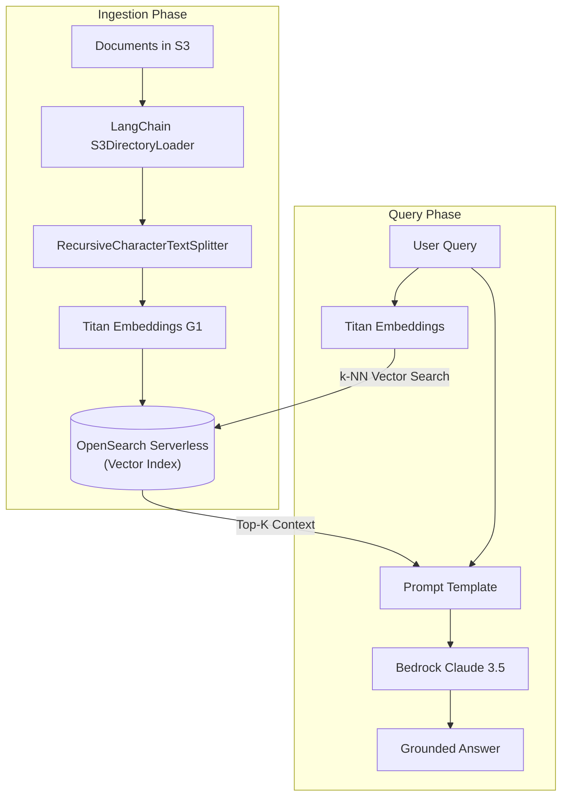

# 📹 End To End Advanced RAG App Using AWS Bedrock And Langchain

<div className="video-card" style={{border: '1px solid #30363d', borderRadius: '8px', padding: '16px', marginBottom: '24px', background: 'rgba(56, 139, 253, 0.05)'}}>
  <div style={{display: 'flex', gap: '16px', flexWrap: 'wrap'}}>
    <div><strong>Instructor:</strong> Krish Naik</div>
    <div><strong>Duration:</strong> 2244</div>
    <div><strong>Course:</strong> Module 7: Cloud AI & LoRA Fine-Tuning</div>
    <div><strong>Watch Link:</strong> <a href="https://www.youtube.com/watch?v=0LE5XrxGvbo" target="_blank" rel="noopener noreferrer">YouTube Lecture ↗</a></div>
  </div>
</div>

## 📌 Executive Summary

Building enterprise Retrieval-Augmented Generation on AWS pairs Amazon Bedrock foundation models with vector storage in OpenSearch Serverless, orchestrated through LangChain.

This lesson covers document ingestion into Amazon S3, generating vector embeddings using Amazon Titan Embeddings, indexing into OpenSearch Serverless, and querying with Bedrock Claude models.

---

## 🏗️ System Architecture & Execution Flow



---

## 📖 Core Concepts & Technical Deep Dive

### 1. Amazon Titan Embeddings
- `amazon.titan-embed-text-v1`: 1,536 dimensions, up to 8k input tokens.
- Optimized for semantic similarity, clustering, and retrieval tasks on AWS.

### 2. LangChain ChatBedrock Integration
LangChain provides first-class integrations (`langchain-aws`) supporting `ChatBedrock`, `BedrockEmbeddings`, and native streaming with IAM role authentication.

---

## 💻 Production Implementation

```python
from langchain_aws import ChatBedrock, BedrockEmbeddings
from langchain_core.prompts import ChatPromptTemplate
from langchain_core.output_parsers import StrOutputParser

# 1. Initialize Bedrock Foundation Model and Embeddings
embeddings = BedrockEmbeddings(model_id="amazon.titan-embed-text-v1", region_name="us-east-1")
llm = ChatBedrock(
    model_id="anthropic.claude-3-haiku-20240307-v1:0",
    model_kwargs={"temperature": 0.0, "max_tokens": 512},
    region_name="us-east-1"
)

# 2. Build RAG Prompt Pipeline
prompt = ChatPromptTemplate.from_messages([
    ("system", "Answer the question strictly using the provided context:\n{context}"),
    ("human", "{question}")
])

rag_chain = prompt | llm | StrOutputParser()
print("LangChain AWS Bedrock RAG pipeline configured.")
```

---

## ⚙️ Production Gotchas & Best Practices

:::tip Bedrock Knowledge Bases for Zero-Code RAG
If your requirements are standard document Q&A, evaluate **Amazon Bedrock Knowledge Bases**. It manages the entire ingestion, parsing, chunking, vector indexing, and query pipeline automatically without custom code.
:::

:::warning IAM S3 Bucket Permissions
Ensure the Lambda or EC2 execution role has both `s3:GetObject` permissions for documents and `bedrock:InvokeModel` permissions for both the embedding model and chat model.
:::

---

## 📊 Architectural Reference & Comparison

| Component | Managed Solution (No-Code) | Custom Solution (LangChain) |
| :--- | :--- | :--- |
| **Vector Store** | Bedrock Knowledge Bases (Built-in AOSS) | OpenSearch Serverless / Pinecone via LangChain |
| **Embedding** | Automatic Titan / Cohere | Explicit `BedrockEmbeddings` call |
| **Orchestration**| AWS Managed Agents | LangGraph / LCEL customizable graphs |
| **Control Level**| High-level configuration | Low-level token, prompt, and tool customization |

---

## 📚 Key Takeaways & Enterprise Checklist

- [ ] **Architecture Verification:** Ensure your design addresses latency, decoupled interfaces, and strict data validation contracts.
- [ ] **Deterministic Testing:** Run unit tests and golden dataset evaluations before shipping changes to staging or production.
- [ ] **Security & Observability:** Enforce input/output guardrails, scrub sensitive credentials/PII, and capture distributed traces.
- [ ] **Scalability & Sizing:** Calibrate model parameters, context limits, and compute instance requirements against projected request concurrency.
