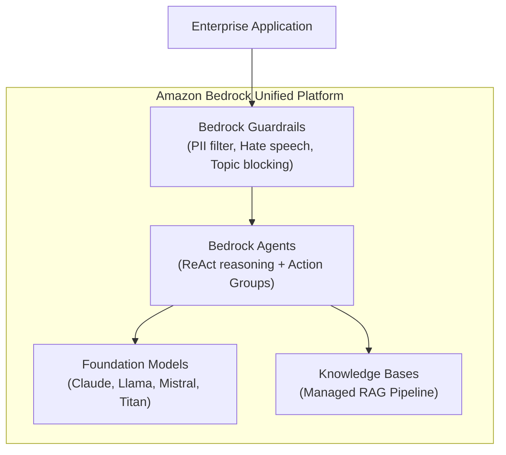

# 📹 Generative AI In AWS-AWS Bedrock Crash Course

<div className="video-card" style={{border: '1px solid #30363d', borderRadius: '8px', padding: '16px', marginBottom: '24px', background: 'rgba(56, 139, 253, 0.05)'}}>
  <div style={{display: 'flex', gap: '16px', flexWrap: 'wrap'}}>
    <div><strong>Instructor:</strong> Krish Naik</div>
    <div><strong>Duration:</strong> 2236</div>
    <div><strong>Course:</strong> Module 7: Cloud AI & LoRA Fine-Tuning</div>
    <div><strong>Watch Link:</strong> <a href="https://www.youtube.com/watch?v=2maPaQutcWs" target="_blank" rel="noopener noreferrer">YouTube Lecture ↗</a></div>
  </div>
</div>

## 📌 Executive Summary

A complete architectural crash course on AWS Bedrock covering model evaluation, custom prompt management, Bedrock Guardrails, and autonomous Bedrock Agents with action groups.

This lesson provides a comprehensive overview of how enterprises leverage Bedrock to build secure, scalable AI capabilities.

---

## 🏗️ System Architecture & Execution Flow



---

## 📖 Core Concepts & Technical Deep Dive

### 1. Bedrock Guardrails
Provides standardized safety layers applied across any foundation model on Bedrock:
- Denied topics (e.g. "Do not provide legal advice").
- Content filters (hate, insults, sexual, violence).
- Sensitive information filters (masking or blocking PII like Social Security numbers).

### 2. Bedrock Agents & Action Groups
Bedrock Agents automate multi-step tasks by:
- Deconstructing user requests into step-by-step reasoning plans.
- Invoking **Action Groups** (backed by AWS Lambda functions) with OpenAPI 3.0 schema definitions.
- Retrieving knowledge from associated Knowledge Bases.

---

## 💻 Production Implementation

```python
import boto3
import json

bedrock = boto3.client("bedrock-runtime", region_name="us-east-1")

def invoke_with_guardrail(prompt: str, guardrail_id: str, guardrail_version: str):
    payload = {
        "anthropic_version": "bedrock-2023-05-31",
        "max_tokens": 200,
        "messages": [{"role": "user", "content": prompt}]
    }
    
    # Bedrock applies guardrail inspection transparently
    response = bedrock.invoke_model(
        modelId="anthropic.claude-3-haiku-20240307-v1:0",
        guardrailIdentifier=guardrail_id,
        guardrailVersion=guardrail_version,
        body=json.dumps(payload)
    )
    return response

print("Bedrock Guardrail invocation routine initialized.")
```

---

## ⚙️ Production Gotchas & Best Practices

:::tip Decouple Guardrails from Models
Because Bedrock Guardrails are independent resources, you can update safety policies, denied topics, or PII regex rules once and have them instantly take effect across all deployed models.
:::

:::warning Guardrail Latency Overhead
Each activated guardrail check adds approximately 50-100ms of latency to the request. Benchmark end-to-end latency when stacking multiple content filters.
:::

---

## 📊 Architectural Reference & Comparison

| Bedrock Feature | Primary Function | Supported Providers |
| :--- | :--- | :--- |
| **Foundation Models** | Raw text, vision, and code generation | Anthropic, Meta, Mistral, Amazon, Cohere |
| **Guardrails** | Input/Output content safety and PII masking | All text foundation models on Bedrock |
| **Knowledge Bases** | Fully managed vector ingestion & RAG | OpenSearch Serverless, Pinecone, Aurora PG |
| **Agents** | Multi-step reasoning and Lambda tool calls | Anthropic Claude models |

---

## 📚 Key Takeaways & Enterprise Checklist

- [ ] **Architecture Verification:** Ensure your design addresses latency, decoupled interfaces, and strict data validation contracts.
- [ ] **Deterministic Testing:** Run unit tests and golden dataset evaluations before shipping changes to staging or production.
- [ ] **Security & Observability:** Enforce input/output guardrails, scrub sensitive credentials/PII, and capture distributed traces.
- [ ] **Scalability & Sizing:** Calibrate model parameters, context limits, and compute instance requirements against projected request concurrency.
