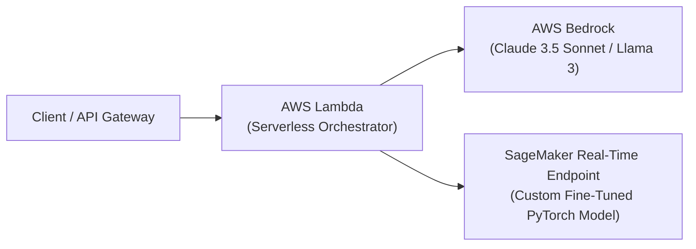

# 📹 #3-Deployment Of Huggingface OpenSource LLM Models In AWS Sagemakers With Endpoints

<div className="video-card" style={{border: '1px solid #30363d', borderRadius: '8px', padding: '16px', marginBottom: '24px', background: 'rgba(56, 139, 253, 0.05)'}}>
  <div style={{display: 'flex', gap: '16px', flexWrap: 'wrap'}}>
    <div><strong>Instructor:</strong> Krish Naik (Krish Naik)</div>
    <div><strong>Duration:</strong> 22m 32s</div>
    <div><strong>Playlist:</strong> Generative AI on AWS (Krish Naik)</div>
    <div><strong>Watch Link:</strong> <a href="https://www.youtube.com/watch?v=U72q95dHpRo" target="_blank" rel="noopener noreferrer">YouTube Lecture ↗</a></div>
  </div>
</div>

## 📌 Executive Summary & Learning Objectives

This lecture covers **#3-Deployment Of Huggingface OpenSource LLM Models In AWS Sagemakers With Endpoints**, focusing on production implementations, edge cases, and industry standards:
- Core intuition, architecture, and underlying mechanisms.
- Key differences between theoretical research implementations and scalable enterprise patterns.
- Concrete Python walkthroughs, error recovery, and performance optimization.

---

## 🏗️ Architecture & Conceptual Workflow



---

## 📖 Core Concepts & Technical Deep Dive

### 1. Architectural Foundations
In modern production AI engineering, **#3-Deployment Of Huggingface OpenSource LLM Models In AWS Sagemakers With Endpoints** is essential for ensuring reliability, low latency, and deterministic outcomes. As AI systems evolve from naive prompt-in / completion-out scripts into distributed systems, engineers must handle:
- **State management & consistency:** Ensuring intermediate states and tool invocations are tracked.
- **Error boundaries & recovery:** Graceful degradation when external LLMs or vector stores encounter rate limits or network partitions.
- **Resource utilization & cost efficiency:** Caching common queries and reducing unnecessary foundation model token expenditure.

### 2. Operational Considerations
- **Latency Optimization:** Pre-computing embeddings, utilizing asynchronous non-blocking event loops, and streaming tokens via Server-Sent Events (SSE).
- **Security & Sandboxing:** Validating inputs before ingestion, sanitizing LLM outputs, and isolating tool execution environments.

---

## 💻 Production Implementation Walkthrough

```python
import boto3
import json

# Initialize Amazon Bedrock Runtime Client
client = boto3.client(service_name="bedrock-runtime", region_name="us-east-1")

payload = {
    "anthropic_version": "bedrock-2023-05-31",
    "max_tokens": 1024,
    "messages": [
        {"role": "user", "content": "Explain serverless AI architecture on AWS."}
    ]
}

response = client.invoke_model(
    modelId="anthropic.claude-3-5-sonnet-20240620-v1:0",
    contentType="application/json",
    accept="application/json",
    body=json.dumps(payload)
)

result = json.loads(response["body"].read())
print(result["content"][0]["text"])
```

---

## 💡 Production Best Practices & Tips

:::tip Production Deployment Guideline
When deploying #3-Deployment Of Huggingface OpenSource LLM Models In AWS Sagemakers With Endpoints in enterprise environments, always configure automated retries with exponential backoff and telemetry tracing (such as OpenTelemetry or LangSmith).
:::

:::warning Common Failure Modes
Watch out for state contamination across concurrent requests. Ensure each session or user interaction uses an isolated thread ID or execution context.
:::

---

## 🎯 Key Takeaways & Quick Reference

| Dimension | Production Standard | Pitfall to Avoid |
| :--- | :--- | :--- |
| **Execution** | Async / Non-blocking with timeouts | Synchronous blocking calls in event loops |
| **Data Validation** | Strict Pydantic v2 schemas | Untyped dictionary access |
| **Monitoring** | Distributed tracing & latency percentiles | Relying only on standard console logs |

## ⏱️ Lecture Timeline & Key Topics

| Timestamp | Key Topic / Concept Discussed |
| :--- | :--- |
| **00:00:00** | hello all my name is Kush n and welcome... |
| **00:05:26** | price so you really need to be uh taking... |
| **00:11:00** | page it is always good to probably check... |
| **00:16:49** | just to give you an idea how does an... |
| **00:22:30** | one all take care bye-bye... |


---

---

## 📜 Complete Lecture Transcript (English)

> **Language:** English | **Source:** `08 - #3-Deployment Of Huggingface OpenSource LLM Models In AWS Sagemakers With Endpoints.en-orig.srt` | **Total Segments:** 12 | **Word Count:** ~4,536 words

<details>
<summary><b>Click to expand full chronological transcript (12 timestamped intervals)</b></summary>

#### ⏱️ [00:00 ➔ 00:02]

hello all my name is Kush n and welcome to my YouTube channel so guys uh we are going to continue our generative AI series on AWS cloud and in this video I'm going to probably show you how you can actually deploy your hugging face model Let It Be An Open Source model or any llm models also specifically in AWS Sage maker that is Amazon Sage maker um Amazon Sage maker is one of the important services in AWS where you can probably complete the entire life cycle of a data science project or an AI project complete completely along with mlops till the deployment each and everything so in this particular video I will be showing you how we can take up any hugging face model in short and probably deploy it in the sage maker itself so please make sure that you watch this video till the end and one more very important thing guys uh um just check out this particular video there will they may some there may be some amount of charges that may incur so please be careful with respect respect to this whenever you start creating and finally when you create that particular endpoint make sure that you delete all the endpoints itself and I will be providing you the entire guidance as we go ahead so first of all we are just going to go ahead and search for AWS Sage maker and uh to start with uh how to probably work with AWS sagemaker studio and all I will also be talking about that so first of all you can see uh you can just go ahead and click on getting started okay uh and with respect to this AWS Sage maker the documentation is pretty much amazing right so if you don't know about AWS Amazon Sage maker it provides machine learning capabilities that are purpose built for data scientist and developer to prepare build train and deploy high quality ml models efficiently so uh what we are going to basically do is that step by step I'm going to actually show you so I'll go to The Domain part and I will go ahead and create the domain so once I probably go ahead and create the domain so here U there are two options one is setup for organization and the other one is set up for single user okay so as soon as uh and right now we are just going to test it for single user so what

#### ⏱️ [00:02 ➔ 00:04]

I'm going to do is that I'm going to select this here you will be able to get an IM Ro automatically it will be creating it with this Amazon Sage Maker full access policy uh public internet access standard encryptions Sage maker Studio you'll get the access to this you'll be getting sharable sagemaker studio notebooks Sage maker canvas and IM am authentication so each and everything uh by inbuilt it will be providing you this entire environment where you can actually do the coding so just go ahead and click this so once you probably go ahead and click this you will be able to see uh something like uh okay the setup is going to take place and it is going to take some amount of time you know um again it depends on how much time it is probably going to take over here it will automatically create the users and everything you'll be able to get it right so here if I probably go ahead and just reload this you'll be able to see that my third domain is probably over here getting set up pending is this and it'll probably take some amount of time based on on the usage but other than that that you can probably see that I've already created two so uh since this is already getting created I will just go ahead and show you some more examples with respect to this so let me just go ahead and quickly click on this quick setup domain you'll be able to see that by default it'll be creating a user okay you can add any number of users based on the organization that you specifically working and let's say you want to provide access to multiple users in the same uh domain itself you can also provide okay so by default uh uh as as soon as you provide the user access also there is one very important thing that you will be able to see right and uh that is nothing but the user information over here along with this let me just hide my face here you'll be able to see that you'll be getting a launch button okay so through this you'll be able to access canvas I will be talking about canvas as we go ahead in the for the videos tensor board I hope everybody knows about tensor board profiler but we are just interested in working on this

#### ⏱️ [00:04 ➔ 00:06]

particular studio right so once I probably click on this studio and uh uh you will be able to see that I will be able to get this entire Amazon Sage maker it'll be a studio completely which will actually provide you the entire ecosystem with respect to any kind of development that you really want to do okay so here you can probably see Jupiter lab is there if you want to quickly start deploy fine tune and evaluate pre-train model specifically for llm you can also go ahead with this you know if you want to probably uh go ahead and do some kind of automl you can also see over here there's an option model evaluation so you'll find this entire ecosystem okay now what I'm actually going to do is that I'm just going to click on this Jupiter lab and right now you'll be able to see that nothing is running over here okay nothing is running specifically and uh what I'm actually going to do I'm going to create a create a Jupiter lab okay over here Jupiter lab space so that I will be able to work it okay so here I'm just going to write test demo Sage maker okay and this I'm going to show you with hugging space okay uh sorry hugging face models right so here uh it will first of all ask you to probably select the instance right uh multiple instances you can probably select for my use cases again uh this instances if I go ahead and check over here Sage maker instances based on different different instances there is a different different price so you really need to be uh taking care of this because see if you're working in a company based on the requirement you can probably select the instances so here you can probably see on demand pricing so uh let's say if I select ml 33 medium 05 here it provides you CPU with two core 4GB memory but understand if you are specifically working with generative AI models right you definitely require a huge amount of data right uh sorry huge amount of space so uh if you probably go further there will be good good amazing system accelerating Computing which also Pro provides you not only CPU cores but also

#### ⏱️ [00:06 ➔ 00:08]

gpus right so as you keep on using more and more you'll be able to see the charges will be going higher and higher but just uh in this specific video I really want to show you some demo uh but again if you just get this idea in any companies if you go you'll be able to work it out right so I'm going to take a small system and probably work with this right now which small system I'm going to specifically take so if I go up here is something called as ml. m52 large so if you go ahead and see over here uh MLF I 2 large so this is basically providing 8 core gpus and 32 GB memory the charges will be 461 price per hour for using this particular instance the reason why I'm doing this is that because I will just give you an example of one of the model how it is deployed and all okay and uh we'll see to that okay so here I'm just going to keep the storage to 10 GB uh and now I will go ahead and click on run space okay so once once the Run space is clicked on you'll be able to see that my entire environment will be ready and I should be able to work it out okay and uh with the respect to this uh any kind of code that you run right in the my recent video you have also seen that I have actually uh created entire one Lambda function with the API Gateway I've shown you how to probably create the endpoint and all so all those things you can probably do with this also but here more amazing end points you'll be more amazing ecosystem and features you'll be able to get okay so this is going to take some amount of time so okay now it is created now I can just go ahead and click on open Jupiter lab Now understand with respect to hugging phase there are multiple ways to load a specific model okay there are multiple ways uh all those ways I'm going to talk about and this will be important for you because you really need to know have an idea like how we can actually work in AWS system right so once this is loaded uh the first step okay what you can do I will just go ahead and and change my theme so I'll

#### ⏱️ [00:08 ➔ 00:10]

make it Jupiter dark okay so here you have options uh you have options for Notebook you have options for console terminal python anything you can specifically work it I will just go ahead and open Terminal uh sorry notebook and the first thing that I will do is that just go ahead and write pip install Sage maker okay which is the upgraded version just go ahead and install that automatically the installation will be taking place and all the recent updates that is basically there with respect to the sage maker that will get updated understand this is my entire environment the same jupyter notebook that we usually specifically work on at all so right so here you'll be able to see this now uh to go ahead with what we really need to do initially so I will go ahead and import Sage maker okay and there are some steps that you definitely need to follow as we start right so I'm going to import boto 3 and I'll be providing you all the code in the description of this particular video so first of all we'll go ahead and create our session the session will be nothing but sagemaker do session okay sagemaker do session so by default whatever is the session we'll be able to get it uh initially uh we have not set up any uh session buckets or anything as such you can also create that particular session so I'm just going to write over here even some comments so that it'll be beneficial for you so here you can see session uh s maker session bucket used for uploading data model logs if you want to probably upload data upload a custom data or download the hugging face model in this particular s3b and probably retrieve from that or use from that you can actually do that s maker will automatically create this bucket if it does not exist okay so you can probably go ahead and write this particular condition and here you'll be able to see that if there is nothing as such um if it is none I'm just going to probably uh make if the session is not there I'm going to probably go ahead and create the default bucket okay so this is the code that we do initially uh and this bucket will specifically be used to upload any custom data or training data it can be models after the inferencing and multiple things now other than this

#### ⏱️ [00:10 ➔ 00:12]

we uh really need to focus on the role management over here now because since we are using AWS s maker to execute any kind of code uh specifically by using the services of AWS maker we really need to provide the RO access and all so for this uh we can just go ahead and write some trat blocks so here I'm just going to go ahead and write try um try and let me just go ahead and do pass over here and let me go ahead and write accept block um with respect to this particular except block I will just go ahead and raise some value error and the best thing over here is that you'll get all the suggestion right and that is pretty much amazing right once you're specifically using it let's say my IM user is not yet set so it will obviously give an exception so it will go to this particular value error and here I will first of all go ahead and set up my uh user so I'm I'm user in short so I'll go ahead and write boto 3. client and uh I'm Al checking out the documentation page it is always good to probably check out the documentation page and perform in that particular way and then I'm going to basically set up my roll um I'm going to use im. getor rooll now it is going to probably pick up those role that is configured with this particular Jupiter notebook right so I'm just going to write role name okay is equal to Sage maker Sage maker underscore execution underscore roll okay and this is basically going to be set up with our role and from that we're going to probably take our Arn number right that is how we specifically identify the unique role that we are probably trying to give okay so all this things is done over here let me just make some spaces that is actually required whenever we work with this okay so here you can probably see my role is also set up uh this is my exception now let me quickly go ahead and write in a try once the uh ex once once the role is set up so I can

#### ⏱️ [00:12 ➔ 00:14]

basically go ahead and write sagemaker do get execution role okay this will be responsible in getting the execution role if by default nothing is set up then you can probably call it out uh based on the role that it has it has okay again one common thing that I've seen that we have to provide spaces over here so that is one of the thing over here so please make sure that you keep on working with respect to that whenever you're writing any code uh after that I will just go ahead and write session is equal to S maker do session I'm just going to call my session and here I'm just going to use my default bucket uh so here one of the parameter that you can probably see is nothing but your default bucket which will be assigned to my default bucket or sorry not default bucket Sage makeer session bucket that is my default parameter that is specifically required okay so this is the first step that you really need to do it okay and then finally I can go ahead and print my you you can see how it is going to pick up the Arn role okay s maker Ro Arn and here I'm going to basically set it up to role okay so this is the role that is going to get print up and next the print is equal to and here you can probably also go ahead and write your Sage maker session so Sage maker session region if I want to display it okay it'll be nothing but session dot do boto region name right so this is also there so once I execute it uh let's see whether it'll be working fine so here you can see not applying htk defaults this is there not applying info okay some error I can probably see over okay let's go ahead and do that again okay now it's working fine you can probably see stage maker role is basically this and this is the default role that uh the domain has basically created with respect to the user and then Us East one I'm actually working on okay so this is the first step now if I

#### ⏱️ [00:14 ➔ 00:16]

have the roles and all uh now I can probably go ahead and call any kind of models that I specifically one so uh first uh we will try to call one type of model and uh I will just go ahead and show you the code okay so here I'm I'm calling one model which is called as distal BT uncase distal Squad and this is specifically used for question answering so I am basically going to give the Hub configuration see hugging face Hub if you don't know about hugging face Hub then uh there you definitely have a lot of models which can probably use for multiple use cases so here you can see hugging face uh model ID I have to probably give whatever is my model ID the kind of task that I'm looking for I'll be giving in the form of uh key value pairs in this particular variable called as Hub okay then we go ahead and create the hugging face model right and for that we have already deployed or imported from Saker do hugging face model import hugging face right and then finally you'll be able to see that I'm using this environment Hub okay role I've obviously used Transformer version which I provided PTO version and Pi version 3.9 okay so this is how the parameters you really need to give with respect to this okay so uh I've already executed this uh and I don't want to again deploy this entire model in my another Jupiter notebook because it is going to definitely take time so just to give you an idea I have already done that so let me just show you over here this is my another instance which I was actually working on so here uh is my second hugging face model which I have actually given third uh how to deploy it to the sage maker inferences as you know I've selected ml. M5 x large okay so I'm here I'm writing predictor by using the same hugging face model do deploy I'll be saying the instance count as one okay because I just required one instance and what is the instance type instance time is ml. m5x large okay where I'm specifically deploying other than that I need to to make sure that how should I give my

#### ⏱️ [00:16 ➔ 00:18]

input so I will be creating in this particular format because this model that is digital B based uncas digital squar will be requiring the uh the input data in this particular format that is question what is the used for inferences then context my name is so and so I've just given some examples so that my more charges should not incur and then we'll go ahead and predict the data so here you'll be able to see if I go ahead and write predictor do predict okay with respect to this particular data because because this data is required in that particular use case so here you can see score is this one start is this one end is this one answer is Sage maker right so what is used for inferences so here you can see from this particular question uh you have that Sage maker it is going to pick up understand when I execute this code it is going to take 5 to 10 minutes to deploy into this and you'll be able to get your Endo okay just to give you an idea how does an endpoint look like um I'll just go over here just a second uh how does the Endo look like if I if you really want to see so here I if I go back to my sage maker Studio I've created multiple endpoints so if you go to deployments you'll be able to see endpoints over here right these two endpoints are there let's say I want to go ahead and see this particular endpoint okay I can click on this particular endpoint and uh once we deployed that endpoint will be created if I want to test the inferences you'll be able to see that uh I'll be getting this application juston and whatever body I'm specifically giving like how I'm giving over here this is my entire body right and with respect to that particular body if give over here also and just test it I should be able to get if I just click on send request I should be able to get my output right and there also multiple options like Auto scaling you can scale to whatever things you specifically want based on the charges again uh but here you'll be able to see that I am I have deployed this model in this particular instance and uh you'll be able to just use that particular endpoint wherever you want in your code anywhere as such based on your requirement right so this was the entire thing right let's let's try some more things okay I will again create some

#### ⏱️ [00:18 ➔ 00:20]

more data over here and uh um my name is Kish and I teach data science I I'll just gift I say and I teach data science okay so what does Kish like okay I'm just going to execute this let's see I'm going to get the answer I'm predictor do predict so you have a predict method here you can see the answer is data science right what does Kish like uh what does Kish teach also you can basically do okay you'll be able to get the answer data science okay so in short this is just a simple model right I've probably deployed this particular model you'll be able to see that this is my entire stage maker and here uh you know it took some amount of time I think this dot dot like every 1 minute around 6 to 7 minutes to deploy this entire model in this particular instance which I have actually created now just to give you an idea like how does uh uh machine learning uh llm model be like so I'll be giving you multiple examples so first of all you have to probably go ahead and update Sage maker the same thing by keeping your role and uh region name then you are basically going to call the Sage maker image URI right since we are going to run it as a container so here you can you can see hugging face deep learning container in AWS Sage maker so the entire llm model will basically be put in a container then you can actually call that particular container over here so in order to call that container you will be using from sagemaker do hugging face get hugging face llm image URI and then here is your version that you're specifically using and what kind of image you are actually coming up with okay just to show you if I probably give you an example I will go ahead and install all this let's see you'll be able to see the URI okay and then it will probably

#### ⏱️ [00:20 ➔ 00:22]

download it and upload it so there will be a lot of task in that and lot of money will be required because again at the end of the day you are see over here you have probably got this now let me just execute this again so here is your sagemaker role Arn then you can you can see that which URI I'm actually calling right so if I probably go and see this is the URI that is basically required Right image URL so if you know about Dockers and containers so once you get the URI then you should be able to load the hugging face model now here also you can probably see here we are calling Falcon B 40b instruct number of gpus is how much you want and just imagine the instance type that we are going to use is MLG 52 into large I'll just show you the cost and you will be pretty much shocked to see the cost so here you can see internal storage GB is 1 into 3 3800 uh total GPU memory is 96 you know GPU 24 core bandwidth internet bandwidth is 40 and the GPU model is NVIDIA A10 H right memory is nothing but 192 CPU cores is nothing but 48 just imagine how much the charges will be so that is the reason I have actually taken a small model and probably shown it to you uh later on you can probably do with respect to anything once you probably go through the company right so that is the reason we have selected all these parameters over here then we initialize the hugging face model then we deploy it that's it right and then after that you can probably use the same payload you can structure the payload over here uh with the prompt and then you'll be able to get the text okay so anyhow I will be giving you this entire examples in the description of this particular video but again yes I've told that I've been uploading videos on AW s maker and all but definitely there requires a lot of charges that is involved but it is always good to have a knowledge about it that is the reason that is the main aim for this particular video so I hope you like this particular video this was it for my side uh again you can refer to

#### ⏱️ [00:22 ➔ 00:22]

multiple examples uh here I will also give you this GitHub link from the documentation of uh hugging pH so there are multiple Labs which has been created which you can also go ahead and refer to okay so this uh some from aret companies so this is an amazing lab details that is pro provided I will be providing you this entire code itself other than that you can obviously see the documentation of hugging face s maker so yes this was it for my side I'll see you in the next video have a great day ahead thank you one all take care bye-bye

</details>
