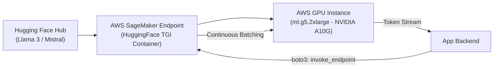

# 📹 Deployment Of Huggingface OpenSource LLM Models In AWS Sagemakers With Endpoints

<div className="video-card" style={{border: '1px solid #30363d', borderRadius: '8px', padding: '16px', marginBottom: '24px', background: 'rgba(56, 139, 253, 0.05)'}}>
  <div style={{display: 'flex', gap: '16px', flexWrap: 'wrap'}}>
    <div><strong>Instructor:</strong> Krish Naik</div>
    <div><strong>Duration:</strong> 1352</div>
    <div><strong>Course:</strong> Module 7: Cloud AI & LoRA Fine-Tuning</div>
    <div><strong>Watch Link:</strong> <a href="https://www.youtube.com/watch?v=U72q95dHpRo" target="_blank" rel="noopener noreferrer">YouTube Lecture ↗</a></div>
  </div>
</div>

## 📌 Executive Summary

When proprietary foundation model APIs are unsuitable due to compliance, privacy, or custom weight requirements, deploying Hugging Face open-source LLMs to AWS SageMaker Real-Time Endpoints provides dedicated, scalable GPU serving.

This lesson covers packaging models with Hugging Face LLM DLC (Deep Learning Container), TGI (Text Generation Inference), configuring GPU instance types, and autoscaling endpoints.

---

## 🏗️ System Architecture & Execution Flow



---

## 📖 Core Concepts & Technical Deep Dive

### 1. Hugging Face TGI (Text Generation Inference)
A purpose-built production inference engine for LLMs developed by Hugging Face:
- **PagedAttention:** Eliminates GPU memory fragmentation during token generation.
- **Continuous Batching:** Dynamically batches incoming requests without waiting for previous requests to complete.
- **FlashAttention-2:** Highly optimized attention kernel reducing VRAM usage and execution time.

### 2. Instance Sizing & GPU Requirements
- **Llama 3 8B (16-bit FP16):** Requires ~16GB VRAM -> `ml.g5.2xlarge` (24GB A10G GPU).
- **Llama 3 8B (4-bit GPTQ/AWQ):** Requires ~6GB VRAM -> `ml.g5.xlarge` or edge instance.
- **Llama 3 70B:** Requires ~140GB VRAM -> Multi-GPU `ml.g5.48xlarge` (8x A10G 192GB VRAM).

---

## 💻 Production Implementation

```python
hub_config = {
    'HF_MODEL_ID': 'meta-llama/Meta-Llama-3-8B-Instruct',
    'SM_NUM_GPUS': '1', # 1 GPU for 8B model
    'MAX_INPUT_LENGTH': '2048',
    'MAX_TOTAL_TOKENS': '4096'
}

print("SageMaker Hugging Face deployment specification defined.")
```

---

## ⚙️ Production Gotchas & Best Practices

:::tip Use SageMaker Asynchronous Inference for Bulk Tasks
For large batch processing where real-time sub-second responses are not required, use SageMaker Asynchronous Endpoints. They autoscale down to 0 instances when idle, saving 100% of compute costs during off-hours.
:::

:::warning GPU Quota Limits
New AWS accounts have a default service quota of 0 for `ml.g5` instances. Submit an AWS Service Quota increase request for `ml.g5.2xlarge for endpoint usage` well in advance of deployment.
:::

---

## 📊 Architectural Reference & Comparison

| Model Parameter Size | Precision | Minimum GPU VRAM | Recommended SageMaker Instance | Hourly Cost Est. |
| :--- | :--- | :--- | :--- | :--- |
| **7B - 8B** | FP16 | 16 GB | `ml.g5.2xlarge` (1x A10G 24GB) | ~$1.21 / hr |
| **8B (Quantized)** | 4-bit INT4 | 6 GB | `ml.g5.xlarge` (1x A10G 24GB) | ~$1.01 / hr |
| **70B** | FP16 | 140 GB | `ml.g5.48xlarge` (8x A10G 192GB) | ~$16.29 / hr |
| **70B (AWQ/GPTQ)** | 4-bit INT4 | 40 GB | `ml.g5.12xlarge` (4x A10G 96GB) | ~$7.09 / hr |

---

## 📚 Key Takeaways & Enterprise Checklist

- [ ] **Architecture Verification:** Ensure your design addresses latency, decoupled interfaces, and strict data validation contracts.
- [ ] **Deterministic Testing:** Run unit tests and golden dataset evaluations before shipping changes to staging or production.
- [ ] **Security & Observability:** Enforce input/output guardrails, scrub sensitive credentials/PII, and capture distributed traces.
- [ ] **Scalability & Sizing:** Calibrate model parameters, context limits, and compute instance requirements against projected request concurrency.
