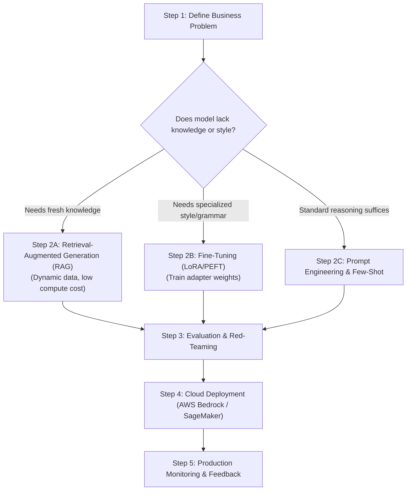

# The GenAI Project Lifecycle on Cloud Platforms

<div className="video-card" style={{border: '1px solid #30363d', borderRadius: '8px', padding: '16px', marginBottom: '24px', background: 'rgba(56, 139, 253, 0.05)'}}>
  <div style={{display: 'flex', gap: '16px', flexWrap: 'wrap', alignItems: 'center'}}>
    <div><strong>Curators:</strong> Krish Naik</div>
    <div><strong>Module:</strong> Module 7: Cloud AI & LoRA Fine-Tuning</div>
    <div><strong>Focus:</strong> Beginner to Production</div>
  </div>
</div>

## 🎯 What You'll Learn
- Master the 5 stages of the Generative AI Project Lifecycle on enterprise cloud platforms.
- Make informed architectural decisions between Prompt Engineering, RAG, and Fine-Tuning.
- Understand security, IAM roles, and compliance requirements in cloud AI.

---

## 💡 Concept & Architecture

Building enterprise GenAI applications on the cloud requires a structured engineering lifecycle:
1. **Define the Use Case & Scope:** Clarify whether the task requires open-ended creativity, factual lookup, or strict structured extraction.
2. **Select the Base Model:** Choose between proprietary foundation models (Claude 3.5 Sonnet, GPT-4o) and open-weight models (Llama 3, Gemma 2).
3. **Adaptation Strategy Decision:**
   - *Can this be solved with prompt engineering and few-shot examples?* (Fastest, cheapest).
   - *Does the model need dynamic enterprise knowledge?* -> Use **RAG**.
   - *Does the model need to learn a specialized domain style, vocabulary, or output format?* -> Use **Fine-Tuning (PEFT/LoRA)**.
4. **Evaluation & Safety Benchmarking:** Run offline evals and red-teaming.
5. **Deployment & Monitoring:** Deploy to managed serverless endpoints with auto-scaling and observability.

### System Architecture & Data Flow



---

## 💻 Step-by-Step Code Walkthrough

Below is the complete implementation broken down into digestible parts so you can understand every line.

### Part 1: Step 1: Architectural Decision Matrix in Python

```python
def recommend_adaptation_strategy(needs_fresh_data: bool, needs_custom_style: bool, budget_high: bool) -> str:
    """Determine the recommended adaptation approach based on project constraints."""
    if needs_fresh_data and not needs_custom_style:
        return "RAG (Retrieval-Augmented Generation): Grounds model in dynamic data with zero training cost."
    elif needs_custom_style and not needs_fresh_data:
        return "LoRA Fine-Tuning: Adapts weights to master domain vocabulary, syntax, or tone."
    elif needs_fresh_data and needs_custom_style:
        return "Hybrid RAG + Fine-Tuning: Fine-tune model for style/format, use RAG for live data injection."
    else:
        return "Prompt Engineering: Solve via in-context learning, system prompts, and few-shot examples."

print("Strategy for internal company FAQ bot:")
print(recommend_adaptation_strategy(needs_fresh_data=True, needs_custom_style=False, budget_high=False))

print("\nStrategy for SQL generation in custom proprietary dialect:")
print(recommend_adaptation_strategy(needs_fresh_data=False, needs_custom_style=True, budget_high=True))
```

#### 🔍 In-Depth Explanation:
This decision logic guides cloud architecture design, preventing teams from spending thousands on fine-tuning when RAG or prompt engineering is sufficient.

---

## ⚠️ Beginner Tips & Best Practices

:::tip Start with Prompt Engineering First
Always start with prompt engineering. If that fails, implement RAG. Only invest in fine-tuning if both prompt engineering and RAG fail to achieve the required style or latency.
:::

:::warning Fine-Tuning Does Not Fix Knowledge Cutoff
Never use fine-tuning to teach an LLM new factual documents (like company policies). Fine-tuned weights suffer from hallucinations. Always use RAG for factual knowledge retrieval.
:::

---

## 📝 Key Takeaways & Summary

- The cloud GenAI lifecycle guides projects from scoping to production monitoring.
- RAG provides dynamic factual knowledge; Fine-Tuning provides specialized style and grammar.
- Cost and latency constraints dictate model selection and adaptation paths.

