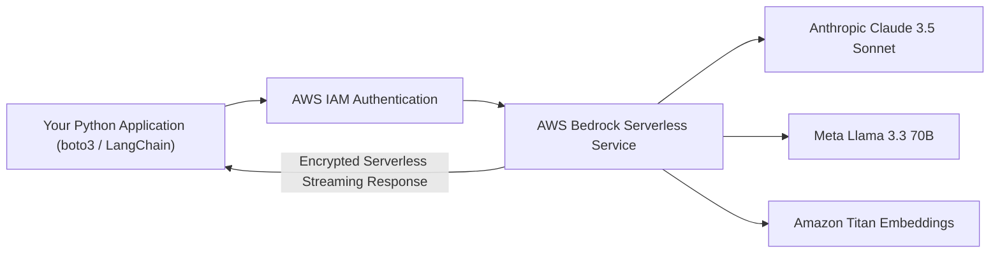

# Getting Started with AWS Bedrock: Foundation Models & API Invocation

<div className="video-card" style={{border: '1px solid #30363d', borderRadius: '8px', padding: '16px', marginBottom: '24px', background: 'rgba(56, 139, 253, 0.05)'}}>
  <div style={{display: 'flex', gap: '16px', flexWrap: 'wrap', alignItems: 'center'}}>
    <div><strong>Curators:</strong> Krish Naik</div>
    <div><strong>Module:</strong> Module 7: Cloud AI & LoRA Fine-Tuning</div>
    <div><strong>Focus:</strong> Beginner to Production</div>
  </div>
</div>

## 🎯 What You'll Learn
- Understand AWS Bedrock: a fully managed serverless foundation model service.
- Configure IAM credentials and invoke foundation models using `boto3`.
- Integrate AWS Bedrock models with LangChain via `ChatBedrock`.

---

## 💡 Concept & Architecture

Managing GPU compute clusters (EC2 instances with Nvidia H100s) is expensive, complex, and requires managing drivers, CUDA versions, and auto-scaling groups.

**AWS Bedrock** provides a **serverless, fully managed API** for foundation models:
- Zero infrastructure to manage or patch.
- Single unified API to access leading models from multiple AI vendors: Anthropic (Claude 3.5 Sonnet), Meta (Llama 3.3), Mistral AI, and Amazon Titan.
- Native integration with AWS security, VPC private endpoints, and IAM role permissions.

### System Architecture & Data Flow



---

## 💻 Step-by-Step Code Walkthrough

Below is the complete implementation broken down into digestible parts so you can understand every line.

### Part 1: Step 1: Installing AWS Bedrock SDK and Client Packages

```python
pip install boto3 langchain-aws
```

#### 🔍 In-Depth Explanation:
Installs the official AWS SDK (`boto3`) and the LangChain AWS partner package (`langchain-aws`).

### Part 2: Step 2: Invoking Claude via AWS Bedrock with LangChain

```python
import boto3
from langchain_aws import ChatBedrock
from langchain_core.prompts import ChatPromptTemplate
from langchain_core.output_parsers import StrOutputParser

# 1. Initialize AWS Bedrock client using standard AWS credentials (~/.aws/credentials)
bedrock_client = boto3.client(
    service_name="bedrock-runtime",
    region_name="us-east-1"
)

# 2. Configure ChatBedrock wrapper
bedrock_llm = ChatBedrock(
    client=bedrock_client,
    model_id="anthropic.claude-3-5-sonnet-20240620-v1:0",
    model_kwargs={"temperature": 0.1, "max_tokens": 500}
)

# 3. Assemble LCEL chain
prompt = ChatPromptTemplate.from_template("Summarize the business benefits of AWS Bedrock for: {target_audience}")
chain = prompt | bedrock_llm | StrOutputParser()

# Blueprint demonstration of Bedrock invocation
print("AWS Bedrock ChatBedrock client initialized successfully in region us-east-1.")
# response = chain.invoke({"target_audience": "CTOs and Enterprise Architects"})
```

#### 🔍 In-Depth Explanation:
Because `ChatBedrock` inherits from `BaseChatModel`, it integrates directly into any existing LangChain LCEL pipeline with standard `.invoke()` and `.stream()` methods.

---

## ⚠️ Beginner Tips & Best Practices

:::tip Request Model Access in AWS Console First
By default, foundation models in AWS Bedrock are locked. You must visit the AWS Bedrock Console > Model Access page and check the boxes for Anthropic and Meta models to activate them.
:::

:::warning Use Bedrock Guardrails for Enterprise Compliance
AWS Bedrock allows attaching native Guardrails directly in the AWS console, blocking PII and toxic content before calls even reach your application code.
:::

---

## 📝 Key Takeaways & Summary

- AWS Bedrock provides serverless API access to top foundation models without GPU management.
- Supported models include Anthropic Claude, Meta Llama, and Amazon Titan.
- `ChatBedrock` connects AWS models seamlessly to LangChain workflows.

