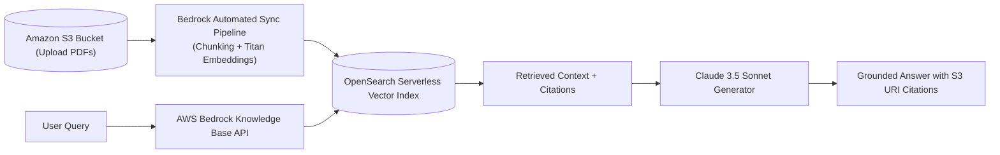

# Building Advanced RAG with AWS Bedrock Knowledge Bases

<div className="video-card" style={{border: '1px solid #30363d', borderRadius: '8px', padding: '16px', marginBottom: '24px', background: 'rgba(56, 139, 253, 0.05)'}}>
  <div style={{display: 'flex', gap: '16px', flexWrap: 'wrap', alignItems: 'center'}}>
    <div><strong>Curators:</strong> Krish Naik</div>
    <div><strong>Module:</strong> Module 7: Cloud AI & LoRA Fine-Tuning</div>
    <div><strong>Focus:</strong> Beginner to Production</div>
  </div>
</div>

## 🎯 What You'll Learn
- Understand AWS Bedrock Knowledge Bases: fully managed ingestion, chunking, and retrieval.
- Connect S3 document buckets to Amazon OpenSearch Serverless vector indices.
- Query Knowledge Bases using `RetrieveAndGenerate` APIs.

---

## 💡 Concept & Architecture

Building a self-hosted RAG system requires orchestrating document parsers, chunking scripts, vector database clusters, and embedding endpoints.

**AWS Bedrock Knowledge Bases** provides a **100% managed RAG service**:
1. You upload documents (PDFs, Markdown, Word) to an **Amazon S3** bucket.
2. Click **Sync**: Bedrock automatically chunks the documents, computes embeddings with Amazon Titan, and indexes them into **Amazon OpenSearch Serverless**.
3. Call the `RetrieveAndGenerate` API: Bedrock handles hybrid search, citation linking, and model generation automatically!

### System Architecture & Data Flow



---

## 💻 Step-by-Step Code Walkthrough

Below is the complete implementation broken down into digestible parts so you can understand every line.

### Part 1: Step 1: Querying AWS Bedrock Knowledge Bases via boto3

```python
import boto3

# Initialize Bedrock Agent Runtime client for Knowledge Bases
bedrock_agent_runtime = boto3.client(
    service_name="bedrock-agent-runtime",
    region_name="us-east-1"
)

def query_bedrock_knowledge_base(knowledge_base_id: str, query: str):
    """Execute managed RAG using Bedrock RetrieveAndGenerate API."""
    # API invocation blueprint
    # response = bedrock_agent_runtime.retrieve_and_generate(
    #     input={'text': query},
    #     retrieveAndGenerateConfiguration={
    #         'type': 'KNOWLEDGE_BASE',
    #         'knowledgeBaseConfiguration': {
    #             'knowledgeBaseId': knowledge_base_id,
    #             'modelArn': 'arn:aws:bedrock:us-east-1::foundation-model/anthropic.claude-3-5-sonnet-20240620-v1:0'
    #         }
    #     }
    # )
    # return response['output']['text']
    print(f"Knowledge Base {knowledge_base_id} configured for query: '{query}'")

query_bedrock_knowledge_base("KB-ABC123XYZ", "What is our enterprise data retention policy?")
```

#### 🔍 In-Depth Explanation:
The `retrieve_and_generate` API executes both vector search and answer generation in a single managed call, returning grounded answers with citations.

---

## ⚠️ Beginner Tips & Best Practices

:::tip Leverage Built-In Metadata Filtering
AWS Bedrock Knowledge Bases support metadata filtering attributes. Attach metadata JSON files alongside your S3 PDFs to enable filtering by department or date.
:::

:::warning OpenSearch Serverless Minimum OCU Pricing
Amazon OpenSearch Serverless maintains a minimum baseline of OpenSearch Compute Units (OCUs), costing ~$350/month. For small hobby projects, local Chroma or Pinecone serverless is more economical.
:::

---

## 📝 Key Takeaways & Summary

- Bedrock Knowledge Bases provide a turnkey, fully managed enterprise RAG solution.
- Documents stored in Amazon S3 are automatically chunked and indexed into OpenSearch.
- `RetrieveAndGenerate` delivers grounded answers with verifiable S3 citations.

