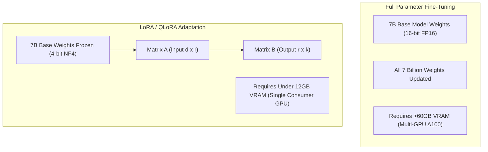

# 📹 Road To Learn Finetuning LLM With Custom Data-Quantization,LoRA,QLoRA Indepth Intuition

<div className="video-card" style={{border: '1px solid #30363d', borderRadius: '8px', padding: '16px', marginBottom: '24px', background: 'rgba(56, 139, 253, 0.05)'}}>
  <div style={{display: 'flex', gap: '16px', flexWrap: 'wrap'}}>
    <div><strong>Instructor:</strong> Krish Naik</div>
    <div><strong>Duration:</strong> 1975</div>
    <div><strong>Course:</strong> Module 7: Cloud AI & LoRA Fine-Tuning</div>
    <div><strong>Watch Link:</strong> <a href="https://www.youtube.com/watch?v=6S59Y0ckTm4" target="_blank" rel="noopener noreferrer">YouTube Lecture ↗</a></div>
  </div>
</div>

## 📌 Executive Summary

Full fine-tuning of modern foundation models requires updating billions of 16-bit parameters, demanding clusters of enterprise GPUs with hundreds of gigabytes of VRAM. Parameter-Efficient Fine-Tuning (PEFT) with LoRA and QLoRA fundamentally alters this equation by freezing base weights and training low-rank adapter matrices.

This lesson explores weight representation, quantization math (FP32 to INT8/INT4), and the architectural principles of LoRA and QLoRA.

---

## 🏗️ System Architecture & Execution Flow



---

## 📖 Core Concepts & Technical Deep Dive

### 1. The VRAM Problem in Full Fine-Tuning
Training requires storing four components in GPU VRAM:
1. Model weights ($2 	imes \Phi$ bytes in FP16).
2. Gradients ($2 	imes \Phi$ bytes).
3. Optimizer states (Adam stores 2 states per parameter in FP32 = $8 	imes \Phi$ bytes).
4. Activations & temporary memory.
For an 8B model, full training requires > 80 GB VRAM, necessitating enterprise A100/H100 clusters.

### 2. Quantization Principles
Quantization maps continuous high-precision floating-point weights into discrete lower-bit integer representations:
- **FP32 (32-bit):** 1 sign bit, 8 exponent bits, 23 mantissa bits (4 bytes).
- **FP16 / BF16 (16-bit):** 2 bytes per weight.
- **INT8 (8-bit):** 1 byte per weight (50% memory reduction).
- **INT4 (4-bit):** 0.5 bytes per weight (75% memory reduction).

---

## 💻 Production Implementation

```python
def estimate_vram_requirement(param_count_billions: float, precision_bits: int = 16) -> float:
    # Estimate raw weight memory in Gigabytes
    bytes_per_param = precision_bits / 8.0
    weight_memory_gb = (param_count_billions * 1e9 * bytes_per_param) / (1024 ** 3)
    return round(weight_memory_gb, 2)

print("8B Model in FP16:", estimate_vram_requirement(8.0, 16), "GB")
print("8B Model in INT4 (QLoRA):", estimate_vram_requirement(8.0, 4), "GB")
```

---

## ⚙️ Production Gotchas & Best Practices

:::tip QLoRA as the Default Starting Point
Always start fine-tuning experiments with 4-bit QLoRA. It achieves comparable performance to 16-bit full fine-tuning on downstream tasks while running on a single consumer GPU (RTX 3090/4090 or T4 on Google Colab).
:::

:::warning Quantization Discrepancy
Post-Training Quantization (PTQ) can degrade model reasoning on complex mathematics. Always validate quantized base models on your domain task before training LoRA adapters on top.
:::

---

## 📊 Architectural Reference & Comparison

| Method | Base Model Precision | Trainable Parameters | Hardware Requirement | Downstream Quality |
| :--- | :--- | :--- | :--- | :--- |
| **Full Fine-Tuning** | 16-bit FP16 | 100% of weights | 4x - 8x A100 (80GB) | 100% (Baseline) |
| **Standard LoRA** | 16-bit FP16 | 0.1% - 1.0% | 1x A100 (40GB) | 99% of Full |
| **QLoRA** | 4-bit NF4 | 0.1% - 1.0% | 1x RTX 3090 (24GB) or T4 (16GB) | 98.5% of Full |

---

## 📚 Key Takeaways & Enterprise Checklist

- [ ] **Architecture Verification:** Ensure your design addresses latency, decoupled interfaces, and strict data validation contracts.
- [ ] **Deterministic Testing:** Run unit tests and golden dataset evaluations before shipping changes to staging or production.
- [ ] **Security & Observability:** Enforce input/output guardrails, scrub sensitive credentials/PII, and capture distributed traces.
- [ ] **Scalability & Sizing:** Calibrate model parameters, context limits, and compute instance requirements against projected request concurrency.
