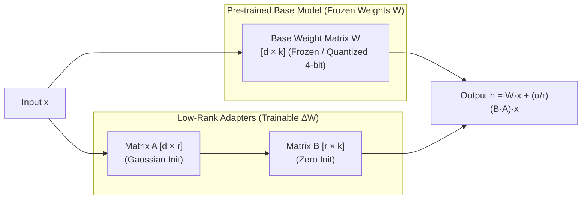

# 📹 Part 1-Road To Learn Finetuning LLM With Custom Data-Quantization,LoRA,QLoRA Indepth Intuition

<div className="video-card" style={{border: '1px solid #30363d', borderRadius: '8px', padding: '16px', marginBottom: '24px', background: 'rgba(56, 139, 253, 0.05)'}}>
  <div style={{display: 'flex', gap: '16px', flexWrap: 'wrap'}}>
    <div><strong>Instructor:</strong> Krish Naik (Krish Naik)</div>
    <div><strong>Duration:</strong> 32m 55s</div>
    <div><strong>Playlist:</strong> LLM Fine-Tuning with LoRA & QLoRA (Krish Naik)</div>
    <div><strong>Watch Link:</strong> <a href="https://www.youtube.com/watch?v=6S59Y0ckTm4" target="_blank" rel="noopener noreferrer">YouTube Lecture ↗</a></div>
  </div>
</div>

## 📌 Executive Summary & Learning Objectives

This lecture covers **Part 1-Road To Learn Finetuning LLM With Custom Data-Quantization,LoRA,QLoRA Indepth Intuition**, focusing on production implementations, edge cases, and industry standards:
- Core intuition, architecture, and underlying mechanisms.
- Key differences between theoretical research implementations and scalable enterprise patterns.
- Concrete Python walkthroughs, error recovery, and performance optimization.

---

## 🏗️ Architecture & Conceptual Workflow



---

## 📖 Core Concepts & Technical Deep Dive

### 1. Architectural Foundations
In modern production AI engineering, **Part 1-Road To Learn Finetuning LLM With Custom Data-Quantization,LoRA,QLoRA Indepth Intuition** is essential for ensuring reliability, low latency, and deterministic outcomes. As AI systems evolve from naive prompt-in / completion-out scripts into distributed systems, engineers must handle:
- **State management & consistency:** Ensuring intermediate states and tool invocations are tracked.
- **Error boundaries & recovery:** Graceful degradation when external LLMs or vector stores encounter rate limits or network partitions.
- **Resource utilization & cost efficiency:** Caching common queries and reducing unnecessary foundation model token expenditure.

### 2. Operational Considerations
- **Latency Optimization:** Pre-computing embeddings, utilizing asynchronous non-blocking event loops, and streaming tokens via Server-Sent Events (SSE).
- **Security & Sandboxing:** Validating inputs before ingestion, sanitizing LLM outputs, and isolating tool execution environments.

---

## 💻 Production Implementation Walkthrough

```python
from peft import LoraConfig, get_peft_model, TaskType
from transformers import AutoModelForCausalLM

# 1. LoRA Configuration
lora_config = LoraConfig(
    r=16,                         # Rank dimension
    lora_alpha=32,                # Scaling factor (usually 2 * r)
    target_modules=["q_proj", "v_proj", "k_proj", "o_proj"],
    lora_dropout=0.05,
    bias="none",
    task_type=TaskType.CAUSAL_LM
)

# 2. Load Base Model and Wrap with PEFT Adapter
base_model = AutoModelForCausalLM.from_pretrained("meta-llama/Meta-Llama-3-8B")
model = get_peft_model(base_model, lora_config)

# 3. Inspect Trainable Parameters (<1% of total!)
model.print_trainable_parameters()
```

---

## 💡 Production Best Practices & Tips

:::tip Production Deployment Guideline
When deploying Part 1-Road To Learn Finetuning LLM With Custom Data-Quantization,LoRA,QLoRA Indepth Intuition in enterprise environments, always configure automated retries with exponential backoff and telemetry tracing (such as OpenTelemetry or LangSmith).
:::

:::warning Common Failure Modes
Watch out for state contamination across concurrent requests. Ensure each session or user interaction uses an isolated thread ID or execution context.
:::

---

## 🎯 Key Takeaways & Quick Reference

| Dimension | Production Standard | Pitfall to Avoid |
| :--- | :--- | :--- |
| **Execution** | Async / Non-blocking with timeouts | Synchronous blocking calls in event loops |
| **Data Validation** | Strict Pydantic v2 schemas | Untyped dictionary access |
| **Monitoring** | Distributed tracing & latency percentiles | Relying only on standard console logs |

## ⏱️ Lecture Timeline & Key Topics

| Timestamp | Key Topic / Concept Discussed |
| :--- | :--- |
| **00:00:00** | hello all my name is Kish naak and... |
| **00:07:52** | obviously for fine tuning if I want to F... |
| **00:15:44** | there this may be getting stored in 32... |
| **00:24:34** | 20.0 if I quantize... |
| **00:32:53** | and all take care bye-bye... |


---

---

## 📜 Complete Lecture Transcript (English)

> **Language:** English | **Source:** `01 - Part 1-Road To Learn Finetuning LLM With Custom Data-Quantization,LoRA,QLoRA Indepth Intuition.en.srt` | **Total Segments:** 17 | **Word Count:** ~5,281 words

<details>
<summary><b>Click to expand full chronological transcript (17 timestamped intervals)</b></summary>

#### ⏱️ [00:00 ➔ 00:02]

hello all my name is Kish naak and welcome to my YouTube channel so guys in one of our previous video i' had already shown you how you can actually fine tune Lama 2 model with the with your own custom data set and uh over there we learned about or we saw code that were related to something called as quantization Laura CLA techniques and all right and all these techniques are super important if you also want to train or fine-tune your own llm models with your own custom data set now when I showed the code right when I executed that particular code many people had actually requested about to explain the theoretical in-depth intuition about it and that is what I'm actually going to do uh the best thing is that when I learned about this theoretical intuition and I'm doing it from past 2 to 3 months it's quite amazing guys you now this is where that machine learning era is probably coming where I used to upload a lot of theoretical in-depth geometrical intuitions regarding various machine learning algorithms similarly here here also in the series of videos in this video we are going to discuss about quantization now what exactly is quantisation we going to discuss about that in the upcoming video we are going to see techniques like Laura CLA every maths intution that is probably involved uh and these all are important for the fine tuning technique right if I probably talk about generative AI one of the most important interview questions will be something related to fine tuning and what is the techniques that is usually used behind right so what all things we are going to cover in this video in this video we going to talk about quantization um specifically when I say quantization it is all about model quantization because if you remember in our Lama 2 code right when we doing the fine tuning here you could see that we had put some parameters right regarding Precision base modeling we had spoken about quanis you know when what when we are downloading the models you know from from a higher bit to a lower bit why we

#### ⏱️ [00:02 ➔ 00:04]

are specifically doing this I will be explaining about that right so with respect to each and every parameters definitely I will explain you the theoretical intuition and later on you just go ahead and see my previous video with respect to all the coding now you everything will make sense okay so what exactly is quation we're going to discuss you know uh we're going to discuss about full Precision half precision and this is something related to data types like how the data is stored in the memory when I specifically say data in llm models I will talk about weights and parameters right because at the end of the day llms are also deep learning neural networks in the form of Transformers or Bird right then we are going to discuss about what exactly is calibration uh this is also called as like calibration in model quantization right we are going to also make sure that we are going to see some problems right how we can actually do calibration then there is different different modes of quation right uh first of all I will explain you the definition then only you'll be able to understand in modes of quation we're going to discuss about two types one is post training Quant and Quant aware training right so these all are very important in terms of fine tuning techniques now let's go ahead and talk about quantization and we will try to see the definition right quantization okay now if you want to really understand understand the meaning of quantisation it is better to write a simple definition for it okay so quantisation basically means conversion from higher memory format to a lower memory format right now I've written a very generic

#### ⏱️ [00:04 ➔ 00:06]

definition what exactly quantization mean it is nothing but conversion from a higher memory format to a lower memory format now when I say higher memory format let's let's consider um any data right and if I probably consider any neural network okay so let's say if I have neural network right and when we train this neural network right all this neural network are interconnected at the end of the day what are the parameters that is probably involved over here it is nothing but weights right we specifically have weights now weights are usually in the form of metrics right let's say that I have a 3 cross3 weight okay I'm just taking as an example in one of the layer I have 3 cross three weights and over here every value right is probably stored in the memory in the form of 32 bits right 32 bits we also say this bits as we also we also denote it as something like something like fp32 what exactly is fp32 so fp32 basically means I can also consider it as see FP full form is not floating Point okay but we are I'm just writing floating Point 32 bits right when I say FP FP basically means it is nothing but full Precision right full Precision or single Precision okay so this is the definition that is given right but in short this is like a floating Point number okay so over here let's say my number is somewhere around 7.23 now this number is stored based on 32 bits in the memory right now understand when you have a very big neural network or you have llm models right as you see different different llm models right parameters keeps on increasing right some may have 70 billion parameters if I probably consider

#### ⏱️ [00:06 ➔ 00:08]

llama 2 with 70 billion parameters that basically means it has 70 billion parameters in terms of weights and bias okay now it is not possible for me to let's say I want to use this particular model and I want to probably do a some fine tuning with respect to the normal GPU that I have right and let's say I have a very limited Ram in my system let's say the ram I have is somewhere around 32 GB right I cannot directly download the specific model and put it in my me in my Ram itself right let's say or load it in my vram that is available in the GPU because GPU also has some limited Ram right and it is not possible you cannot directly download it obviously it will require h space the other way is that yes I can probably take a cloud space somewhere let's say in AWS I can create my instance I can say hey give me this this much RAM 64GB RAM and I probably want this much GPU and then I will try to load the model over there that you can do it but over there what is basically happening lot of cost is involved right based on the resources the cost is involved right so in this scenario and why the 70 billion parameter is happening why this model has a 7on parameter because every weights or every bias that is available in this you know this may be getting stored in 32 bits so what we can specifically do is that we can convert this 32 bits into as I said over here see conversion from a higher memory format to a lower memory format let's say I I can probably convert this 32 bit into int 8 and then download the model or then use the model right after doing this what will happen within my system I will be able to inference it right obviously for fine tuning if I want to F tune with the new data set I will obviously require GPU but if I consider with respect to inferencing it becomes

#### ⏱️ [00:08 ➔ 00:10]

quite easy because now all my values that are stored in the form of 32 bits it will be stored in the form of 8 Bits so what we are specifically doing over here we are converting from a high memory format to a low memory format and this is what is called as Quant quantisation a very important thing now why quation is important because you will be able to inference it quickly see inferencing basically means what if I have an llm model if I give any input to that I should be able to get any output right I should be able to get response right now when I give any input all the calculation with respect to different different weights will happen right and obviously if I have a bigger GPU this inferencing will quickly happen right but if I have a GPU with less less scores let's say then what will happen this calculation will take time but if I convert my 32 bit to 8 Bits right every weights are basically converted into Ed bits now just imagine the calculation will there be a difference yes it will happen little bit much more quicker so quantization is very much important for inferencing and some of the example that I again probably talk about is that and obviously you may have heard about this it's not like only in llm model we specifically do right in different Compu Vision models in N LP models also where you think that there is a lot of Weights that is involved and all this if I want to quantize it right I can actually do it right now this inferencing let's say I want to use a specific deep learning model in my mobile phone so in my mobile phone if I want to use it right in in a specific app then what I will do I will try to quantize right whatever deep learning model I have created from 32 bits to 8 bit and then I will try to deploy it in my mobile phone or any Edge device any Edge device right it is not possible that you can probably deploy

#### ⏱️ [00:10 ➔ 00:12]

this big model over there right it is not possible so and so many parameters so what we do we basically perform quantisation so I hope you're able to understand over here quantisation is nothing but we are trying to lower down the memory right with respect to any weights that we have like from 32 to probably 6 uh intake or let's say fp6 we can also say fp16 right let's say if I have an fp32 bit that is specifically required to store any information in my memory I can also convert this into FP 16bit this is also quation only right usually all these values are stored in floating point right we specifically say this fp32 bit we say single Precision or full Precision we uh for FB 16bit if I'm trying to convert like this it is basically called as half Precision right so you should be be able to understand all these technical terms right and in short these are nothing but these are floating Point numbers right now similarly in tensorflow also you'll be able to see when we probably work with tensor flow you'll find tf32 bit right the data types the the numbers are stored in this particular format right and it is important okay this all our terminologies that are super important but I hope you got an idea what what is the main aim what is the main motivation out of cont ization is that if I have a bigger model I should be able to quantize it and make it as a smaller model so that I can use it for my faster inferencing purpose both in Mobile phones in Edge devices let's say in even watches smart watches I want to use it over here I can actually do that right now if I talk with respect to llm model also with the help of contag see once we compress this particular model right later on we can also perform fine tuning

#### ⏱️ [00:12 ➔ 00:14]

right fine tuning but here there is one disadvantage when we quantize right when we perform this quation since we are converting from 32 bits to intake let's say as an example there is some loss of information also and because of this there will be some loss of accuracy now how to overcome this we will talk about it there are different different techniques how we can specifically overcome it but I hope you got an example what exactly is quation what is full Precision half Precision half Precision example is something like this now let's talk about what exactly is calibration now calibration basically means how we will be able to convert this 32bit into int 8 like what is the formula what is the mathematical intuition that is specifically required let's go ahead and discuss that so guys now let's go ahead and try to understand how to perform quantisation and this this is super important in terms of mathematical concept that I'm probably going to talk about because with with the help of tensor flow just by writing four lines of code you know I will be able to perform quation but it is important you should know that how you can actually do it manually whenever I talk in terms of what are the types of quation that we have so we have two different types of contag one is symmetric contag and one is called as asymmetric contag now just by showing you an example you will be able to understand what is the exact difference between them okay let's say I have a task and this first task that I am probably going to talk is with respect to symmetric and understand I hope in deep learning you have heard of something called as batch normalization so if you have heard about this batch normalization so batch normalization is a technique of symmetric quantisation right so every time you'll be able to see that whenever we do forward propagation backward propagation between all the layers we

#### ⏱️ [00:14 ➔ 00:16]

apply batch normalization so that all our all our weights are zero centered that is near the zero and the entire distribution of the weights will be centered near zero okay so batch normalization is one technique uh of symmetric quantization so let's go ahead and see one example so this will be my first example over here I will go ahead and write it down and now you'll be able to understand it how symmetric quantisation is basically performed what is Quant you have understood from higher memory format to lower memory format we'll try to convert okay so here we are going to understand the mathematical intution so let's go ahead and talk about one technique which is called as symmetric unsigned unsigned in it unsigned in8 okay quantization so we will see this technique first now here what is our main aim let's say I have a floating Point number okay so let's go ahead and write it down let's say I have a floating Point number between 0 to, now just imagine that these are my weights right whatever Matrix Ms I have my values ranges between 0 to th000 Let's consider in this particular way right and this is let's say these are the weights for my larger model OKAY larger model okay now one very important thing that you really need to understand right when I talk about any larger model let's consider any llm model okay so in llm model you have lot of parameters let's consider this is one kind of llm model now when I say all these weights are there this may be getting stored in 32 bits okay usually uh what will happen guys the weights will not be in this range also okay it will be in the minimalistic range so I will just consider this as some numbers okay so that you don't get confused with respect

#### ⏱️ [00:16 ➔ 00:18]

to these are some numbers I will also not consider llm model over here and let's say this this this numbers are stored in the form of 32 bits okay now my main aim is to convert this into unsigned int 8 that basically means 8bit right so 8bit basically means what 2 to 8 is how much 2 to 8 but when we say U unsigned that basically means my value will be ranging between 0 to 255 so I want to quantise from this values to this value okay what is my aim I want to quantise my range of values between 0 to th000 to 0 to 255 okay this is what is my aim with respect to this okay so this is what is my target now let's see okay so if I probably draw just a real points and the same thing we will do with the weights over there whatever quantization process we have specific Al doing let's say I have values between zero and this is basically th000 okay then what I will do over here I want to convert this into again 0 to 255 okay now let me talk about one very important thing guys whenever we have any let's let's consider this one if we have this single Precision single Precision floating point 32 right if you have this number how this number is stored do you know that the one bit will specifically be used for sign or unsign values right let's say positive or negative if positive is there then this will be plus one if negative is there it will be minus one so all the values are basically saved between 0 to 1 right uh it can be0 or 1 okay then the next eight bits are stored for export component okay 1 2 3 4

#### ⏱️ [00:18 ➔ 00:20]

5 6 7 8 okay so this is for sign these all numbers that you see it is basically stored for exponent this is how it is stored inside the memory and remaining 23 numbers all this 23 bits will basically be saved for manesa this is specifically for the fraction so if I have a number which looks like 7.32 now 7.32 is a number it is a positive number so for my sign bit there will be a positive value let's say one over here then this seven will be probably put up in this 8 Bit And remaining 32 will be put up in this mantisa right so this is how the numbers are basically stored in the memory right if I consider an example with respect to FP 16 right half Precision floating Point 16 bit then you'll be able to see there will be one bit for the sign number there'll be five bits for the exponent we basically say exponent 1 2 3 4 five let's consider this five let's let's draw till here okay so this let's let's let's say that this is five 1 2 3 4 5 Okay so this will be five and remaining remaining 10 bits will be saved with respect to mantisa mantisa so we basically say this as a fraction right anything that comes after the decimal right and this is how you will be able to see it will take this will take less memory this will take High memory right now what is our main aim over here I already have a 32-bit number I need to probably convert this into a range of unsigned inate unsigned int basically means I will not take any negative numbers it will be between 0 to 255 right this is what I really want to do

#### ⏱️ [00:20 ➔ 00:22]

okay now for this what will be the equation and I hope you have heard about something called as minmax scalar I've I've repeated so many times this in my machine learning sections also so any number that is over here how will I be able to convert from this floating point to this unit8 unit inate right unsigned inent right how I will be able to do it now for this let's go ahead and calculate it and what equation is specifically required okay so that basically means over here what we are going to do 0.0 will be converted into a quantise value of zero okay not 0 Z it'll be zero and similarly thousand should be converted to a quantise value of 255 at the end of the day the bits are decreasing so quantization is basically happening but we have to probably come up with a scale factor now what exactly is a scale factor so let me Define a scale over here so here the scale formula will be x max / x mean and then they will be divided by Q Max minus Q mean this Q is nothing but quantization now what is the x max over here 1,000 right so this I will consider as my X this I will consider as my Q right I'm showing you how quation happens in a symmetric distribution symmetric basically means all the data is evenly distributed okay and we really need to convert this based on this itself these are evenly distributed now what is xmax xmax is nothing but 1,000 - 0 then qax qmax basically means 255 - 0 right so if I probably go ahead with this specific division right then what will be the value that I will be having right 1,000 divid by 255 it is nothing but 3.92 so this is nothing but this is called as a scale factor right scale

#### ⏱️ [00:22 ➔ 00:24]

factor so any number that I have over here if I want to convert from this fp32 bit to U in 8 I just need to use the scale along with one formula which is called as round okay so I will apply round with respect to any number let's say if I consider 500 divided by 3.92 or let's let's just consider 250 divide by 3.92 so if I want to see what will happen to 250 right what will be the number in this U inate so I can probably go ahead and divide it it'll be nothing but 250 / by 3.92 so if I go and calculate it it is nothing but 63.7 so if I do the rounding that basically means this will be 64 so in short any number that is over here let's say it is 2 50 over here this will get converted to a quanti value to 64 right so the same thing the code will also be doing and this is for symmetric unsigned inate okay quation if I want a quation some for some other Factor let's let's talk about this okay so let's say um I have another kind of distribution and this is time that it is asymmetric and I want this as u in 8 so if I want to perform this contration so what will happen now in this particular case let's say if I have a values between minus 20.0 to 1,000 okay so these are my floating point now I want to perform quation and convert this into 0 to 255 right now in case of asymmetric what will happen is that in my real number section right this numbers are not symmetrically distributed it may be right skewed it may be left skewed okay

#### ⏱️ [00:24 ➔ 00:26]

so in this scenario you'll be able to see that my values are ranging between - 20 to 1,000 I want to convert this into this now in this scenario if I apply the same formula x max minus x mean so how it will be 1,000 - 20 so minus of - 20 is nothing plus + 20 divid by 255 so if I probably do the calculation then you will be able to see that I will be getting somewhere around 4.0 okay now very important thing that basically means this 20.0 if I quantize it right if I quantize it it will get converted to something like 4.0 oh sorry this this is the my scale factor okay scale factor now if I take any number and try to convert it let's consider minus 20 if I try to convert it by dividing by 4.0 right and if I do the round so what it will become -5 right minus 5 of round this much I will probably get minus 5 right now you can understand that this - 20.0 is getting converted to - 5.0 but you can see over here my distribution starts from 0 to 255 so how can I forcefully make this - 20.0 to 0o all you have to do is that go ahead and add the same number in a positive way so in this case the number that you see this five right this is basically called as 0 point right so there are two important parameters that we specifically talk with respect to quantization one is 0 point for for the above one since we have a symmetrical distribution here the 0 point was Zero only and the scale was 3.92 in this particular case since it asymmetrical distribution here here we have a 0 point as nothing but five but

#### ⏱️ [00:26 ➔ 00:28]

scale is 4.0 so this two parameters we usually require to perform quantization okay and these are some of the examples that I have shown you to just give you an idea like how quantization basically happens and super important in terms of understanding is the simple equations you'll be able to understand how things are basically working right at the end of the day understand quantization is a simple process of converting that high uh full single Precision or full Precision floating Point 32 bits into small bits you know it can be uh unsigned integer 8 it can be signed integer 8 if we say signed integer eight then what will happen it is that it will be ranging betweenus 128 to 127 and based on that you can specifically apply the formula right now let's go go ahead see we had already discussed about these two topics one is this and second one we wanted to discuss about calibration now this squeezing that you could see right from here to here to here here to here we squeezing it right this squeezing process is basically called as calibration whatever process we are basically applying in this quantization process it is nothing but it is called as calibration because we are squeezing those values from higher format to a lower format okay so that is nothing but calibration so we have completed both this thing okay now let's see what are the different modes of quantisation one is called as post training quantisation and quantisation aware training right I will talk about this why it is super important both this technique okay so you'll get an idea about it over here so first of all we will go ahead and say post training quantization so what exactly is posttraining

#### ⏱️ [00:28 ➔ 00:30]

conation here we already have a pre-trained model so we already have a pre-trained model now if I want to use this pre-train model obviously the weights are very high here we apply calibration right when I say calibration that basically means squeezing the value from high format to a lower format right and then after performing this particular calibration we take what kind of data we take that weights data whatever weights data is basically there in this particular preer model and then we convert this into a quantized model okay so once we apply this process then only we'll be able to get the quantise model and then we can use this entire model for any use cases okay for any use cases right this is a simple mechanism with respect to post training quation see understand post trining basically means I already have a pre-train model where my weights are fixed I don't need to change those weights I will just take or download those weights I will take this weights data apply the calibration and then convert this into a quantized model right the second technique that we have written over is quantization aware training okay quantization aware training so let's talk about this quantization aware training this is also called as CU so this is also called as Q8 okay so we can write it as Q8 okay quantization aware technique this is basically called as ptq ptq okay so over here what is the exact difference we'll try to see between this

#### ⏱️ [00:30 ➔ 00:32]

two okay now in quantisation a training what happens see over here what is the problem if I probably perform calibration and if I create a quantise model there is a loss of data and because of this what will happen is that the accuracy will also decrease okay for any use cases but in the case of quantisation aware training okay you'll be able to see that we will be taking our train model whatever train model is there train model is there okay let me just go ahead and write it down train model is there then we perform quantisation again quation is what same the calibration process will apply over there we will probably do all these things okay and then once we do this The Next Step is that we will go ahead and perform fine tuning see we know that we know that with the help of ptq you'll be seeing over here on the top some loss of data and accuracy is there but here with respect to finetuning we will take new training data new training data now once we specifically take new training data we will be fine-tuning this model and then we create a contage model Quant model so with respect to any fine-tuning technique that we will be seeing we don't use post trining quantization we specifically use quantization away training technique so that basically means we are just not losing accuracy or data over here because we are in turn adding more data for the training purpose and through this we will be fine-tuning our data and then we create our quantized models

#### ⏱️ [00:32 ➔ 00:32]

right so this is the basic difference so all the fine-tuning technique that I will probably show you in the future will be of this type that is quantisation aware training so that we do not lose much data accuracy so I hope you got an idea with respect to all these three techniques guys going ahead there are two important techniques that we really need to understand one is claa and one is Laura so this techniques specifically will be also understanding with respect to fine tuning so I hope you got an idea just get to know about all these things guys this is important because someone if someone ask in the interview what exactly it is then you'll be able to understand it very much easily and again explaining all these things will be important if you're really interesting because in generative a what I feel is the most important thing is with respect to the fine tuning things so I hope uh you like this particular video uh this was it for my side I'll see you in the next video have a great day thank you and all take care bye-bye

</details>
