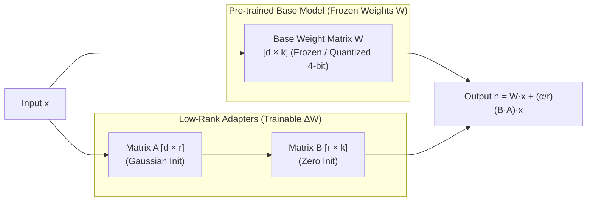

# 📹 Part 2-LoRA,QLoRA Indepth Mathematical Intuition- Finetuning LLM Models

<div className="video-card" style={{border: '1px solid #30363d', borderRadius: '8px', padding: '16px', marginBottom: '24px', background: 'rgba(56, 139, 253, 0.05)'}}>
  <div style={{display: 'flex', gap: '16px', flexWrap: 'wrap'}}>
    <div><strong>Instructor:</strong> Krish Naik (Krish Naik)</div>
    <div><strong>Duration:</strong> 22m 44s</div>
    <div><strong>Playlist:</strong> LLM Fine-Tuning with LoRA & QLoRA (Krish Naik)</div>
    <div><strong>Watch Link:</strong> <a href="https://www.youtube.com/watch?v=l5a_uKnbEr4" target="_blank" rel="noopener noreferrer">YouTube Lecture ↗</a></div>
  </div>
</div>

## 📌 Executive Summary & Learning Objectives

This lecture covers **Part 2-LoRA,QLoRA Indepth Mathematical Intuition- Finetuning LLM Models**, focusing on production implementations, edge cases, and industry standards:
- Core intuition, architecture, and underlying mechanisms.
- Key differences between theoretical research implementations and scalable enterprise patterns.
- Concrete Python walkthroughs, error recovery, and performance optimization.

---

## 🏗️ Architecture & Conceptual Workflow



---

## 📖 Core Concepts & Technical Deep Dive

### 1. Architectural Foundations
In modern production AI engineering, **Part 2-LoRA,QLoRA Indepth Mathematical Intuition- Finetuning LLM Models** is essential for ensuring reliability, low latency, and deterministic outcomes. As AI systems evolve from naive prompt-in / completion-out scripts into distributed systems, engineers must handle:
- **State management & consistency:** Ensuring intermediate states and tool invocations are tracked.
- **Error boundaries & recovery:** Graceful degradation when external LLMs or vector stores encounter rate limits or network partitions.
- **Resource utilization & cost efficiency:** Caching common queries and reducing unnecessary foundation model token expenditure.

### 2. Operational Considerations
- **Latency Optimization:** Pre-computing embeddings, utilizing asynchronous non-blocking event loops, and streaming tokens via Server-Sent Events (SSE).
- **Security & Sandboxing:** Validating inputs before ingestion, sanitizing LLM outputs, and isolating tool execution environments.

---

## 💻 Production Implementation Walkthrough

```python
from peft import LoraConfig, get_peft_model, TaskType
from transformers import AutoModelForCausalLM

# 1. LoRA Configuration
lora_config = LoraConfig(
    r=16,                         # Rank dimension
    lora_alpha=32,                # Scaling factor (usually 2 * r)
    target_modules=["q_proj", "v_proj", "k_proj", "o_proj"],
    lora_dropout=0.05,
    bias="none",
    task_type=TaskType.CAUSAL_LM
)

# 2. Load Base Model and Wrap with PEFT Adapter
base_model = AutoModelForCausalLM.from_pretrained("meta-llama/Meta-Llama-3-8B")
model = get_peft_model(base_model, lora_config)

# 3. Inspect Trainable Parameters (<1% of total!)
model.print_trainable_parameters()
```

---

## 💡 Production Best Practices & Tips

:::tip Production Deployment Guideline
When deploying Part 2-LoRA,QLoRA Indepth Mathematical Intuition- Finetuning LLM Models in enterprise environments, always configure automated retries with exponential backoff and telemetry tracing (such as OpenTelemetry or LangSmith).
:::

:::warning Common Failure Modes
Watch out for state contamination across concurrent requests. Ensure each session or user interaction uses an isolated thread ID or execution context.
:::

---

## 🎯 Key Takeaways & Quick Reference

| Dimension | Production Standard | Pitfall to Avoid |
| :--- | :--- | :--- |
| **Execution** | Async / Non-blocking with timeouts | Synchronous blocking calls in event loops |
| **Data Validation** | Strict Pydantic v2 schemas | Untyped dictionary access |
| **Monitoring** | Distributed tracing & latency percentiles | Relying only on standard console logs |

## ⏱️ Lecture Timeline & Key Topics

| Timestamp | Key Topic / Concept Discussed |
| :--- | :--- |
| **00:00:00** | hello my name is krishak and welcome to... |
| **00:05:44** | called as specific task fine tuning in... |
| **00:11:32** | nothing but 1 cross 3 and this is... |
| **00:17:26** | decomposed Matrix that I have right two... |
| **00:22:42** | you one all take care bye-bye... |


---

---

## 📜 Complete Lecture Transcript (English)

> **Language:** English | **Source:** `02 - Part 2-LoRA,QLoRA Indepth Mathematical Intuition- Finetuning LLM Models.en.srt` | **Total Segments:** 12 | **Word Count:** ~3,907 words

<details>
<summary><b>Click to expand full chronological transcript (12 timestamped intervals)</b></summary>

#### ⏱️ [00:00 ➔ 00:02]

hello my name is krishak and welcome to my YouTube channel so guys we are into the part two of fine-tuning series and in this particular video we're going to discuss about Laura and CLA indepth intuition already in the playlist of fine tuning I've discussed about quation and I hope you have seen the video early many people were requesting for Laura and claa also so let's uh discuss uh and uh we will try to discuss the complete in-depth maths intuition uh the best thing will be that guys I'll try to explain this math in depth intuition uh I've already seen the research paper and there are lot of complicated things that is probably there in the research paper but I will try to teach you in such a way that at least you should be able to understand you know what exactly is Laura what exactly is claa and then we'll also see one example you know how with the help of code you will be able to do it and trust me these are some of the very important things in fine tuning because tomorrow you go in any interviews you are going to get asked respect to this kind of questions that may be coming because at the end of the day any generative AI projects specifically with llm right llm models if you are working in the company they will be giving you fine-tuning task so let me quickly share my screen and show it to you so here already I have uploaded a video uh part one where we have discussed just about quation uh a good 32 minutes video Everything you'll be able to understand it because here I've also used all the mathematical intuitions everything as possible as as much as possible uh to talk about the research paper so what does Laura means Laura basically means low rack adaptation of large language models uh this is this amazing research paper and uh probably you'll be seeing lot of this kind of equations as you go ahead there'll be different different performance metrics

#### ⏱️ [00:02 ➔ 00:04]

but as usual I will do what I'm good at I will try to break down all these things and probably explain you with respect to examples with respect to code and many more things so quickly let's go ahead so why Laura and CLA is basically used Laura basically means low low rank adaptation lower order rank adaptation it is specifically used in fine-tuning of llm models okay so let's go ahead and discuss this and I've created this amazing diagram over here initially whenever whenever you have a pre-trained nlm model that basically means uh let's say that there's a model something like GPT 4 or GPT 4 Turbo right and this model has been created by opening a so we basically see this model as the base model OKAY gp4 turbo and this model is trained with huge amount of data right so the data sources will be internet it can be books it can be multiple sources right at the end of the day all these models how you can measure them they may be saying that hey uh it supports 1.5 million tokens you know it has been trained with this many number of words right so many tokens of words now what will happen is that all these models you know probably to predict the next word it will have the context of all those tokens and then it'll be able to give you the response so these all models are basically base model and we also say this as a pre-train model OKAY some of the examples again I'll be telling you GPT 4 gp4 Turbo right gpt3 GPT 3.5 something so all these models are specifically pre-trained models now further we can take this model and there are various ways of fine tuning it please make sure that you watch this video till the end if you watch this video you will understand everything

#### ⏱️ [00:04 ➔ 00:06]

that is actually required with respect to fine tuning and there are multiple ways of fine tuning also now let's say that I take this model I do some amount of fine tuning okay and this fine tuning is done on all the weights of the specific model right so some of the application that we may generate is like chat GPT you know we may generate like Cloud uh cloudy chat GPT right cloudy GPT itself like the chatbot that we specifically use some of the examples okay so this one way of fine tuning is there where we train all our parameters so here we specifically say full full full parameter training okay so here you can see full parameter fine tuning so here I'm going to write full parameter fine tuning now this is one way of fine tuning where we train our entire parameter based on our data that we have okay and after training it we can develop applications like chat GPT or any custom GPT that you specifically create as we go ahead you can also take these models and perform domain specific fine tuning okay so one type of fine tuning is this the other tune other fine tuning technique that you can specifically use is called as domain specific fine tuning some of the example let's say that I'm fine-tuning a a a chatbot model you know which will be for finance it can be for sales it can be for different different domains itself right so here the main important word is domain so this fine-tuning also we can perform okay again why I'm saying all these things because there are various ways of fine tuning things right one more fine tuning we can basically divide by is something called as specific task fine tuning in case of specific task fine tuning these are my different different task let's say this is Task a b c d this task can be something related to Q&A chatbot this task can be something related to to document q& ad but different different

#### ⏱️ [00:06 ➔ 00:08]

applications so that is the reason why we are specifically saying over here as specific task okay specific task finetuning now perfect now this is good you have seen all the different ways of f tuning okay now let's talk about full parameter F tuning again I'll repeat it this is my base model right now if you use it as an example as I said gp4 turbo GPT 3.5 you know Gemini Gemini 1.4 different different models can be there we can take this base model we can finetune and create applications like chat GPT we can create other other application like stable diffusions you know not specifically to llm but L we can actually do it then we can also further fine-tune this based on domain specific fine tuning right based on different different domains like Finance sales retail we can also take this model and do more specific task F tuning like task a task B task D let's say I want to convert this into text to SQL I want to have this as document Q&A so I can further fine tune it based on specific task now let's talk about this full parameter fine tuning okay and what are the challenges with full parameter fine tuning and that is where see I'm building up the story later on I'll be explaining you where Laura will be used now in full parameter fine tuning the major challenge is that we really need to update all the model weights let's say that I have I have a model which has somewhere around 175 billion parameters that basically means 175 billion weights now in this particular case whenever I fine tune this model I need to update all the weights great now when I'm saying updating all the model weights and when we talk about this many number of parameters white can be a challenge because there will be Hardware resource constraint right so with respect to different different task if I really want to use this particular model that

#### ⏱️ [00:08 ➔ 00:10]

much RAM I really require for inferencing purpose that much GPU I really require right so for Downstream task it becomes very difficult now what is Downstream task Downstream task some of the example is like model monitoring right model monitoring the other task can be like uh model inferencing right model inference ing similarly the GPU constraint that we may have the ram constraint that we may have so we may face multiple challenges when we have this full parameter tuning full parameter fine tuning now in order to overcome this challenge we will specifically use Laura and clora okay what exactly is Laura as I said low order rank adaptation and clora is something it is also called as la 2.0 so we'll discuss about both of them with respect to mathematical intuition and you'll get a complete idea what I'm actually trying to say now what does Laura do okay now let's read the first point and this is very much important because in the research paper you will find this equation okay this equation now what exactly Laura will do Laura says that instead of updating all the weights in full parameter fine tuning right instead of updating all the weights it will not update them instead it will track the changes it will track the changes now what changes this is basically tracking it will track the changes of the new weights based on finetuning okay this is very much important to understand so uh based on the new weights how we are going to combine this weights with the pre-trained weights okay so here you can see these are my pre-trained weights from the base model like let's say that uh this model is llama 2 now if you're

#### ⏱️ [00:10 ➔ 00:12]

performing fine tuning using Laura then Laura will track the new weights over here which will be of the same size okay so let's say if this weight is 3 cross 3 then the new weights when it is probably doing the forward and the backward propagation those new weights will be tracked in a separate Matrix and then this two weights will be combined wherein we will get the fine tune weights now this way what will happen is that this tracking will happen in a separate way but still you may be thinking Kish here also we are updating all the weights itself right so here also the resource constraint will definitely happen yeah fine I'm talking about 3 cross 3 but what about uh weights and parameters where there are 175 billion right 175 billion parameters or 7 billion parameters that time I'll be having a huge metrix right so at that scenario you need to Now understand how Laura works because this weights how it is getting tracked it will just not get tracked in this 3 cross3 Matrix instead all these weights that is getting tracked there a simple mathematical equation will happen uh I'll not say mathematical equation will happen but there will be a technique that will happen which is called as metrix decomposition that basically means the same 3 cross3 Matrix is saved it in a two smaller mat Matrix now in this two smaller Matrix you can see this is nothing but 1 cross 3 and this is nothing but 3 cross 1 right sorry this is 3 CR 1 and this is 1 CR 3 right so this is 3 CR 1 and this is 1 cross 3 when we multiply both these weights then I will be getting this weight only right so over here if I consider I have some around nine weights 4 5 6 7 8 9 right you'll be be able to see that I will be

#### ⏱️ [00:12 ➔ 00:14]

able to get all these nine weights from how many number of parameters just six parameters right because when we multiply this then you'll be able to see that I'll get all these nine parameters or nine weights that I have right so in short what Laura is doing is that it is performing this Matrix decomposition where a big Matrix and this Matrix can be of any size is decomposed into two smaller Matrix based based on a parameter which is called as rank how to calculate a rank of a metrix you can definitely check out any YouTube channel it is a simple algebraic equations based on transpose of a metrix how we calculate the rank but let's say that this Matrix that I have which is a 3 cross one over here the rank of this particular Matrix is one right and if I use this two matric you can obviously see that the number of parameters that I'm storing over here is less when compared to this right yes there will be a loss in Precision but it is making sure that when we combine both this metrics we'll be able to get the entire updated weights and just imagine start thinking guys let's say that if I have 7 billion parameters now I'm trying to perform fine-tuning on those parameters so whenever I track those weights this huge metrix will be decomposed into two smaller Matrix and when we are decomposing this this metrix this updated track weights metrix into two smaller metrix obviously we'll be requiring less parameter to store all these values right and this way your fine-tuning becomes very much efficient and this really solves the resource constraint right this is the most important thing right and so in any research paper that you go ahead you'll be seeing this equation w0 this is my pre-trained weights Plus the track changed weights is nothing but my

#### ⏱️ [00:14 ➔ 00:16]

pre-trained weights plus b multiplied by a what is b b is this a is this so when we multiply this you'll be able to see that we are able to get the all the track change weights right and obviously this requires less parameter if you are decomposing our bigger Matrix into two smaller Matrix less parameters is required now what will happen if we keep on increasing the ranks if we keep on increasing the ranks this parameters will also keep on increasing but it will always be less than this right if I have 7 billion parameters if I try to decompose that into two two matrices two small matrices with increasing rank then also the parameters that will be required will be less how I am saying this because in the research paper also they have tried with multiple trainable parameters now let's see over here there are multiple techniques of fine tuning some of the techniques that are there is something called as prefix embed prefix layer adapter adapter is one very famous thing that is probably used before Laura right you can see as the rank is increasing the parameters also increases right initially the trainable parameters are 175 billion but when I use techniques like adapter right so initially it will have 7.5 7.1 million parameters with rank is equal to one but as I keep on increasing the rank as I keep on increasing the rank you'll be able to see that this parameters also get increased but you can see from 175 billion parameter if I compare 7.1 million weights the percentage is very less now similarly in Laura because of that uh metrix decomposition you'll be able to see that as I keep on increasing my ranks so these are my ranks with respect to Q KV because in transer you have this three parameter qkv there only all the matrix multiplication will happen with respect to this three parameters and then we as we keep on increasing the rank here you can see four here you can see 8 here you can see

#### ⏱️ [00:16 ➔ 00:18]

64 then you'll be able to see initially we got 4.7 million parameters compare from 175 billion to 4.7 million how this was possible because of the because of the metric decomposition because of the metrix decomposition right and as we keep on increasing the rank you'll be seeing that the parameters are increasing right the parameters are obviously increasing but if I compare it with 175 billion parameter this is very less 9.4 million if you just see the percentage right so here also uh when rank is equal to 8 37.7 million then rank is equal to 6430 1.9 million right parameters are there so still it is making sure that the parameter is not that much like like not not like 175 billion or not near to this if I talk with respect to percentage it is very very less I've also made another table right just to show show you if I have different different models number of trainable parameter number of trainable parameter here you can see I have one llm model with 7 billion if I use rank is equal to 1 then I will be having 167k parameters to fine tune fine tune weights based on fine tune weights then and this 17 67k parameter basically means what this decomposed Matrix that I have right two Matrix that many number of parameters so in the first case it is just nothing but 7 167k parameters that is the available in this decomposed Matrix okay when we combine them then we will be able to get how many 7 billion parameters if we combine both this metrix then we'll be getting uh 7 billion parameters okay then similarly you can see in 13 billion then you have 228k parameters in 70 billion you have 529k parameters in 180 billion you have 849k parameters so as you keep on increasing the weight this parameters

#### ⏱️ [00:18 ➔ 00:20]

will keep on increasing but it is not increasing with that huge amount right even you can see when we keep the rank as 52 right so here you can see 86 million parameters is there when compared to billions right uh Microsoft uh you know it came up with this Laura technique uh in one of the research paper and it has used rank is equal to 8 okay to probably do the finding and it has performed absolutely well so most of the time we select this particular value but at the end of the day how to select this right it won't matter you know because the parameters are increasing by very less number over here as we go ahead so usually you can select rank one 2 8 while you're performing fine tuning now there may be also scenario that when should we use very high rank when to use high rank when to use high rank this answer because in the interview they may ask you if the model wants to learn complex things complex things then you can specifically use high rank right let's say some of the model is not trained to probably uh interact or probably uh perform some of the behavior at that point of time those complex things can be handled when you are probably increasing the number of ranks okay so this can be a very simple question that may be asked in the interview but I hope you got a complete idea at the end of the day this is the equation that you'll be able to see in most of the research paper uh what Laura is doing is that nothing very simple all the track weights is decomposed into two smaller matrixes with different different ranks it can be different different ranks when you're fine tuning the first thing is that you really need to set that rank okay if you set that rank like in this particular case if I probably see if I go ahead and calculate with all the mathematical stuff I will be able to get the rank is equal to one okay uh for this also rank is equal to one right so similarly if you have rank two so one of the Matrix can be something like this so decomposed Matrix so this is based on

#### ⏱️ [00:20 ➔ 00:22]

rank two okay so if I probably combine this right so how many 1 2 3 4 5 6 7 8 9 10 11 12 right if I multiply this I'll be getting a metrix uh of much more parameters right but at the end of the day for in this particular case it is less number of parameters right so this is what Laura is all about and because of this technique the fine tuning is done less the the weights the parameters becomes less so this is how the main resource constraint is done and uh with respect to all the downstream task it becomes very much easy now one more thing that I really want to talk about is clora okay chora chora basically means quantized quantized Laura okay now you have already learned from the first video what is quantied quantied basically means now in clora case what will happen is that all these parameters that is probably stored in float float 16bit okay we will try to convert this into 4bit that's it okay once we do this you'll be able to see that we reduce the Precision and then we try to reduce this values also by this you won't require much more memory so that is the reason we say quantized Laura technique okay and the best thing about is this is that U clora also has one amazing algorithm which will be able to take care of both this part let's say if there is a float 16bit I quantize it 4 bit I can also convert this back into 16 bit okay so with respect to this explanation guys I've already spoken about many things over here Laura and CLA uh just to show you an example so here is one example uh I've already shown you this fine tuning using Google Gamma model let me talk about quantisation quation over here is basically done by bits and bytes config so here it says load in 4bit true that basically means we going to convert that entire model of 16bit to 4bit quantisation technique te that we are going to use is something called as nh4

#### ⏱️ [00:22 ➔ 00:22]

and all the further fine tuning is basically done in V float 16 okay um now there is also one more thing right see Laura configuration here we have selecting the first rank value eight and then Target modules where we need to apply this particular decomposition and the task type casual LM once you do this and just execute everything you'll be able to see it right and that is how the entire quation and the Laura happens uh you can obvious ly check this entire projects I've already done it in my previous videoos so you can check it out you can go ahead and execute it now I think everything makes sense with respect to the fine tuning so yes this was it for my side I hope you like this particular video I will see you all in the next video have a great day thank you one all take care bye-bye

</details>
