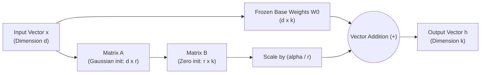

# 📹 LoRA,QLoRA Indepth Mathematical Intuition- Finetuning LLM Models

<div className="video-card" style={{border: '1px solid #30363d', borderRadius: '8px', padding: '16px', marginBottom: '24px', background: 'rgba(56, 139, 253, 0.05)'}}>
  <div style={{display: 'flex', gap: '16px', flexWrap: 'wrap'}}>
    <div><strong>Instructor:</strong> Krish Naik</div>
    <div><strong>Duration:</strong> 1364</div>
    <div><strong>Course:</strong> Module 7: Cloud AI & LoRA Fine-Tuning</div>
    <div><strong>Watch Link:</strong> <a href="https://www.youtube.com/watch?v=l5a_uKnbEr4" target="_blank" rel="noopener noreferrer">YouTube Lecture ↗</a></div>
  </div>
</div>

## 📌 Executive Summary

LoRA (Low-Rank Adaptation) operates on the fundamental mathematical hypothesis of intrinsic rank: weight updates during adaptation have a very low intrinsic dimension. By decomposing large weight update matrices into two low-rank matrices, LoRA dramatically slashes trainable parameters and memory footprint.

This lesson explores the linear algebra and mathematical formulation of LoRA: rank selection, scaling factor alpha, NormalFloat4 (NF4), and double quantization.

---

## 🏗️ System Architecture & Execution Flow



---

## 📖 Core Concepts & Technical Deep Dive

### 1. The Mathematical Linear Algebra of LoRA
For a pre-trained weight matrix `W_0` (dimension `d x k`), full fine-tuning modifies weights via $W = W_0 + \Delta W$.
LoRA decomposes the update matrix $\Delta W$ into the product of two low-rank matrices:
`delta_W = B * A`, where `B` has shape `(d, r)` and `A` has shape `(r, k)` with `r << min(d, k)`
- During forward pass: `h = W_0 * x + (alpha / r) * B * A * x`.
- **Initialization:** $A$ is initialized with random Gaussian distribution $Gaussian distribution (mean 0, variance sigma^2)$, and $B$ is initialized to $0$. Thus, $\Delta W = 0$ at the start of training, preserving pre-trained behavior.

### 2. The Innovations of QLoRA
1. **NF4 (NormalFloat 4):** An information-theoretically optimal quantile quantization data type for normally distributed weights.
2. **Double Quantization (DQ):** Quantizes the quantization constants themselves, saving 0.37 bits per parameter (~3GB for a 65B model).
3. **Paged Optimizers:** Uses CUDA Unified Memory to automatically page optimizer states between GPU and CPU RAM during memory spikes.

---

## 💻 Production Implementation

```python
from peft import LoraConfig

# Standard Enterprise LoRA Configuration
peft_config = LoraConfig(
    r=16,                         # Rank: intrinsic dimension
    lora_alpha=32,                # Scaling factor: typically 2x rank
    target_modules=[              # Apply to all linear attention projections
        "q_proj", "k_proj", "v_proj", "o_proj",
        "gate_proj", "up_proj", "down_proj"
    ],
    lora_dropout=0.05,
    bias="none",
    task_type="CAUSAL_LM"
)

print(f"LoRA Configured: Rank={peft_config.r}, Alpha={peft_config.lora_alpha}, Scaling={peft_config.lora_alpha / peft_config.r}")
```

---

## ⚙️ Production Gotchas & Best Practices

:::tip Target All Linear Modules
Original LoRA only adapted query and value matrices (`q_proj`, `v_proj`). Modern research demonstrates that applying LoRA to all linear layers (including MLP projection matrices) with lower rank (`r=8` or `r=16`) yields superior accuracy.
:::

:::warning Alpha / Rank Scaling Rule
Keep the ratio `alpha / r = 2.0` consistent when tuning rank. If you double `r` from 16 to 32, double `alpha` from 32 to 64 to maintain learning rate gradient dynamics.
:::

---

## 📊 Architectural Reference & Comparison

| LoRA Parameter | Mathematical Symbol | Typical Values | Impact on Training |
| :--- | :--- | :--- | :--- |
| **Rank** | $r$ | 8, 16, 32, 64 | Capacity of the adapter; higher rank learns more complex behaviors |
| **Alpha** | $lpha$ | 16, 32, 64 | Scaling constant for weight delta $\Delta W$; stabilizes gradient descent |
| **Target Modules** | - | All projection layers | Scope of adaptation; all linear layers recommended |
| **Dropout** | - | 0.05 - 0.10 | Regularization to prevent overfitting on small datasets |

---

## 📚 Key Takeaways & Enterprise Checklist

- [ ] **Architecture Verification:** Ensure your design addresses latency, decoupled interfaces, and strict data validation contracts.
- [ ] **Deterministic Testing:** Run unit tests and golden dataset evaluations before shipping changes to staging or production.
- [ ] **Security & Observability:** Enforce input/output guardrails, scrub sensitive credentials/PII, and capture distributed traces.
- [ ] **Scalability & Sizing:** Calibrate model parameters, context limits, and compute instance requirements against projected request concurrency.
