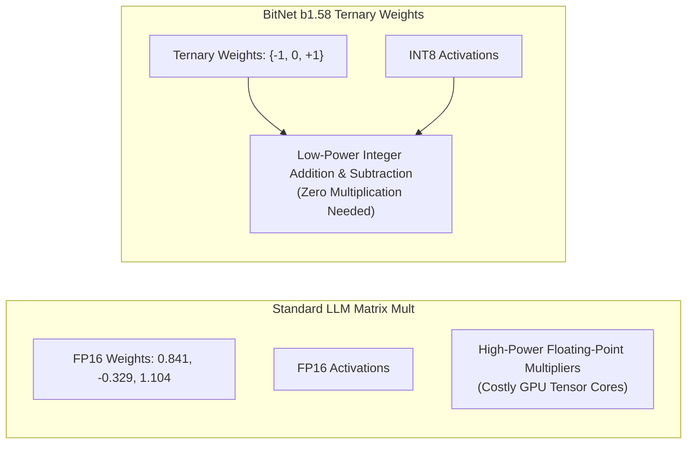

# 📹 The Era of 1-bit LLMs-All Large Language Models are in 1.58 Bits

<div className="video-card" style={{border: '1px solid #30363d', borderRadius: '8px', padding: '16px', marginBottom: '24px', background: 'rgba(56, 139, 253, 0.05)'}}>
  <div style={{display: 'flex', gap: '16px', flexWrap: 'wrap'}}>
    <div><strong>Instructor:</strong> Krish Naik</div>
    <div><strong>Duration:</strong> 1026</div>
    <div><strong>Course:</strong> Module 7: Cloud AI & LoRA Fine-Tuning</div>
    <div><strong>Watch Link:</strong> <a href="https://www.youtube.com/watch?v=wN07Wwtp6LE" target="_blank" rel="noopener noreferrer">YouTube Lecture ↗</a></div>
  </div>
</div>

## 📌 Executive Summary

The frontier of model quantization and extreme efficiency has arrived with 1-bit Large Language Models, pioneered by Microsoft's BitNet b1.58. Every weight in BitNet is ternary: taking values in `{-1, 0, +1}`, replacing expensive floating-point matrix multiplications with simple additions.

This lesson explores the mathematics of ternary weights, BitLinear layers, hardware acceleration implications, and energy efficiency.

---

## 🏗️ System Architecture & Execution Flow



---

## 📖 Core Concepts & Technical Deep Dive

### 1. Why BitNet b1.58?
In standard binary quantization `{-1, +1}`, the model has 1 bit of information per weight. By adding $0$ (making it ternary), the capacity becomes `log2(3) ≈ 1.58` bits per parameter. 
The inclusion of $0$ provides **feature filtering**—enabling the model to explicitly ignore irrelevant tokens or activations.

### 2. Eradicating Matrix Multiplications
Standard matrix multiplication: $Y = W \cdot X = \sum w_i x_i$ requires thousands of floating-point multiply-accumulate (MAC) operations.
In BitNet b1.58:
- If $w_i = +1$: add $x_i$.
- If $w_i = -1$: subtract $x_i$.
- If $w_i = 0$: do nothing.
This converts matrix multiplication into simple integer additions, reducing energy consumption by up to 70x.

---

## 💻 Production Implementation

```python
import torch

def round_clip_ternary(w: torch.Tensor):
    scale = w.abs().mean()
    w_scaled = w / (scale + 1e-8)
    w_quant = torch.clamp(torch.round(w_scaled), min=-1, max=1)
    return w_quant, scale

raw_weights = torch.tensor([1.2, -0.8, 0.05, -1.9, 0.4])
ternary_weights, scale = round_clip_ternary(raw_weights)
print("Raw Weights:    ", raw_weights.numpy())
print("Ternary Weights:", ternary_weights.numpy())
```

---

## ⚙️ Production Gotchas & Best Practices

:::tip Post-Training vs Quantization-Aware Training
1-bit architectures cannot be achieved through simple Post-Training Quantization (PTQ). Models must be trained from scratch (or extensively continued) using Quantization-Aware Training (QAT) with Straight-Through Estimators (STE).
:::

:::warning Hardware Kernel Availability
While the theoretical energy savings are enormous, off-the-shelf GPU CUDA kernels are optimized for FP16 and INT4. Specialized FPGA or ASIC accelerators (or custom Triton kernels) are required to unlock maximum speedups.
:::

---

## 📊 Architectural Reference & Comparison

| Architecture | Bits per Weight | Hardware Operation | Memory Footprint (7B Model) | Energy Efficiency |
| :--- | :--- | :--- | :--- | :--- |
| **Standard FP16** | 16 bits | Floating-point MAC | ~14.0 GB | 1x (Baseline) |
| **INT4 (GPTQ/AWQ)**| 4 bits | INT4 x FP16 dequantization | ~3.5 GB | 3.5x |
| **BitNet b1.58** | 1.58 bits (Ternary) | Integer Addition / Subtraction | ~1.4 GB | Up to 70x |

---

## 📚 Key Takeaways & Enterprise Checklist

- [ ] **Architecture Verification:** Ensure your design addresses latency, decoupled interfaces, and strict data validation contracts.
- [ ] **Deterministic Testing:** Run unit tests and golden dataset evaluations before shipping changes to staging or production.
- [ ] **Security & Observability:** Enforce input/output guardrails, scrub sensitive credentials/PII, and capture distributed traces.
- [ ] **Scalability & Sizing:** Calibrate model parameters, context limits, and compute instance requirements against projected request concurrency.
