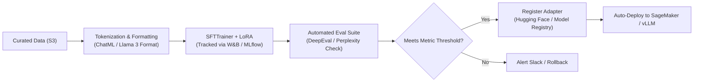

# 📹 Simplify LLMOps & Build LLM Pipeline in Minutes

<div className="video-card" style={{border: '1px solid #30363d', borderRadius: '8px', padding: '16px', marginBottom: '24px', background: 'rgba(56, 139, 253, 0.05)'}}>
  <div style={{display: 'flex', gap: '16px', flexWrap: 'wrap'}}>
    <div><strong>Instructor:</strong> Krish Naik</div>
    <div><strong>Duration:</strong> 1333</div>
    <div><strong>Course:</strong> Module 7: Cloud AI & LoRA Fine-Tuning</div>
    <div><strong>Watch Link:</strong> <a href="https://www.youtube.com/watch?v=4ijnajzwor8" target="_blank" rel="noopener noreferrer">YouTube Lecture ↗</a></div>
  </div>
</div>

## 📌 Executive Summary

Production fine-tuning is not a one-off script run in a notebook; it is a continuous LLMOps engineering pipeline: automated data formatting, model training, metric evaluation, model registry versioning, and endpoint deployment.

This lesson explores how to build automated end-to-end LLMOps pipelines using Hugging Face, MLflow, Weights & Biases (W&B), and automated CI/CD deployment triggers.

---

## 🏗️ System Architecture & Execution Flow



---

## 📖 Core Concepts & Technical Deep Dive

### 1. The Core LLMOps Pipeline Stages
1. **Data Ingestion & Formatting:** Converting raw domain interactions into chat-templated datasets (e.g. ShareGPT or ChatML format) with token length filtering.
2. **Experiment Tracking:** Logging loss curves, learning rates, GPU temperatures, and memory utilization using MLflow or W&B.
3. **Automated Evaluation Gate:** Testing the fine-tuned adapter against the frozen golden dataset; blocking deployment if regression occurs.
4. **Adapter Merging & Artifact Export:** Merging LoRA weights back into the base model (if zero-latency deployment is required) or exporting standalone LoRA adapter artifacts.

---

## 💻 Production Implementation

```python
from transformers import TrainingArguments

# LLMOps Training Arguments with Automated Experiment Logging
training_args = TrainingArguments(
    output_dir="./lora_checkpoints",
    per_device_train_batch_size=4,
    gradient_accumulation_steps=4,
    learning_rate=2e-4,
    logging_steps=10,
    num_train_epochs=3,
    optim="paged_adamw_8bit",
    fp16=True,
    report_to=["mlflow"],
    run_name="llama3-lora-customer-support-v1"
)

print(f"Training Arguments configured for MLflow tracking. Output: {training_args.output_dir}")
```

---

## ⚙️ Production Gotchas & Best Practices

:::tip Version Base Model Hashes
Never rely on floating model tags like `meta-llama/Meta-Llama-3-8B-Instruct`. Pin the exact git commit SHA of the base model in your pipeline to prevent upstream weight changes from invalidating trained adapters.
:::

:::warning Early Stopping Saves GPU Costs
Configure `EarlyStoppingCallback` tied to evaluation validation loss. If validation loss stops improving for 3 consecutive evaluation checks, terminate training immediately.
:::

---

## 📊 Architectural Reference & Comparison

| LLMOps Component | Recommended Tools | Primary Value |
| :--- | :--- | :--- |
| **Data Versioning** | DVC, Hugging Face Datasets | Immutable dataset snapshots linked to git commits |
| **Experiment Tracking**| Weights & Biases, MLflow | Live loss curves, hyperparameter comparison, GPU telemetry |
| **Training Framework** | TRL (`SFTTrainer`), Unsloth | High-throughput distributed LoRA training |
| **Model Registry** | Hugging Face Hub, AWS SageMaker Registry | Versioned adapter artifacts with model cards |

---

## 📚 Key Takeaways & Enterprise Checklist

- [ ] **Architecture Verification:** Ensure your design addresses latency, decoupled interfaces, and strict data validation contracts.
- [ ] **Deterministic Testing:** Run unit tests and golden dataset evaluations before shipping changes to staging or production.
- [ ] **Security & Observability:** Enforce input/output guardrails, scrub sensitive credentials/PII, and capture distributed traces.
- [ ] **Scalability & Sizing:** Calibrate model parameters, context limits, and compute instance requirements against projected request concurrency.
