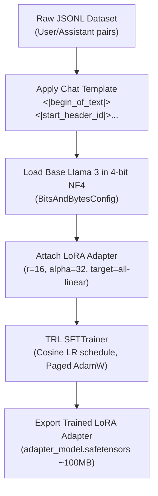

# 📹 Steps By Step Tutorial To Fine Tune LLAMA 2 With Custom Dataset Using LoRA And QLoRA Techniques

<div className="video-card" style={{border: '1px solid #30363d', borderRadius: '8px', padding: '16px', marginBottom: '24px', background: 'rgba(56, 139, 253, 0.05)'}}>
  <div style={{display: 'flex', gap: '16px', flexWrap: 'wrap'}}>
    <div><strong>Instructor:</strong> Krish Naik</div>
    <div><strong>Duration:</strong> 1605</div>
    <div><strong>Course:</strong> Module 7: Cloud AI & LoRA Fine-Tuning</div>
    <div><strong>Watch Link:</strong> <a href="https://www.youtube.com/watch?v=Vg3dS-NLUT4" target="_blank" rel="noopener noreferrer">YouTube Lecture ↗</a></div>
  </div>
</div>

## 📌 Executive Summary

A complete, hands-on production tutorial fine-tuning Meta's Llama 3 using Hugging Face PEFT, BitsAndBytes (4-bit QLoRA), and TRL's `SFTTrainer`.

This lesson covers setting up bitsandbytes quantization configurations, mapping chat templates, defining LoRA hyper-parameters, training, and testing inference with the fine-tuned adapter.

---

## 🏗️ System Architecture & Execution Flow



---

## 📖 Core Concepts & Technical Deep Dive

### 1. BitsAndBytes 4-bit Quantization Configuration
Using `BitsAndBytesConfig` to load 15GB base weights in under 5.5GB VRAM:
- `load_in_4bit=True`
- `bnb_4bit_quant_type="nf4"`
- `bnb_4bit_use_double_quant=True`
- `bnb_4bit_compute_dtype=torch.bfloat16`

### 2. The TRL SFTTrainer (Supervised Fine-Tuning)
TRL's `SFTTrainer` wraps Hugging Face `Trainer` with native awareness of causal language modeling, prompt masking (training loss computed only on assistant response tokens), and dataset packing.

---

## 💻 Production Implementation

```python
from peft import LoraConfig

model_id = "meta-llama/Meta-Llama-3-8B-Instruct"

peft_config = LoraConfig(
    r=16,
    lora_alpha=32,
    target_modules=["q_proj", "k_proj", "v_proj", "o_proj"],
    lora_dropout=0.05,
    bias="none",
    task_type="CAUSAL_LM"
)

print("Ready for SFTTrainer initialization with 4-bit NF4 base and LoRA adapter.")
```

---

## ⚙️ Production Gotchas & Best Practices

:::tip Compute Loss Only on Assistant Responses
Use `DataCollatorForCompletionOnlyLM` to mask out user prompts during loss computation. Backpropagating gradients on user questions wastes adapter capacity teaching the model how to ask questions rather than answer them.
:::

:::warning Merge Before Production Deployment
While running separate LoRA adapters at inference time is convenient for multi-tenant systems, merging the adapter weights back into the base model (`model.merge_and_unload()`) provides 15-25% lower latency in single-task serving.
:::

---

## 📊 Architectural Reference & Comparison

| Hyperparameter | Recommended Value | Rationale |
| :--- | :--- | :--- |
| **Learning Rate** | `2e-4` | Optimal starting rate for LoRA; higher than full fine-tuning |
| **LR Scheduler** | `cosine` with 10% warmup | Smooth decay prevents abrupt gradient shocks |
| **Batch Size** | 2-4 with Grad Accum = 4 | Simulates effective batch size of 16 without VRAM OOM |
| **Weight Decay** | `0.01` | Prevents overfitting on small custom datasets |

---

## 📚 Key Takeaways & Enterprise Checklist

- [ ] **Architecture Verification:** Ensure your design addresses latency, decoupled interfaces, and strict data validation contracts.
- [ ] **Deterministic Testing:** Run unit tests and golden dataset evaluations before shipping changes to staging or production.
- [ ] **Security & Observability:** Enforce input/output guardrails, scrub sensitive credentials/PII, and capture distributed traces.
- [ ] **Scalability & Sizing:** Calibrate model parameters, context limits, and compute instance requirements against projected request concurrency.
