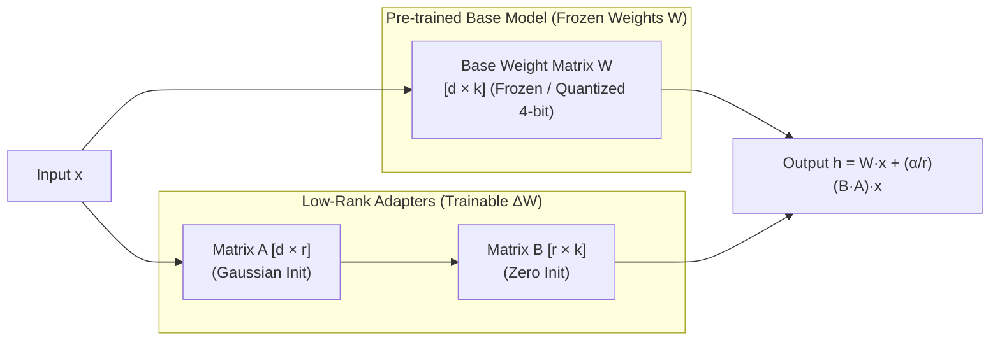

# 📹 Steps By Step Tutorial To Fine Tune LLAMA 2 With Custom Dataset Using LoRA And QLoRA Techniques

<div className="video-card" style={{border: '1px solid #30363d', borderRadius: '8px', padding: '16px', marginBottom: '24px', background: 'rgba(56, 139, 253, 0.05)'}}>
  <div style={{display: 'flex', gap: '16px', flexWrap: 'wrap'}}>
    <div><strong>Instructor:</strong> Krish Naik (Krish Naik)</div>
    <div><strong>Duration:</strong> 26m 45s</div>
    <div><strong>Playlist:</strong> LLM Fine-Tuning with LoRA & QLoRA (Krish Naik)</div>
    <div><strong>Watch Link:</strong> <a href="https://www.youtube.com/watch?v=Vg3dS-NLUT4" target="_blank" rel="noopener noreferrer">YouTube Lecture ↗</a></div>
  </div>
</div>

## 📌 Executive Summary & Learning Objectives

This lecture covers **Steps By Step Tutorial To Fine Tune LLAMA 2 With Custom Dataset Using LoRA And QLoRA Techniques**, focusing on production implementations, edge cases, and industry standards:
- Core intuition, architecture, and underlying mechanisms.
- Key differences between theoretical research implementations and scalable enterprise patterns.
- Concrete Python walkthroughs, error recovery, and performance optimization.

---

## 🏗️ Architecture & Conceptual Workflow



---

## 📖 Core Concepts & Technical Deep Dive

### 1. Architectural Foundations
In modern production AI engineering, **Steps By Step Tutorial To Fine Tune LLAMA 2 With Custom Dataset Using LoRA And QLoRA Techniques** is essential for ensuring reliability, low latency, and deterministic outcomes. As AI systems evolve from naive prompt-in / completion-out scripts into distributed systems, engineers must handle:
- **State management & consistency:** Ensuring intermediate states and tool invocations are tracked.
- **Error boundaries & recovery:** Graceful degradation when external LLMs or vector stores encounter rate limits or network partitions.
- **Resource utilization & cost efficiency:** Caching common queries and reducing unnecessary foundation model token expenditure.

### 2. Operational Considerations
- **Latency Optimization:** Pre-computing embeddings, utilizing asynchronous non-blocking event loops, and streaming tokens via Server-Sent Events (SSE).
- **Security & Sandboxing:** Validating inputs before ingestion, sanitizing LLM outputs, and isolating tool execution environments.

---

## 💻 Production Implementation Walkthrough

```python
from peft import LoraConfig, get_peft_model, TaskType
from transformers import AutoModelForCausalLM

# 1. LoRA Configuration
lora_config = LoraConfig(
    r=16,                         # Rank dimension
    lora_alpha=32,                # Scaling factor (usually 2 * r)
    target_modules=["q_proj", "v_proj", "k_proj", "o_proj"],
    lora_dropout=0.05,
    bias="none",
    task_type=TaskType.CAUSAL_LM
)

# 2. Load Base Model and Wrap with PEFT Adapter
base_model = AutoModelForCausalLM.from_pretrained("meta-llama/Meta-Llama-3-8B")
model = get_peft_model(base_model, lora_config)

# 3. Inspect Trainable Parameters (<1% of total!)
model.print_trainable_parameters()
```

---

## 💡 Production Best Practices & Tips

:::tip Production Deployment Guideline
When deploying Steps By Step Tutorial To Fine Tune LLAMA 2 With Custom Dataset Using LoRA And QLoRA Techniques in enterprise environments, always configure automated retries with exponential backoff and telemetry tracing (such as OpenTelemetry or LangSmith).
:::

:::warning Common Failure Modes
Watch out for state contamination across concurrent requests. Ensure each session or user interaction uses an isolated thread ID or execution context.
:::

---

## 🎯 Key Takeaways & Quick Reference

| Dimension | Production Standard | Pitfall to Avoid |
| :--- | :--- | :--- |
| **Execution** | Async / Non-blocking with timeouts | Synchronous blocking calls in event loops |
| **Data Validation** | Strict Pydantic v2 schemas | Untyped dictionary access |
| **Monitoring** | Distributed tracing & latency percentiles | Relying only on standard console logs |

## ⏱️ Lecture Timeline & Key Topics

| Timestamp | Key Topic / Concept Discussed |
| :--- | :--- |
| **00:00:00** | hello all my name is krishak and welcome... |
| **00:06:39** | specifically require the system prompt... |
| **00:13:23** | specifically in PFT then training... |
| **00:20:06** | once we train it it is going to run for... |
| **00:26:42** | thank you and all take care bye-bye... |


---

---

## 📜 Complete Lecture Transcript (English)

> **Language:** English | **Source:** `05 - Steps By Step Tutorial To Fine Tune LLAMA 2 With Custom Dataset Using LoRA And QLoRA Techniques.en.srt` | **Total Segments:** 14 | **Word Count:** ~5,193 words

<details>
<summary><b>Click to expand full chronological transcript (14 timestamped intervals)</b></summary>

#### ⏱️ [00:00 ➔ 00:02]

hello all my name is krishak and welcome to my YouTube channel so guys I'm happy to announce that I will be soon creating a series of videos of showing you that how you can fine-tune various llm models using custom data set in this video we are going to see how we can fine-tune Lama 2 model uh with the custom data set by using techniques like parameter efficient transfer learning and low rank adaptation of large language models which is also called as Laura so all these techniques we'll specifically use in this particular video I will show you the Practical implementation uh and in the upcoming video because I was planning that how I can efficiently teach you this entire fine-tuning techniques because it is a complex topic altoe so first of all in this video we'll see the entire implementation quickly there will be a template of code which will try to learn we'll take a data set if there is data pre-processing that is required we will do it if there is quantisation that is required we will specifically do it okay and then in the upcoming video I will try to demonstrate the entire theoretical intuition about this parameter efficient transfer learning and low rank adaptation what exactly it is and there is also another variant which is called as chora okay and then we will try to relate this entire theoretical intuition with the Practical implementation it will be amazing to understand because that is how I have also learned and it was very much helpful for me in order to understand each and everything as you all know guys there there are lot of Open Source models that are going to come up in the future also and good good models like Lama 2 Mistral falcon there are so many models as such it is better that we should know how to fine-tune all these models with our own custom data set and that is what companies will be requiring so let's go ahead and let's see that how you can uh fine-tune your llama 2 model uh with this techniques again here we'll be using Transformers uh from hugging face and there will be a lot many different libraries that we'll be using with respect to this at least get the, ft overview about these topics and in the next topic when I discussed about the theoretical intuition your knowledge will get more intact and

#### ⏱️ [00:02 ➔ 00:04]

you'll be able to understand it so let's go ahead and let's proceed towards the Practical implementation hello all my name is krishn and welcome to my YouTube channel so guys in this particular video we are going to see the stepbystep way of probably fine tuning your llm models in this case I'm going to specifically take open- Source Lama 2 model and with the help of a custom data set we are going to fine-tune this specific model right over here we are going to learn about various techniques practically not theoretically because if you really want theoretically you can let me know in the comment section so we will be discussing about something called as parameter efficient transfer learning for NLP which is an amazing technique to basically fine-tune all these llm models which will definitely be of use size like 70 billion parameters and all so how this parameter efficient transfer learning actually happens we'll try to see in the code and and we are also going to see a technique which is called as Laura right so Laura paper if I go ahead and search right it is basically called as low rank adapt adaptation of large language models right so these are some of the mathematical concept don't worry in the upcoming videos I will talk about all every theoretical intuition about PFT about Laura right now a simple way of fine-tuning I'm just going to show you because many people were requesting for this right so initially what we will do is that we will go ahead and install some of the important libraries like accelerate PFT as I said PFT is nothing but parameter efficient transfer learning inside this only you'll find this Laura technique which is called as low rank adaptation of large language models uh then we have bits and bytes bits and bytes are specifically used for doing quantization now what does quantisation basically mean all these llm models you know when they are trained with 70 billion parameters or 13 billion parameters by

#### ⏱️ [00:04 ➔ 00:06]

default the weights data types are in the form of floating values right when we say floating values that they are basically 32 bid values what we can actually do and obviously since I'm actually going to do this in Google collab we get a very less Ram so it is a better way that you quantize those weights you know from float 32 probably convert that into int 8 and then probably based on the Ram size you'll be able to quickly fine tune it along with that I will be also so we'll also be using Transformers and then you have TRL so all this libraries will go ahead and execute it and once we specifically execute it you'll be able to see that all these libraries will get installed now in the Second Step the major thing is that we will specifically be using the library called as Transformers which is specifically used for this particular purpose and internally we'll also be using PFT which is having some Laura configuration and we'll use this PF model I know you'll not be able to understand what exactly PFT is but I'll just tell you in some time just let me go ahead with but at the end of the day PFT actually uh you know uses techniques which will try to freeze you know when it applies transfer learning on these llm models it is freezing most of the weights of that llm model and only some of the weights will be retrained and based on that they will be able to provide you accurate results based on your custom data set okay uh how it is done don't worry I'll create a amazing dedicated video to make you understand this mathematical intuitions okay now over here you'll be able to see that I'm going to import OS import torch I'm going to use a data set I will talk about what data set we are going to specifically do the fine tuning but here we are specifically using open source llm models and then from Transformer I'm going to use Auto model for casual LM Auto tokenizer bits and bytes I will talk about all these libraries as we go ahead so let me quickly go ahead and

#### ⏱️ [00:06 ➔ 00:08]

execute it okay now till this is getting executed this import statement is getting executed let's talk about some of the important properties over here with respect to llama 2 in the case of llama 2 the following prompt template is used for chat model so this is the specific prompt template uh here we be give an instruction in this s symbol and then we have our system prompt which will be closed with the CIS brackets and then you will also be able to give your user prompt over here and the model answer will be coming after this after this entire instruction okay so this is how the entire Lama 2 models llm models specifically require the system prompt and the user prompt and the model answer format right now any data set that you specifically get right we really need to convert that data set into this format okay and that is how I will show you how to probably do this there's a technique uh you can also write your own custom code and all there are many ways okay now what we'll do we will reformat our instruction data set to follow Lama 2 template so right now we are going to use this data set which is basically called as open open Assistant Guan guanako I hope I'm pronouncing it right now here you will be able to see this is my data set right human can you write a short introduction about the relevance of term uh monopsony in economics please use example related to this and then Mon Mon monopsony ref first to the market so here you can see assistant answer so here the data set is basically in the form of human and assistant like human has a question over there and assistant is probably providing uh you a specific answer so in this format you'll be able to find out each and every rows each and every rows in different different languages so we are going to take this entire data set and then considering this entire data set what we are going to do we are going to reform the data set following the Lama 2 template and out of all these

#### ⏱️ [00:08 ➔ 00:10]

samples all this data set there are around how many data sets are there I guess there are around 10 10K records we just going to take thousand uh th000 Records or 1K records the reason is that I really need to show you how the fineing is basically done so if I go ahead and click on this and if you see this format right this format you'll be able to see that this entire data set is converted in this format only right instruction is basically there the answer is over here and this entire s is getting closed right so all the data set is basically converted into that specific format now how do you convert it right so for that already what we have basically done is that over here to know how this data set was created you can check this notebook so this notebook is there already you can see that we are loading the data set we are applying this we are taking the Thousand records and then we are transforming right so in transforming basically a simple python code like I have to probably keep in that specific format right so that is the reason I'm showing you this specific code over here just by one click you will be able to do that okay so all the links are actually given now you need to follow Now understand guys see understanding how the specific techniques are definitely I'll create a dedicated theoretical video understanding all the maths equations that is required right over here we are trying to see that how you can also run your own fine tun model right so note you don't need to follow a specific prom template if you're using the base Lama 2 model but right now we'll not use we'll use will not use this base Lama 2 model okay how to F tune Lama 2 so these are some of the steps not only with Lama 2 with other models also this will work but again there the format may change you know the the format of the instruction the format of your prompts may change so free Google collabs offers a 15gb graphic card right so limited resources barely enough to store Lama to 7 billion weights now here we are going to use 7 billion weights but it is also very difficult to store 15 GB right whatever free model that we specifically have we also need to consider the

#### ⏱️ [00:10 ➔ 00:12]

overhead due to Optimizer State gradient and forward activation okay so usually in in any llm models you'll be having gradients you'll be having forward activations you'll be having optimizers so there also you require some amount of memory fine tuning is not possible here right obviously this will not be possible because 7 billion weights you cannot store it in 15 GB that is the reason we require this parameter efficient fine-tuning technique now what does PFT basically do it is going to freeze most of the weights that is present in that llm model like Lama 2 and only with some of the weights after applying quantization it is going to probably perform the fight fine tuning now parameter efficient fine tuning I will in the my next video I will talk about this research paper if you quickly want this video please make sure that you make the video likes 2,000 okay now what we are going to do over here we are going to use techniques like Laura and clora as I said Laura or clora Laura is nothing but low rank adaptation of large language model again I'm apologist guys if you don't know the mathematical Concepts I will explain in the upcoming video okay so first of all we will load a Lama 27b chart GPT model this chart HF model then train it on this 1K sample which will produce a fine tune model with which in the name of chat fine tune we'll try to create in this clora will use a rank of 64 with a scaling parameter of 16 we will load the Lama 2 model directly in 4bit Precision we are trying to convert that 32 bit into 4 bit so that is how we are going to do the training and with respect to chora in order to find the low rank index we are going to use the rank of 64 right this is an hyper tuning parameter you can just consider right now this is a kind of hyper tuning parameter with a scaling parameter Alpha this is also called as Alpha it will be having a scaling parameter of 16 as I said everything will be explained detailly when I probably go with the mathematical equation but right now our main name is is to probably learn how to find T it

#### ⏱️ [00:12 ➔ 00:14]

now what model we are going to use we are going to use Lama 2 7bh uh 7B chat HF then the instruction data set to use is this particular data set we will be downloading it from the hugging face the model name also will be downloading it and after finetuning it this will be my new model name okay now these are some of the clor parameters that is required okay so one is laurore R 64 what is this R this R is a rank of 64 kind of hyperparameter Laura Alpha as I said Alpha right I told you Alpha why because I know the entire mathematics stuffs in this okay just to increase the Curiosity I'm coming up with this first video and later on I will come up with that then here also Dropout is basically required now in order to do the quantization we will be using bits and bytes parameter so here you can see activate 4bit precision based model so there is a parameter which is called as _ 4bit which is equal to true then compute data type for 4bit base model so here it is basically float 16 then quantization we using fp4 on np4 so BNB 4bit Quant type you have to keep this particular value to np4 since it is 4bit activate Ned quation for 4bit based model so here we are keeping it as false Now understand Guys these are some of the basic parameters that we specifically use in Lura technique specifically in PFT then training argument parameters our output directory will be present in this results I'm going to run one Epoch then we are going to enable this fp6 and B bf16 training okay uh it is set to True with an a100 right so a100 uh you can set it if you're using a100 you can set it to True right now I'm using T4 if you have the paid version of Google collab then you can set it to True bass size for uh Pur GPU for training I hope you know what is bass size then you have GPU for evaluation bass size then gradient accumulation step check points Max gr uh Max grad nor

#### ⏱️ [00:14 ➔ 00:16]

learning rate weight DK right Optimizer page adamw we will be using which is of a variety of Adam itself then learning sh learn uh LR sched type cosine because it works on similarity right whatever question and answers we specifically write then maximum steps is minus one number of training steps override number of training epochs and after this you are also putting logging steps is equal to 25 now with respect to any fine tuning technique you use something called as supervised tuning right in supervised tuning that is you require some parameters right max sequent length then packing then device map so this is load the entire model on the GPU zero right so this is what are the some of the parameters don't worry uh these are some of the parameters that you don't need to learn each and every parameter because already all these things are provided by the official page itself I've just copied and pasted it over here right so we will go ahead and execute it so let's go ahead and execute it so all these parameters are set now the step four right there are multiple four steps right uh one more step is there later on load everything and start the F tuning process right first of all we want to load the data set we defined here our data set is already pre-processed but usually this is where you should reformat The Prompt right filter out bad text combine multiple data some amount of pre-processing is required but already we have done that so we are not going to do it then we are Recon we are configuring bits and byes for four bit quantization as I said right from 16 from 32 or 16 bit we are converting that into 4 bit so that it required less space with respect to GPU for the fine tuning purpose next we are loading the Llama 2 model in 4bit Precision GPU with the current corresponding tokenizer right with that tokenizer we'll try to load that and obviously we'll also be loading it with the 4bit Precision finally we are loading the configuration of clor so uh and passing everything to the sft trainer so here is what self fine tuning uh s uh this sft will basically happen right now let's go ahead and let's do this so first of all

#### ⏱️ [00:16 ➔ 00:18]

we are loading the data set we are loading the tokenizer model with clora configuration so here I have return this B&B compute D type and we are using torch so along with that you also require bits and bytes config again load we are enabling this 4 bit then all the necessary parameters like compute D type you'll be using H net nested Quant okay again I'm telling you guys there is nothing new to learn in this because all these formats will be available in the official documentation then we are going to check the GPU compatibility with float 16 if compute dipe is equal to torch. float 16 use 4bit otherwise this all things are there right then we are going to load the base model see whenever we want to load the base model from hugging face we can use this Auto model for casual LM right that is the reason we have imported on top Dot from pre-trained model name what is my model name I've given that quation config so here you'll be able to see in conation config we are also given something called as uh BNB config right so here you'll be able to see this is the compute type let me just search for it somewhere here only it will be available so so BNB config so here you can see this entire bytes config is basically there so uh based on that you'll be okay yeah computer app okay yeah perfect so B&B config is basically given over here then device map is nothing but with respect to the GPU mapping then model. config do use cache false you can also make it true if you want model. config pre-training _ TP is equal to one then we are loading the Lama tokenizer see for any LM model we also need a tokenizer so that it will be able to convert any llm model the input data that we are specifically using into word embeddings and all so that is the reason order tokenizer from pre-trained again model name we are going to use this trust remote code is one additional parameter that is used then we going to put a pad token with respect to the end

#### ⏱️ [00:18 ➔ 00:20]

of statement token right so do this eore token specifically applies the token for the Lama itself right and here we are giving the padding side as right fixed weird overflow issue with fp16 training all these parameters will be almost fixed guys only thing that you will probably be changing is with respect to the configuration then load Laura configuration here you'll be able to see PFT config Laura config all the values that you're putting with respect to this Lowa configs and here here you have your PFT configuration now this is the most important thing because in this training arguments we set all the parameters output directory number of epo this this this learning rate PP p uh FP 16 bs6 you can probably see over here and then finally we are reporting it to the tensal flow right tensor board then you can also see that supervised fine-tuning parameters right I'm giving my model name I'm giving my data set my PFT config my data set text field this PF config has a Lowa config right then you have a tokenizer you have the arguments you you have packing then you have finally trainer1 okay now this is what is the main thing and that is where your supervised fine tuning will happen step by step you have done it okay let me repeat it quickly we have loaded the data set we have set our D type right we are setting up all our contag process over here here we are checking whether GPU is compatible or not here we are loading our llm model that is Lama 2 here we are specifically loading our tokenizer which is be used in Lama 2 along with this we are putting padding techniques then my Laura configuration which will specifically be in terms of PETA PFT config and then all my training arguments will go inside this right um the this training arguments is with respect to where my output directory is and all learning rate and all okay finally set supervised tuning parameters here we have seted model data set PFT config text Max equal length tokenizer

#### ⏱️ [00:20 ➔ 00:22]

everything is put up over here and finally we go ahead and train this now once we train it it is going to run for 250 aox uh I think 250 step size I have actually given over here sorry 25 steps uh logging steps let's see what is the bass size bass size is four um yeah till that much it will probably go so let this start so it has already started I guess so here you can see it is downloading here you'll also be able to see the data set okay sample data right now you cannot see it because the data set will get loaded okay so table of contents installed all the required packages we'll reformat all the steps are given side by side you can also read it out I know this looks like a little bit tough guys but at the end of the day uh I'll not say that it is easy and just the reason why I'm sharing you this finetuning technique because you should just get in your mind later on you know this is the pattern that I'm following first execute this don't worry about anything as such just try to get an high level overview how things work later on I will try to break down each and everything in my next video by breaking this entire code why this specific parameters used because the main thing is to understand what is PFT what is quantisation what is precision and uh how how do you specifically use this PFT technique what is qora everything what is low order rank index uh how to basically calculate that everything I will talk about it okay so we'll wait for some time till then uh just let let us wait and uh we will I'll just uh come again I I think it'll take 15 to 20 minutes to complete this entire fine tuning with thousand records and then again I'll come back and we'll start doing and seeing whether we are able to get the good results or not so yes uh let's wait for some time thank you so guys uh finally you can see the 250

#### ⏱️ [00:22 ➔ 00:24]

EPO or 250 steps have completed it took 25 minutes and again this is in Google collab if you have paid version of Google collab it will probably take hardly 5 to 10 minutes to complete okay so over here you can see the global step was 250 training loss it went went till 1.36 metrics runtime everything met training samples per second all this information is basically done okay and please remember this particular word which which is called as floss okay total floss because I'm going to discuss about this in my next video also now once we do this we are going to save this trained model right and understand the new model name what it will be right so here you can probably see Lama 27b chat fine tune so this is my results with respect to run all the results you'll be able to see over here also okay so here uh in this fine tuning technique it is also creating some something called as adapter adapter model okay please remember these words because in the next theoretical intuition we are going to discuss each and everything as we go ahead okay so please make sure that you remember it so we are going to save this model so we have written trainer. model. save. pre-rain model right now you can also check out in the tensor board but I will just go ahead and show you quickly that how it is probably going to generate it right so here we have created a prompt which is called as what is large language model I've used pipeline right so this pipeline we have already imported it the task will be task generation whatever model we have actually created that model will be there tokenizer will be used over here and max length we can keep to 2 200 to 250 the result uh and always understand as I always suggested with respect to Lama 2 this will be my format there will be an S then there will be an instruction and here I will be having my prompt and with respect to this particular prompt we are going to get some kind of response so whatever response we are going to get inside this result variable it will be in the form of list and inside that there will will be one field which is called as generated text so if I go ahead and

#### ⏱️ [00:24 ➔ 00:26]

search what is large language model you'll be able to see that how we going to get the result okay because we are running the same model over here so here is my prompt here we are using pipeline pipeline basically helps you to combine multiple things like task model tokenizers you know multiple things it will be able to give you right now since this is already running in this particular collab uh and obviously you'll be able to see RAM and all are almost it is used the dis space of somewhere around 39 GB right so just wait for some time and here you will be able to get the response if you quickly want to get the response obviously you need to have a good GPU right based on that it'll be able to give you a quick result right so after that you'll be also able to see that we'll be able to delete all these vams and all okay so let's see and let's see whether we'll be able to get our result in the next step we can also push our model to the hugging face which I will keep it right now I will not explain it because this I will show you as an complete project as we go ahead so here you can see what is large language Model A large language model is a type of artificial intelligence large language model often seen then here you can also see all the information are there some example of large language models are uh include this okay now what we are going to do let's go ahead and take any one example over here from this particular data set okay so I will just write how to own a plane in United States okay okay so this will be my over here and I'll paste it over here let's see so this will also run and I will finally get my result also so same same question I've have taken right so from this 1K result so to a plane this is the answer that we will probably be getting let's see how much time it'll take to probably showcase but always remember please keep on looking at this particular Ram like how much uh time it is probably taking and how much space it is taking okay so so guys here you can

#### ⏱️ [00:26 ➔ 00:26]

probably see the response how to own a plane in united state in United State and owning a plane is this determine your budget so this is completely based on this information that is present over here but here I've written only 200 max length so I can only see 200 characters that is given right so you can probably try with each and everything as you go ahead now guys uh here also you'll be able to see the detailed explanation of each and every step but the most interesting video after seeing this will obviously be able to understand like what all each and everything does over here what this PFT does what is this bits and bites what is this Laura everything we will discuss in our next video so I hope you like this particular video this was it from my side I'll see you in the next video have a great day thank you and all take care bye-bye

</details>
