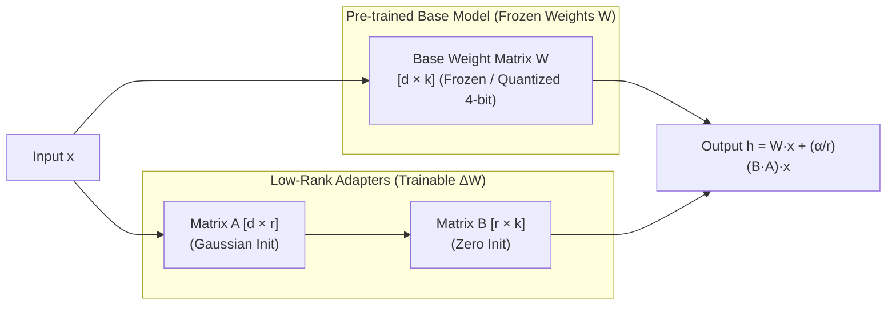

# 📹 Fine-tune Gemma models With Custom Data in Keras using LoRA

<div className="video-card" style={{border: '1px solid #30363d', borderRadius: '8px', padding: '16px', marginBottom: '24px', background: 'rgba(56, 139, 253, 0.05)'}}>
  <div style={{display: 'flex', gap: '16px', flexWrap: 'wrap'}}>
    <div><strong>Instructor:</strong> Krish Naik (Krish Naik)</div>
    <div><strong>Duration:</strong> 18m 1s</div>
    <div><strong>Playlist:</strong> LLM Fine-Tuning with LoRA & QLoRA (Krish Naik)</div>
    <div><strong>Watch Link:</strong> <a href="https://www.youtube.com/watch?v=IZXNgu4dW70" target="_blank" rel="noopener noreferrer">YouTube Lecture ↗</a></div>
  </div>
</div>

## 📌 Executive Summary & Learning Objectives

This lecture covers **Fine-tune Gemma models With Custom Data in Keras using LoRA**, focusing on production implementations, edge cases, and industry standards:
- Core intuition, architecture, and underlying mechanisms.
- Key differences between theoretical research implementations and scalable enterprise patterns.
- Concrete Python walkthroughs, error recovery, and performance optimization.

---

## 🏗️ Architecture & Conceptual Workflow



---

## 📖 Core Concepts & Technical Deep Dive

### 1. Architectural Foundations
In modern production AI engineering, **Fine-tune Gemma models With Custom Data in Keras using LoRA** is essential for ensuring reliability, low latency, and deterministic outcomes. As AI systems evolve from naive prompt-in / completion-out scripts into distributed systems, engineers must handle:
- **State management & consistency:** Ensuring intermediate states and tool invocations are tracked.
- **Error boundaries & recovery:** Graceful degradation when external LLMs or vector stores encounter rate limits or network partitions.
- **Resource utilization & cost efficiency:** Caching common queries and reducing unnecessary foundation model token expenditure.

### 2. Operational Considerations
- **Latency Optimization:** Pre-computing embeddings, utilizing asynchronous non-blocking event loops, and streaming tokens via Server-Sent Events (SSE).
- **Security & Sandboxing:** Validating inputs before ingestion, sanitizing LLM outputs, and isolating tool execution environments.

---

## 💻 Production Implementation Walkthrough

```python
from peft import LoraConfig, get_peft_model, TaskType
from transformers import AutoModelForCausalLM

# 1. LoRA Configuration
lora_config = LoraConfig(
    r=16,                         # Rank dimension
    lora_alpha=32,                # Scaling factor (usually 2 * r)
    target_modules=["q_proj", "v_proj", "k_proj", "o_proj"],
    lora_dropout=0.05,
    bias="none",
    task_type=TaskType.CAUSAL_LM
)

# 2. Load Base Model and Wrap with PEFT Adapter
base_model = AutoModelForCausalLM.from_pretrained("meta-llama/Meta-Llama-3-8B")
model = get_peft_model(base_model, lora_config)

# 3. Inspect Trainable Parameters (<1% of total!)
model.print_trainable_parameters()
```

---

## 💡 Production Best Practices & Tips

:::tip Production Deployment Guideline
When deploying Fine-tune Gemma models With Custom Data in Keras using LoRA in enterprise environments, always configure automated retries with exponential backoff and telemetry tracing (such as OpenTelemetry or LangSmith).
:::

:::warning Common Failure Modes
Watch out for state contamination across concurrent requests. Ensure each session or user interaction uses an isolated thread ID or execution context.
:::

---

## 🎯 Key Takeaways & Quick Reference

| Dimension | Production Standard | Pitfall to Avoid |
| :--- | :--- | :--- |
| **Execution** | Async / Non-blocking with timeouts | Synchronous blocking calls in event loops |
| **Data Validation** | Strict Pydantic v2 schemas | Untyped dictionary access |
| **Monitoring** | Distributed tracing & latency percentiles | Relying only on standard console logs |

## ⏱️ Lecture Timeline & Key Topics

| Timestamp | Key Topic / Concept Discussed |
| :--- | :--- |
| **00:00:00** | hello all my name is kushak and welcome... |
| **00:04:21** | think this is the first kind of videos... |
| **00:09:15** | go... |
| **00:13:45** | this up and then finally we are going to... |
| **00:17:59** | care bye-bye... |


---

---

## 📜 Complete Lecture Transcript (English)

> **Language:** English | **Source:** `06 - Fine-tune Gemma models With Custom Data in Keras using LoRA.en-orig.srt` | **Total Segments:** 9 | **Word Count:** ~3,814 words

<details>
<summary><b>Click to expand full chronological transcript (9 timestamped intervals)</b></summary>

#### ⏱️ [00:00 ➔ 00:02]

hello all my name is kushak and welcome to my YouTube channel so guys in this specific video we are going to fine-tune gamma models in caras using the Laura technique already if you have seen my fine-tuning playlist I've created a lot of videos how does fine tuning happen what is Laura what is chora what is Contagion and many more things so in this particular video we are going to f tune the GMA model and again remember guys GMA if you don't know it is a completely open source model that has been provided by Google and uh we'll try to see that how we can actually uh you know fine-tune our llm models with respect to this with with our own custom data so here uh what all things we are going to use everything uh step by step we'll go ahead and uh do it okay now first of all uh you need to complete the setup instruction at Gamma setup so if you probably click over here you can probably watch this entire you can see this entire uh you know the the documentation that is specifically given the first thing that you specifically required is an API key so first of all go to aist studio. google.com and then click on get API key right and if you don't know guys you also have now access of uh Google gini 1.5 Pro which you can probably access it right and then over here after uh going to this particular page you need to click on create API key right once you specifically create API key you'll be just allowed to give the name select the project give the name and automatically you'll be able to get an API key over here copy that API key my API key is already I've have created it so I'll be specifically using that right so you have to just just go to aist studio. google.com Okay so this is the website that you'll specifically go to okay then you need to go to kaggle.com and specifically get the access right so you need to get the acccess of this um you know the gamma setup itself right uh so if you go ahead and write kaggle gamma right uh access right if you just go ahead and write it over here here you can see that gamma will be there so you have to go to this particular page log in into it and here

#### ⏱️ [00:02 ➔ 00:04]

you'll be seeing you have consented the license to uh license for gamma first of all if you have not consented it here they'll be asking you an option of request the access so once you need to click the request the access and once you go ahead and select all the terms and condition you will be able to get the license agreement right so then you'll be able to get the license consent and then you'll be able to use it okay so that is the first thing and right now all these models are available over here with both uh and it can run on Jack tensorflow and py toch okay so this is the next step that you really need to do right and then go ahead and configure it I'm already using a paid Google collab Pro account so for me I definitely require a lot of ram because I really need to show you a good fine-tuning technique okay so quickly let's go ahead and configure it as I said once you probably go ahead and create your API key go to this particular secret key and then you need to write over here as kaggle key along with the API key otherwise you can also go ahead and write Google API key right so I I will just enable it so that I'll be able to use it over here okay so this is the Google API key that I require and if you really want to access it from the kaggle itself you need to probably select this to okay so once it is done and uh if you want hugging fish token also if you want to use it you have to create it right so all these things is selected now what I'm actually going to do is that import OS and how to okay one more thing that you specifically require is kaggle key and username how do you create it so you have to probably go to this particular settings button right if you go ahead and click on settings right once you go ahead and click on settings I think uh somewhere the API will be there so you can go ahead and create a new token right so once you create a new token you'll be getting two important Keys one is kaggle key and one is kaggle username so you have to set it up so once you probably click on token generating a node token will automatically expire the previous one so I'll not do that because I have already done it so once you do that uh Json file will get downloaded and there you'll be getting two keys one key is the kaggle key and one key is the kagle username so

#### ⏱️ [00:04 ➔ 00:06]

you have to make sure that you have to set all this up over here okay before you start this particular project then we will go ahead and select all the will go ahead and set up all the environment over here one is the kaggle username and one is the kagle key so I will go ahead and execute this once this is basically getting executed the next step is that we will go ahead and install K NLP and I think this is the first kind of videos where I've specifically uploaded how you can find in gamma models in caras using Laura okay so caras is also having this this specific feature so first of all I will go ahead and install kasas NLP and kasas greater than or equal to 3 so once the installation will specifically take place because we are going to use kasas to do the entire fine tuning okay so this is going to take some amount of time uh then we can go ahead and select the back end you can use Jacks torch tensor flow so it already provides all the specific features right so in the environment I will be selecting K's back end as Jax right uh Jax the best thing is that our to to again it's just like tensor flow and torch but again it is an completely open source you can also use this specific thing okay so till the installation is taking place uh then we are going to uh avoid memory fragmentation on the Jax packet so we are going to set this xcla python client memory fraction okay so here we'll be setting it to 1.0 so this is the initial environment that we really need to select okay so you are now connected to GPU runtime but not utilizing the GPU don't worry we'll be utilizing because I need to probably do the entire fine tuning with the help of GPU okay so initially kaggle username kaggle key then install all the Kos libraries that is specifically required and then you select the back end that is called as jaxs okay so here we getting some error I think uh it is a conflict but no worries I think it is working fine then we'll go ahead and execute this where we are selecting the back end and this okay now let's go ahead and import caras and NLP okay kaas NLP okay here uh to fine tuning the GMA model right uh what we

#### ⏱️ [00:06 ➔ 00:08]

need to do is that we need to set up our data set in the form of Json all file okay where you'll be able to see this I will just go ahead and click this particular link and here you'll be able to see this okay how the data will specifically look like so this data is specifically present in hugging face if you go ahead and open it okay so I think uh I will go ahead and open it okay so here uh let's see whether I'll be able to read the Json all Json all format okay so Json all format I'll just try to load it over here okay Json lines Json all I think here you'll be able to find out how you can load it okay uh whether it is ask me to drop it over here let's see I can drop it or what okay so this is how the file looks like here you can see there is a Json all file has two important things one is instruction see I will just zoom out a little bit so here you have something like instruction then you have something like context so in this you specifically have one is instruction one is context instruction is what is the question and context is basically what is the answer so if you probably see all the all the all the all the inputs and outputs are specifically in this particular structure right because I'm going to use this structure itself and for gamma also for even for open you definitely require in the form of uh this Json all file right Json L right so where you have two important information instruction and then you have context So based on this you can also create your own file since uh since I'm showing you a fine tuning technique so I will be downloading this uh Dolly 15K jol so here you have 15,000 records with respect to this as soon as this file will get downloaded you'll be able to see over here okay so here you can see Dolly data bricks Dolly 15K JNL again it is an open source data set just

#### ⏱️ [00:08 ➔ 00:10]

to show it to you you can definitely use it now the next thing over here you'll be able to see that the code that we are specifically writing import Json data and then we are opening this Json all file then we are loading all the Json file into Json itself then we are reading the context if the feature context does not exist we'll continue otherwise we'll create this kind of template right where my instruction will have the instruction data and response will have the response data okay and then we are going to append it inside this particular list of data okay once we do this this is what my first top th000 data looks like and here you can see that it is redit and here you'll be able to see this is my entire data uh uh with respect to the top thousand okay so we are going to just use the top thousand data and uh the format that we specifically want is basically written over here in this format that is instruction with instruction response with response okay whatever content is present in that jonl file then uh it's time that we will be loading the model of gamma so here we can write kasas NLP do models. gamma casual LM from preset and there are two types of model one is gamma 2 billion parameters and one is gamma 7 billion parameters how I'm saying it so if you go over here if you go down okay so here we have the excess of kma 2 billion yes 2 billion parameters 7 billion also if you go and search for hugging phase this one you'll be able to see and this is what is the performance Matrix looks like Okay so here uh you can go ahead and execute this and this will load the model from the kagle itself uh and then it will be loading into our collab notebook all the models are basically getting loaded all the weights are specifically getting loaded and you can create this model I will also show you till the inferencing part each and every thing will be shown over here and once it specifically gets loaded you'll be also able to see the entire uh how that entire model is basically created how many layers it has how many parameters it has and obviously we can see 2 billion parameters but just

#### ⏱️ [00:10 ➔ 00:12]

by downloading it once we downloaded this entire thing in our collab notebook here you can see we have this tokenizer called as gamma tokenizer along with this padding m clearing token ID everything is given over here and here the total number of parameters are somewhere around 2.5 billions and it is 9.34 GB one thing do you have to take care guys if you really want to run this you really need to have a paid Google collap pro account okay then uh let's go and see this and this is just the model I've still not fine-tuned it so without fine-tuning we will run this okay so we will create template. format and the instruction will be what should I do on a trip to Europe okay I'm just asking a generic question to a gamma model and response is completely empty then we take the same Kore NLP so here you can see Kore NLP do sampler top K sampler K is equal to 5 so I'm saying that try to provide me five uh results out of there and whatever G gamma LM I have actually did we are going to compile compile with this particular sampler okay so once we samp uh compile it then we can use this gamma _ LM to generate the prompt and it is probably going to give me some five responses so if you probably go ahead and see this so if you're following my langin playlist on all the fine tuning playlist you will definitely be able to understand how things are going over here right so once I execute it I will be able to see the prompt definitely over here but just understand what are the steps initially we create the prompt then we create a sampler okay this sampler will basically say that how much top five results we want and then we are going to compile with this sampler and then we are going to generate okay so here you can say the response is is easy you should just need to follow the steps so and so what are the benefits of travel agency how do I choose so five different records will be probably over over here along with the response okay but still we have not fine-tuned it with our data set so one more example is over here explain the process of photosynthesis in a way that child could understand and here again we are using gamma lm. generate and we have we have already created the sampler so here

#### ⏱️ [00:12 ➔ 00:14]

we'll be able to see the entire response with respect to the question that we have given and understand multiple response will be able to get it so explain the process of photosynthesis in a way that a child could understand so here you can see all the responses are there chlorop is a g pigment explain how plant absorbes plant captures sunlight energy through the leaves and use it okay so all these things are definitely there but the main thing is with respect to the fine tuning now L of fine tuning I hope you know about the mathematic intuition if you have not known you are very late because I already uploaded a video in my playlist right how does Laura work clur works and all that is the prerequisite that if definitely you need to know okay so this tutorial uses a l of rank for what is rank what is the importance of rank everything I've actually included okay uh so here we are going to enable Laura with rank is equal to 4 and now if you go ahead and see the summary okay so enable Laura for the model and set the rank to four so here you can see the parameters trainable parameters becomes less when compared to the all the parameters over here so hardly 1 million parameters are there from billion to million right so that many number of train parameters only 5.20 MB and then note that enabling Laura reduces the number of training parameters significantly from 2 billion to 1.3 million okay then we are going to set the input sequence length to 52 okay again you can change it to 1024 also we going to select the optimizer called as Adam adamw okay in Kaz it is already there so Keras Optimizer Adam learning rate is so 005 weight Decay is 01 okay uh this is how we basically set optimizers in kasas and then we are also going to exclude from weight uh weight Decay exclude lay norm and bias terms for Decay so here we are going to set this up and then finally we are going to compile with this specific loss that is spse categorical cross entropy again since it is a multiclass classification I'm basically using form logits is equal to true then you have optimizers then you have weighted parametrics again over there SPS categorical accuracy is given

#### ⏱️ [00:14 ➔ 00:16]

and then we do the fit of the entire data with Epoch is equal to one and B size is equal to 1 so this is probably going to take if you're doing it in the paid collab it is going to take somewhere around 10 to 15 seconds uh you can also do along with my execution okay it is probably going to start and again it is going to take around 10 to 15 minutes so we will wait till this entire processing will start but we'll wait at least till the first eox should get started you know and it is going to based on the 1,000 data points I think it is going to take thousand epochs okay because bass size is only one because we are going to send the sentence for every every sentence we are going to do the front forward and backward propagation with the help of adamw optimizers so yes uh let's wait uh and I think it should start now it has started it is hardly going to take somewhere around uh 9 9 minutes 17 seconds so we'll wait till this particular things is getting executed and then once it probably takes okay it shows 1 hour okay but I think it will hardly take 15 to 20 20 minutes okay 15 to 20 minutes so here you'll be able to see as as you keep on going the loss is also getting decreased the sparse SEC categorical accuracy will also keep on increasing okay so we wait till this particular happens again you can increase the number of epo to get a more accurate model okay so let's wait till this particular entire training happens and then we are going to see the inferencing part thank you so guys finally the fine tuning is done and here uh hardly took around 10 minutes 10 to 11 minutes okay so here you can probably see all the fine tuning accuracy if you increase the number of AO so definitely this accuracy will keep on increasing but let's check whether it is working perfectly fine we'll also try to understand how to specifically do the inferencing so here uh you'll be able to see uh now I'm giving the same question what should I do on a trip to Europe now it will be able to give the response based on the data set okay so here you can see the previous response was something like this uh yeah it's easy just you just need to follow the steps first you must book at for the travel agency and all but now you think like

#### ⏱️ [00:16 ➔ 00:17]

it'll be a different response altogether based on the data set we have again over here same thing sampler G GMA lm. compile and then we are going to generate the same thing right so now let's go ahead and see the response uh after the fine tuning how the response looks like okay so yes I think we should be able to get the response now in just some seconds uh and similarly uh the same other example also we'll try to to see explain the process of photosynthesis in a way child could understand so here you can see now the response is completely different the first thing is to get a passport and vision and then plan what to do if you're traveling to Europe I recommended starting out in Paris France Paris France France is Paris is a great City to start out because it's the largest city in France and has tons of things to do and all everything is you you'll be able to see over here right now similarly with respect to the photosynthesis uh so many different kind of answers you saw over there but now you'll be able to see that how quickly you are able to get a quick response and you'll be able to get a better response you know after the fine tuning the same thing you really need to do anyhow I will be giving you the entire materials just go ahead and execute it just the prerequisite is that you really need to understand about the fine tuning techniques I will be putting the fine tuning playlist in the description of this particular video so here you can see explain the process of photosythesis in a in a way that child could understand photosythesis is the process by which plants and some other photos synthetic organisms uses light from the sun as the source of energy so and so so and so all the information is given right so you can also increase the size of the fine tuning data set train for more steps setting up a higher lower anank to increase the probably the uh performance of these models modify the hyper parameters such as learning rate and weight Decay but I hope uh you have understood how you can probably fine tuning fine tuning a gamma model using and we have what we have done using caras and again the technique was used Laura so I hope you like this particular video I'll see you in the next video have a great day thank you and all take care bye-bye

</details>
