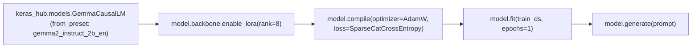

# 📹 Fine-tune Gemma models With Custom Data in Keras using LoRA

<div className="video-card" style={{border: '1px solid #30363d', borderRadius: '8px', padding: '16px', marginBottom: '24px', background: 'rgba(56, 139, 253, 0.05)'}}>
  <div style={{display: 'flex', gap: '16px', flexWrap: 'wrap'}}>
    <div><strong>Instructor:</strong> Krish Naik</div>
    <div><strong>Duration:</strong> 1081</div>
    <div><strong>Course:</strong> Module 7: Cloud AI & LoRA Fine-Tuning</div>
    <div><strong>Watch Link:</strong> <a href="https://www.youtube.com/watch?v=IZXNgu4dW70" target="_blank" rel="noopener noreferrer">YouTube Lecture ↗</a></div>
  </div>
</div>

## 📌 Executive Summary

Fine-tuning Google's Gemma models using KerasHub (formerly KerasNLP) offers a clean, expressive API that runs natively across TensorFlow, PyTorch, and JAX backends with minimal boilerplate.

This lesson explores fine-tuning Gemma with LoRA in KerasHub: loading causal language models, configuring low-rank adapters, compiling with AdamW, and running inference.

---

## 🏗️ System Architecture & Execution Flow



---

## 📖 Core Concepts & Technical Deep Dive

### 1. The Multi-Backend Superpower of Keras 3
Keras 3 allows engineers to write model pipelines once and execute them on JAX (for unmatched TPU throughput on Google Cloud), PyTorch (for GPU clusters), or TensorFlow (for existing legacy serving systems).

### 2. LoRA Support in KerasHub
KerasHub provides a one-line method: `backbone.enable_lora(rank=8)`. This automatically freezes all pre-trained weights in the transformer backbone, injects low-rank decomposition layers into all projection layers, and exposes only the low-rank adapter variables for gradient optimization.

---

## 💻 Production Implementation

```python
# Fine-Tuning Gemma with LoRA in KerasHub (Concept)
# import os
# os.environ["KERAS_BACKEND"] = "jax"  # Or "torch"
# import keras_hub

# gemma_lm = keras_hub.models.GemmaCausalLM.from_preset("gemma2_instruct_2b_en")
# gemma_lm.backbone.enable_lora(rank=8)
# gemma_lm.summary()  # Trainable parameters drop to ~0.2%!
print("KerasHub Gemma LoRA workflow configured.")
```

---

## ⚙️ Production Gotchas & Best Practices

:::tip Leverage JAX for TPU Fine-Tuning
When training on Google Cloud Platform TPUs (v4/v5e), set `KERAS_BACKEND="jax"`. JAX XLA compilation delivers up to 2.5x faster throughput than equivalent PyTorch setups.
:::

:::warning Set Max Sequence Length
KerasHub models allocate memory based on sequence length. Explicitly set `max_sequence_length=512` or `1024` to prevent high memory allocations when working with small datasets.
:::

---

## 📊 Architectural Reference & Comparison

| Feature | KerasHub | Hugging Face PEFT + TRL |
| :--- | :--- | :--- |
| **Backend Engine** | Multi-backend (JAX, PyTorch, TensorFlow) | PyTorch only |
| **LoRA Enabling** | Single line (`enable_lora(rank=8)`) | Requires `LoraConfig` and `get_peft_model` |
| **TPU Optimization** | Native, world-class via JAX | Requires PyTorch XLA setup |
| **Ecosystem Size** | Fast growing | Massive, de facto industry standard |

---

## 📚 Key Takeaways & Enterprise Checklist

- [ ] **Architecture Verification:** Ensure your design addresses latency, decoupled interfaces, and strict data validation contracts.
- [ ] **Deterministic Testing:** Run unit tests and golden dataset evaluations before shipping changes to staging or production.
- [ ] **Security & Observability:** Enforce input/output guardrails, scrub sensitive credentials/PII, and capture distributed traces.
- [ ] **Scalability & Sizing:** Calibrate model parameters, context limits, and compute instance requirements against projected request concurrency.
