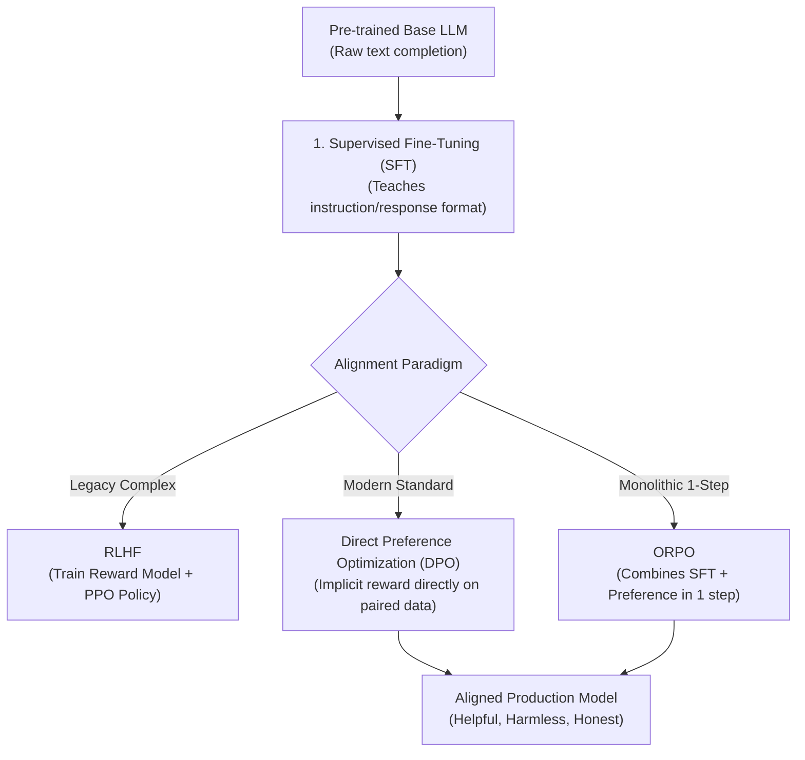

# 📹 Generative AI Fine Tuning LLM Models Crash Course

<div className="video-card" style={{border: '1px solid #30363d', borderRadius: '8px', padding: '16px', marginBottom: '24px', background: 'rgba(56, 139, 253, 0.05)'}}>
  <div style={{display: 'flex', gap: '16px', flexWrap: 'wrap'}}>
    <div><strong>Instructor:</strong> Krish Naik</div>
    <div><strong>Duration:</strong> 9410</div>
    <div><strong>Course:</strong> Module 7: Cloud AI & LoRA Fine-Tuning</div>
    <div><strong>Watch Link:</strong> <a href="https://www.youtube.com/watch?v=t-0s_2uZZU0" target="_blank" rel="noopener noreferrer">YouTube Lecture ↗</a></div>
  </div>
</div>

## 📌 Executive Summary

A complete synthesis crash course on the modern LLM alignment and fine-tuning spectrum: comparing Supervised Fine-Tuning (SFT), Reinforcement Learning from Human Feedback (RLHF), Direct Preference Optimization (DPO), and Odds Ratio Preference Optimization (ORPO).

This lesson provides the architectural roadmap for aligning foundation models to specific enterprise personas and safety guidelines.

---

## 🏗️ System Architecture & Execution Flow



---

## 📖 Core Concepts & Technical Deep Dive

### 1. The Three Stages of Modern Model Training
1. **Pre-Training:** Unsupervised next-token prediction on trillions of tokens (Cost: $5M - $100M).
2. **Supervised Fine-Tuning (SFT):** Instruction tuning on 10k-100k curated (Prompt, Response) pairs. Teaches the model to act as a conversational assistant.
3. **Preference Alignment:** Aligning the model to prefer desirable outputs over undesirable ones (Helpful, Harmless, Honest).

### 2. DPO vs RLHF
- **RLHF (PPO):** Requires training a separate Reward Model, then using reinforcement learning (PPO) to update the actor model. Highly sensitive to hyper-parameters, prone to training instability.
- **DPO (Direct Preference Optimization):** Mathematically proves that the language model itself implicitly defines the reward function. Trains directly on paired data: `(Prompt, Chosen Answer, Rejected Answer)` using standard cross-entropy loss.

---

## 💻 Production Implementation

```python
from trl import DPOTrainer, DPOConfig

# Enterprise DPO Alignment Configuration
dpo_config = DPOConfig(
    output_dir="./dpo_aligned_model",
    beta=0.1,                     # Implicit reward scaling temperature
    learning_rate=5e-7,           # Lower learning rate for preference alignment
    per_device_train_batch_size=2,
    gradient_accumulation_steps=8,
    num_train_epochs=1,
    logging_steps=10
)

print("DPO Alignment Trainer configured for preference fine-tuning.")
```

---

## ⚙️ Production Gotchas & Best Practices

:::tip Start with SFT Before DPO
Never attempt DPO directly on an unaligned base model. The model must first understand basic conversational syntax through SFT before it can differentiate between chosen and rejected responses.
:::

:::warning DPO Data Quality is Paramount
Low-quality chosen/rejected pairs will destroy model reasoning. Ensure human experts (or frontier judge LLMs like Claude 3.5 Sonnet) rigorously curate the preference dataset.
:::

---

## 📊 Architectural Reference & Comparison

| Alignment Method | Reward Model Required? | Training Complexity | Memory Footprint | Industry Adoption |
| :--- | :--- | :--- | :--- | :--- |
| **SFT (Supervised)**| No | Low | Baseline | Standard starting point |
| **RLHF (PPO)** | Yes (Separate Model) | Very High (Unstable) | High (4 active models) | Declining (Legacy) |
| **DPO** | No (Implicit Reward) | Low - Moderate | Moderate (2 active models) | High (Modern Standard) |
| **ORPO** | No | Low (Single stage) | Low (1 active model) | Emerging (Cost-effective) |

---

## 📚 Key Takeaways & Enterprise Checklist

- [ ] **Architecture Verification:** Ensure your design addresses latency, decoupled interfaces, and strict data validation contracts.
- [ ] **Deterministic Testing:** Run unit tests and golden dataset evaluations before shipping changes to staging or production.
- [ ] **Security & Observability:** Enforce input/output guardrails, scrub sensitive credentials/PII, and capture distributed traces.
- [ ] **Scalability & Sizing:** Calibrate model parameters, context limits, and compute instance requirements against projected request concurrency.
