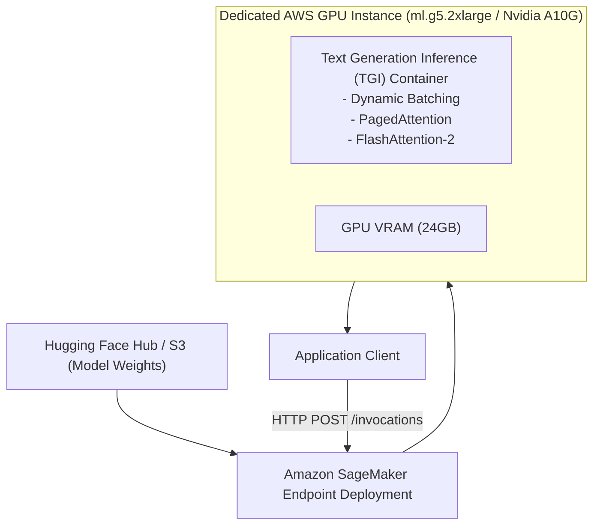

# Deploying Open-Source LLMs on Amazon SageMaker

<div className="video-card" style={{border: '1px solid #30363d', borderRadius: '8px', padding: '16px', marginBottom: '24px', background: 'rgba(56, 139, 253, 0.05)'}}>
  <div style={{display: 'flex', gap: '16px', flexWrap: 'wrap', alignItems: 'center'}}>
    <div><strong>Curators:</strong> Krish Naik</div>
    <div><strong>Module:</strong> Module 7: Cloud AI & LoRA Fine-Tuning</div>
    <div><strong>Focus:</strong> Beginner to Production</div>
  </div>
</div>

## 🎯 What You'll Learn
- Understand when to use Amazon SageMaker dedicated endpoints vs serverless Bedrock APIs.
- Deploy models using Hugging Face Deep Learning Containers with Text Generation Inference (TGI).
- Configure real-time auto-scaling policies based on GPU concurrency.

---

## 💡 Concept & Architecture

While Bedrock is serverless, enterprises often require **dedicated, private GPU endpoints** on **Amazon SageMaker**:
- You have custom fine-tuned weights that you don't want to share with third parties.
- You require ultra-low latency guarantees without noisy-neighbor multi-tenant latency spikes.
- You need deep hardware control (e.g. multi-GPU tensor parallelism with `vLLM` or Hugging Face TGI).

Amazon SageMaker partners with Hugging Face to provide pre-built **Deep Learning Containers (DLC)** that deploy models like Llama 3 with a single Python script.

### System Architecture & Data Flow



---

## 💻 Step-by-Step Code Walkthrough

Below is the complete implementation broken down into digestible parts so you can understand every line.

### Part 1: Step 1: Deploying a Model to SageMaker with the Python SDK

```python
# Blueprint for deploying Llama 3 via SageMaker Python SDK
# from sagemaker.huggingface import HuggingFaceModel, get_huggingface_llm_image_uri
#
# # 1. Retrieve the optimized Hugging Face TGI container URI
# image_uri = get_huggingface_llm_image_uri("huggingface", version="2.2.0")
#
# # 2. Configure model deployment parameters
# hub_config = {
#     'HF_MODEL_ID': 'meta-llama/Meta-Llama-3-8B-Instruct',
#     'SM_NUM_GPUS': '1',
#     'MAX_INPUT_LENGTH': '2048',
#     'MAX_TOTAL_TOKENS': '4096'
# }
#
# # 3. Create SageMaker HuggingFaceModel
# model = HuggingFaceModel(
#     image_uri=image_uri,
#     env=hub_config,
#     role='arn:aws:iam::123456789012:role/SageMakerExecutionRole'
# )
#
# # 4. Deploy to a dedicated GPU instance
# predictor = model.deploy(
#     initial_instance_count=1,
#     instance_type='ml.g5.2xlarge' # Nvidia A10G (24GB VRAM)
# )

print("SageMaker Hugging Face LLM deployment blueprint configured.")
```

#### 🔍 In-Depth Explanation:
This script pulls the official TGI container and deploys an open-source model directly to a dedicated Nvidia A10G instance.

---

## ⚠️ Beginner Tips & Best Practices

:::tip Use Asynchronous Endpoints for Heavy Workloads
If your model processes long 10-page documents taking 30 seconds, use SageMaker Asynchronous Endpoints with S3 queues instead of synchronous real-time endpoints.
:::

:::warning Remember to Delete Unused Endpoints
Dedicated GPU instances charge 24/7 by the hour (e.g. `ml.g5.2xlarge` costs ~$1.20/hour). Always call `predictor.delete_endpoint()` when development testing is complete to avoid unexpected AWS bills.
:::

---

## 📝 Key Takeaways & Summary

- Amazon SageMaker provides dedicated, private GPU hosting for proprietary and open-source models.
- Text Generation Inference (TGI) provides dynamic batching and FlashAttention acceleration.
- Dedicated endpoints guarantee private network security and predictable latency.

