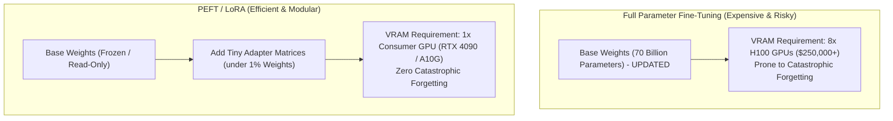

# Foundations of Fine-Tuning: Full Fine-Tuning vs PEFT

<div className="video-card" style={{border: '1px solid #30363d', borderRadius: '8px', padding: '16px', marginBottom: '24px', background: 'rgba(56, 139, 253, 0.05)'}}>
  <div style={{display: 'flex', gap: '16px', flexWrap: 'wrap', alignItems: 'center'}}>
    <div><strong>Curators:</strong> Krish Naik</div>
    <div><strong>Module:</strong> Module 7: Cloud AI & LoRA Fine-Tuning</div>
    <div><strong>Focus:</strong> Beginner to Production</div>
  </div>
</div>

## 🎯 What You'll Learn
- Understand why Full Parameter Fine-Tuning on 70B models requires multi-million dollar GPU clusters.
- Master Parameter-Efficient Fine-Tuning (PEFT) and catastrophic forgetting.
- Differentiate Pre-Training, Supervised Fine-Tuning (SFT), and Preference Alignment (RLHF/DPO).

---

## 💡 Concept & Architecture

To understand fine-tuning, look at the three stages of creating an AI model:
1. **Pre-Training:** Training a model on trillions of tokens of raw internet text across thousands of GPUs for months. The model learns grammar and world facts, but acts like an autocomplete engine.
2. **Supervised Fine-Tuning (SFT) / Instruction Tuning:** Training on high-quality `(Instruction, Response)` prompt pairs. The model learns to follow commands and act as a helpful conversational assistant.
3. **Preference Alignment (RLHF / DPO):** Reinforcement learning aligning the model with human values (helpfulness, honesty, harmlessness).

### Full Fine-Tuning vs PEFT
- **Full Fine-Tuning:** Updates every single weight matrix in the model (all 70 billion parameters!). Requires massive VRAM to store optimizer states (AdamW requires 16 bytes per parameter) and causes **Catastrophic Forgetting** (the model forgets general reasoning).
- **PEFT (Parameter-Efficient Fine-Tuning):** Freezes 99% of the base model weights and trains only a tiny set of lightweight adapter parameters (under 1% of total parameters!).

### System Architecture & Data Flow



---

## 💻 Step-by-Step Code Walkthrough

Below is the complete implementation broken down into digestible parts so you can understand every line.

### Part 1: Step 1: Calculating Memory Requirements for Full vs PEFT Training

```python
def calculate_training_vram(model_params_billions: float, is_full_tuning: bool) -> float:
    """Estimate required GPU VRAM in Gigabytes for fine-tuning."""
    if is_full_tuning:
        # Model weights (16-bit) = 2 bytes/param
        # Gradients = 2 bytes/param
        # AdamW Optimizer states (momentum + variance in 32-bit) = 12 bytes/param
        # Total = ~16 to 18 bytes per parameter + activations
        bytes_per_param = 16
        return round(model_params_billions * bytes_per_param * 1.25, 2)
    else:
        # PEFT with 4-bit quantization (QLoRA):
        # Base model quantized to 0.5 bytes/param
        # Trainable adapter weights < 1% of parameters
        return round((model_params_billions * 0.5) + 4.0, 2)

print(f"70B Full Tuning VRAM:  {calculate_training_vram(70, is_full_tuning=True)} GB (Requires 16x 80GB H100s!)")
print(f"70B QLoRA Tuning VRAM: {calculate_training_vram(70, is_full_tuning=False)} GB (Runs on a single workstation!)")
```

#### 🔍 In-Depth Explanation:
This calculation reveals why PEFT revolutionized AI engineering: it reduces required training VRAM by more than 95%.

---

## ⚠️ Beginner Tips & Best Practices

:::tip Use SFT for Format and Style, Not Facts
Fine-tuning is fantastic for teaching models to output valid medical ICD-10 codes, legal JSON schemas, or company style guidelines. Use RAG for retrieving facts.
:::

:::warning Beware of Data Quality over Quantity
1,000 carefully curated, high-quality instruction pairs will outperform 100,000 noisy, auto-generated examples. High data quality is paramount in SFT.
:::

---

## 📝 Key Takeaways & Summary

- Full Parameter Fine-Tuning updates all weights and requires massive GPU compute clusters.
- Parameter-Efficient Fine-Tuning (PEFT) freezes base weights and trains tiny adapter matrices.
- PEFT eliminates catastrophic forgetting and drastically lowers hardware requirements.

