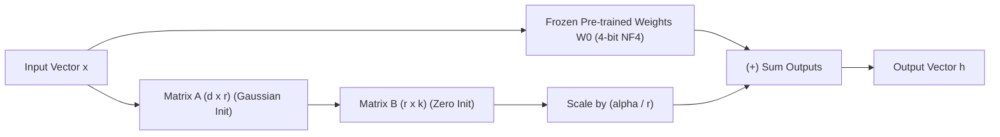

# LoRA & QLoRA: Mathematical Intuition, Rank & 4-bit Quantization

<div className="video-card" style={{border: '1px solid #30363d', borderRadius: '8px', padding: '16px', marginBottom: '24px', background: 'rgba(56, 139, 253, 0.05)'}}>
  <div style={{display: 'flex', gap: '16px', flexWrap: 'wrap', alignItems: 'center'}}>
    <div><strong>Curators:</strong> Krish Naik</div>
    <div><strong>Module:</strong> Module 7: Cloud AI & LoRA Fine-Tuning</div>
    <div><strong>Focus:</strong> Beginner to Production</div>
  </div>
</div>

## 🎯 What You'll Learn
- Understand the mathematical foundation of LoRA: Low-Rank Matrix Decomposition.
- Master the key hyperparameters: Rank `r`, `lora_alpha`, and `target_modules`.
- Understand QLoRA: 4-bit NormalFloat (NF4), Double Quantization, and Paged Optimizers.

---

## 💡 Concept & Architecture

How does **LoRA (Low-Rank Adaptation)** work under the hood?

In a Transformer layer, weight updates during training can be represented as:
$$W = W_0 + \Delta W$$
Where:
- $W_0$ is the original frozen weight matrix of size $(d \times k)$ (e.g. $4096 \times 4096 = 16,777,216$ parameters).
- $\Delta W$ represents the learned updates.

### The Low-Rank Factorization Trick
Edward Hu et al. discovered that $\Delta W$ has a very low **intrinsic rank**. Instead of training all 16.7 million values in $\Delta W$, LoRA decomposes it into two tiny low-rank matrices:
$$\Delta W = B \times A$$
Where:
- $B$ has dimensions $(d \times r)$
- $A$ has dimensions $(r \times k)$
- $r$ (the rank) is a tiny integer, typically **$r = 8$ or $r = 16$**!

If $d = 4096$ and $r = 8$:
- Total parameters in $B \times A$: $(4096 \times 8) + (8 \times 4096) = 65,536$ parameters!
- **That is a 99.6% parameter reduction!**

### What is QLoRA?
Tim Dettmers et al. introduced **QLoRA (Quantized LoRA)**:
1. **NF4 (4-bit NormalFloat):** The 16-bit frozen base weights ($W_0$) are compressed into 4-bit representations.
2. **Double Quantization:** Quantizes the quantization constants themselves, saving additional VRAM.
3. **Paged Optimizers:** Uses CUDA Unified Memory to page memory between GPU and CPU RAM, preventing out-of-memory spikes!

### System Architecture & Data Flow



---

## 💻 Step-by-Step Code Walkthrough

Below is the complete implementation broken down into digestible parts so you can understand every line.

### Part 1: Step 1: Inspecting LoRA Configuration Parameters in Python

```python
from peft import LoraConfig, TaskType

# Standard production LoRA configuration for causal language modeling
peft_config = LoraConfig(
    task_type=TaskType.CAUSAL_LM,
    r=16,                       # Rank dimension: higher r captures more complex patterns (typically 8, 16, or 32)
    lora_alpha=32,              # Scaling factor: alpha / r = 32 / 16 = 2.0 scaling multiplier
    lora_dropout=0.05,          # Dropout probability for regularization
    target_modules=[            # Target attention projection matrices to adapt
        "q_proj",
        "k_proj",
        "v_proj",
        "o_proj"
    ],
    bias="none"                 # Do not train bias terms
)

print("LoRA Configuration successfully initialized:")
print(f"- Rank (r): {peft_config.r}")
print(f"- Alpha Scaling Multiplier: {peft_config.lora_alpha / peft_config.r}")
print(f"- Target Modules: {peft_config.target_modules}")
```

#### 🔍 In-Depth Explanation:
This configuration instructs the `peft` library to insert adapter matrices alongside the query, key, value, and output projection layers of the transformer.

---

## ⚠️ Beginner Tips & Best Practices

:::tip Rule of Thumb for lora_alpha
Set `lora_alpha = 2 * r` (e.g. if `r=16`, set `lora_alpha=32`). This maintains a stable scaling ratio and smooth gradient updates.
:::

:::warning Target All Linear Layers for High Quality
While early LoRA papers only adapted `q_proj` and `v_proj`, modern 2026 practice adapts all linear layers (`q, k, v, o, gate, up, down_proj`) for maximum benchmark performance.
:::

---

## 📝 Key Takeaways & Summary

- LoRA decomposes parameter updates into two low-rank matrices ($B \times A$), reducing trainable weights by 99%.
- Base weights remain frozen, allowing multiple modular task adapters to share one base model.
- QLoRA quantizes base weights to 4-bit NormalFloat, enabling fine-tuning of 70B models on commodity GPUs.

