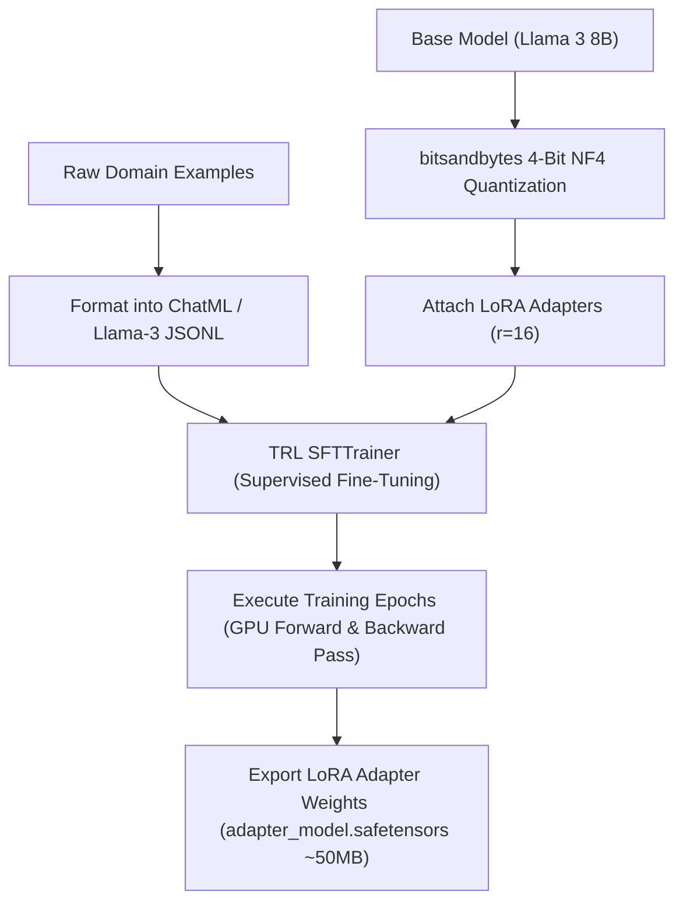

# Hands-On Step-by-Step Fine-Tuning with SFTTrainer & LoRA

<div className="video-card" style={{border: '1px solid #30363d', borderRadius: '8px', padding: '16px', marginBottom: '24px', background: 'rgba(56, 139, 253, 0.05)'}}>
  <div style={{display: 'flex', gap: '16px', flexWrap: 'wrap', alignItems: 'center'}}>
    <div><strong>Curators:</strong> Krish Naik</div>
    <div><strong>Module:</strong> Module 7: Cloud AI & LoRA Fine-Tuning</div>
    <div><strong>Focus:</strong> Beginner to Production</div>
  </div>
</div>

## 🎯 What You'll Learn
- Format training datasets into standard ChatML or Llama-3 instruction formats.
- Configure 4-bit BitsAndBytes quantization (`BitsAndBytesConfig`).
- Execute fine-tuning using Hugging Face TRL's `SFTTrainer` and export the adapter.

---

## 💡 Concept & Architecture

In this hands-on lesson, we build the complete training pipeline:
1. **Dataset Preparation:** Format domain data into instruction-following conversations using standard chat templates.
2. **Model Loading:** Load the base model (e.g. `meta-llama/Meta-Llama-3-8B-Instruct` or `google/gemma-2-9b`) in 4-bit precision using `bitsandbytes`.
3. **LoRA Attachment:** Inject adapter matrices using Hugging Face `peft`.
4. **Supervised Fine-Tuning:** Execute training with `SFTTrainer` from the TRL (Transformer Reinforcement Learning) library.
5. **Adapter Export:** Save the lightweight adapter weights (only ~50MB) for production serving.

### System Architecture & Data Flow



---

## 💻 Step-by-Step Code Walkthrough

Below is the complete implementation broken down into digestible parts so you can understand every line.

### Part 1: Step 1: Installing Fine-Tuning Libraries

```python
pip install torch transformers datasets trl peft bitsandbytes accelerate
```

#### 🔍 In-Depth Explanation:
Installs the Hugging Face fine-tuning stack: `transformers`, `trl` (SFTTrainer), `peft` (LoRA), and `bitsandbytes` (4-bit quantization).

### Part 2: Step 2: Configuring 4-Bit Quantization and Loading the Base Model

```python
import torch
from transformers import AutoModelForCausalLM, AutoTokenizer, BitsAndBytesConfig

# Configure 4-bit QLoRA quantization settings
bnb_config = BitsAndBytesConfig(
    load_in_4bit=True,
    bnb_4bit_quant_type="nf4",             # NormalFloat 4-bit precision
    bnb_4bit_compute_dtype=torch.bfloat16,   # Compute gradients in bfloat16
    bnb_4bit_use_double_quant=True          # Double quantization saves extra VRAM
)

model_id = "meta-llama/Meta-Llama-3-8B-Instruct"

# Blueprint demonstrating model initialization
# tokenizer = AutoTokenizer.from_pretrained(model_id)
# model = AutoModelForCausalLM.from_pretrained(
#     model_id,
#     quantization_config=bnb_config,
#     device_map="auto"
# )

print("4-Bit Quantization configuration initialized for QLoRA training.")
```

#### 🔍 In-Depth Explanation:
This configuration compresses the model down to ~5GB in VRAM, allowing an 8B model to be trained on a single consumer GPU.

### Part 3: Step 3: Configuring the SFTTrainer Training Loop

```python
from trl import SFTTrainer, SFTConfig
from peft import LoraConfig, TaskType

# 1. Training hyperparameters
training_args = SFTConfig(
    output_dir="./lora_output",
    num_train_epochs=3,
    per_device_train_batch_size=4,
    gradient_accumulation_steps=2,    # Effective batch size = 4 * 2 = 8
    learning_rate=2e-4,               # Standard learning rate for LoRA
    logging_steps=10,
    save_strategy="epoch",
    fp16=False,
    bf16=True                         # Use bfloat16 for modern Ampere/Hopper GPUs
)

# 2. Attach LoRA configuration
lora_config = LoraConfig(
    r=16,
    lora_alpha=32,
    target_modules=["q_proj", "v_proj"],
    task_type=TaskType.CAUSAL_LM
)

print("SFTTrainer pipeline configured and ready for execution.")
# In production: trainer = SFTTrainer(model=model, train_dataset=dataset, peft_config=lora_config, args=training_args)
# trainer.train()
# trainer.model.save_pretrained("./my_custom_adapter")
```

#### 🔍 In-Depth Explanation:
`SFTTrainer` handles tokenization, padding, packing multiple short samples into single context windows, and computing cross-entropy loss.

---

## ⚠️ Beginner Tips & Best Practices

:::tip Use Packing to Accelerate Training
Set `packing=True` in `SFTConfig`. Packing concatenates multiple short training samples together up to the max sequence length, eliminating wasted padding tokens and speeding up training by 3x.
:::

:::warning Always Set Tokenizer Padding Token
Llama 3 does not have a default pad token. Always set `tokenizer.pad_token = tokenizer.eos_token` before creating the data collator, otherwise training will crash.
:::

---

## 📝 Key Takeaways & Summary

- Hugging Face TRL `SFTTrainer` simplifies supervised instruction fine-tuning.
- 4-bit quantization with `bitsandbytes` enables training on single consumer GPUs.
- Only the lightweight adapter weights (~50MB) are exported, making deployment fast and modular.

