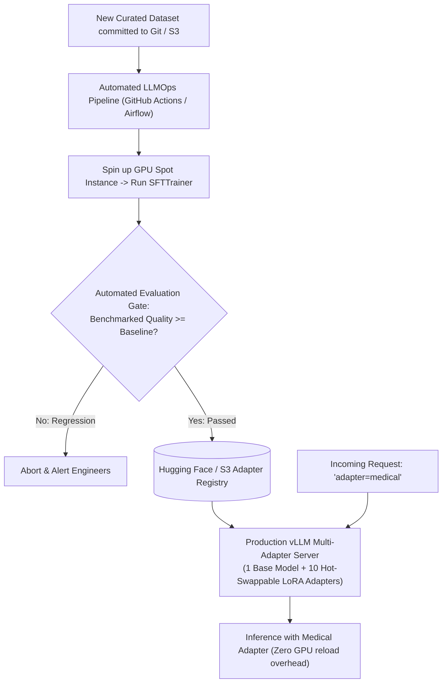

# LLMOps: Automated Retraining Pipelines & Adapter Serving

<div className="video-card" style={{border: '1px solid #30363d', borderRadius: '8px', padding: '16px', marginBottom: '24px', background: 'rgba(56, 139, 253, 0.05)'}}>
  <div style={{display: 'flex', gap: '16px', flexWrap: 'wrap', alignItems: 'center'}}>
    <div><strong>Curators:</strong> Krish Naik</div>
    <div><strong>Module:</strong> Module 7: Cloud AI & LoRA Fine-Tuning</div>
    <div><strong>Focus:</strong> Beginner to Production</div>
  </div>
</div>

## 🎯 What You'll Learn
- Understand LLMOps: continuous integration, automated retraining, and model registry governance.
- Serve multiple specialized LoRA adapters on top of a single base model using `vLLM`.
- Automate retraining jobs when new domain datasets are committed.

---

## 💡 Concept & Architecture

Training a model in a Jupyter Notebook is an experiment. Shipping it as a reliable business capability requires **LLMOps (Large Language Model Operations)**:
1. **Data Versioning:** Versioning training instruction datasets using DVC or Hugging Face Datasets.
2. **Automated CI/CD Retraining:** Triggering GPU training runs in AWS SageMaker or RunPod whenever curated data updates are merged into the main branch.
3. **Adapter Registry:** Storing versioned adapters (`finance-adapter:v1`, `legal-adapter:v2`).
4. **Multi-LoRA Dynamic Serving:** Serving dozens of different specialist adapters concurrently on a single base model without needing 10 separate GPU instances!

### System Architecture & Data Flow



---

## 💻 Step-by-Step Code Walkthrough

Below is the complete implementation broken down into digestible parts so you can understand every line.

### Part 1: Step 1: Serving Multiple LoRA Adapters Dynamically with vLLM

```python
# In production, high-throughput LLM serving engines like vLLM support dynamic LoRA:
# You load ONE copy of the 8B base model into VRAM (16GB).
# Then you register multiple lightweight 50MB adapters!

# vLLM Command Line Launch with multi-LoRA support:
# python3 -m vllm.entrypoints.openai.api_server \
#     --model meta-llama/Meta-Llama-3-8B-Instruct \
#     --enable-lora \
#     --lora-modules \
#         sql-adapter=/adapters/sql_v2 \
#         support-adapter=/adapters/customer_support_v1 \
#     --port 8000
```

#### 🔍 In-Depth Explanation:
This allows a single GPU server to act as a SQL specialist for developer requests and a customer support specialist for user requests without reloading weights.

### Part 2: Step 2: Querying Specific LoRA Adapters via OpenAI Client

```python
from openai import OpenAI

# Connect to the local vLLM OpenAI-compatible endpoint
client = OpenAI(
    base_url="http://localhost:8000/v1",
    api_key="dummy-token"
)

# Request inference specifying the specific LoRA adapter name in the 'model' field
# response = client.chat.completions.create(
#     model="sql-adapter",  # Dynamically routes request through the SQL LoRA adapter!
#     messages=[
#         {"role": "user", "content": "Write an optimized query to find active users."}
#     ]
# )

print("Dynamic LoRA adapter routing configured via standard OpenAI SDK.")
```

#### 🔍 In-Depth Explanation:
Clients simply pass the adapter name in the standard `model` parameter. The serving engine dynamically applies the adapter weights during forward pass calculations.

---

## ⚠️ Beginner Tips & Best Practices

:::tip Use Cloud Spot Instances for Retraining
Because fine-tuning is an offline batch process, train on AWS Spot Instances or RunPod community cloud to cut GPU compute costs by 70% compared to on-demand pricing.
:::

:::warning Always Benchmark Before Deploying New Adapters
Never automatically promote an adapter to production without running the Golden Dataset evaluation suite. Ensure the new adapter beats the current production version on accuracy.
:::

---

## 📝 Key Takeaways & Summary

- LLMOps automates the lifecycle from data versioning to automated retraining and deployment.
- `vLLM` enables multi-LoRA serving, running multiple specialist models on a single GPU instance.
- Automated evaluation gates ensure that only verified, regression-free adapters reach production.

