# 🚀 2026 Production AI Engineering Roadmap
### High-Throughput Systems, Agentic Workflows, Evaluation & Cloud Deployment

This comprehensive documentation portal translates **169 video lectures** from **CampusX (Nitish Singh)** and **Krish Naik** into production-grade study guides, interactive architecture diagrams, code walkthroughs, and interview cheat sheets.

---

## 🗺️ Architectural Learning Path

```mermaid
flowchart TD
    subgraph M1["Module 1: Production Backend & Systems"]
        F1["FastAPI & ASGI Architecture"]
        F2["Pydantic v2 Type Enforcement"]
        F3["Docker Containerization & AWS EC2"]
    end

    subgraph M2["Module 2: LCEL, Local LLMs & Tool Calling"]
        L1["LangChain Expression Language (LCEL)"]
        L2["Local Inference with Ollama & Groq LPUs"]
        L3["Vector DBs: Chroma, FAISS, AstraDB, ObjectBox"]
    end

    subgraph M3["Module 3: Advanced RAG & Memory Architectures"]
        R1["Corrective RAG (CRAG) & Self-RAG"]
        R2["Short-Term State vs Long-Term Episodic Memory"]
        R3["Multi-Modal RAG (Vision + Documents)"]
    end

    subgraph M4["Module 4: Agentic AI & LangGraph"]
        A1["State Graphs & Cyclical Workflows"]
        A2["Persistence & Checkpointers (SQLite/Postgres)"]
        A3["Human-in-the-Loop (HITL) & Time Travel"]
        A4["CrewAI, Agno/Phidata, SmolAgents"]
    end

    subgraph M5["Module 5: Model Context Protocol (MCP) & Claude Code"]
        C1["MCP Architecture & Protocol Lifecycle"]
        C2["Custom Python Stdio & SSE MCP Servers"]
        C3["Claude Code CLI & Spec-Driven Development"]
    end

    subgraph M6["Module 6: LLM Evaluation & Observability"]
        E1["LLM-as-a-Judge & Golden Datasets"]
        E2["RAG Triad: Faithfulness, Relevance, Recall"]
        E3["DeepEval, Ragas & LangSmith Tracing"]
    end

    subgraph M7["Module 7: Cloud AI & LoRA Fine-Tuning"]
        T1["AWS Bedrock & Serverless GenAI Pipelines"]
        T2["SageMaker Real-Time Endpoints"]
        T3["PEFT, LoRA & QLoRA Mathematical Intuition"]
    end

    M1 --> M2 --> M3 --> M4 --> M5 --> M6 --> M7
```

---

## 📚 Curriculum Breakdown by Module

| Module | Title | Primary Topics | Video Count |
| :--- | :--- | :--- | :--- |
| **01** | **[Production Backend, Pydantic & Docker](/docs/1.0.0/category/module-1-production-backend--docker)** | FastAPI, REST, Pydantic v2, Docker, AWS EC2 | 13 Videos |
| **02** | **[LCEL, Local LLMs & Tool Calling](/docs/1.0.0/category/module-2-lcel-local-llms--tool-calling)** | LangChain LCEL, Ollama, Groq, AstraDB, ObjectBox, Pinecone | 38 Videos |
| **03** | **[Advanced RAG, Memory & Vector Search](/docs/1.0.0/category/module-3-advanced-rag--memory)** | CRAG, Self-RAG, Memory architectures, Multi-modal RAG | 15 Videos |
| **04** | **[Agentic AI, LangGraph & Multi-Agents](/docs/1.0.0/category/module-4-agentic-ai--langgraph)** | LangGraph, Checkpointers, HITL, CrewAI, Phidata, SmolAgents | 45 Videos |
| **05** | **[Model Context Protocol & Claude Code](/docs/1.0.0/category/module-5-mcp--claude-code)** | MCP Servers/Clients, Claude Code CLI, SubAgents, Plugins | 27 Videos |
| **06** | **[LLM Evaluation & Observability](/docs/1.0.0/category/module-6-llm-evaluation--observability)** | DeepEval, Ragas, RAG Triad, Toxicity testing, LangSmith | 16 Videos |
| **07** | **[Cloud AI, Bedrock & LoRA Fine-Tuning](/docs/1.0.0/category/module-7-cloud-ai--lora-fine-tuning)** | AWS Bedrock, SageMaker, PEFT, LoRA/QLoRA Fine-Tuning | 15 Videos |
| **Total** | | **Comprehensive 2026 Production Curriculum** | **169 Videos** |

---

## 🎯 Production Engineering Competencies

To meet 2026 industry standards for AI Engineering, each module emphasizes:

1. **Async Non-Blocking Execution:** Asynchronous Python (`asyncio`) endpoints with Server-Sent Events (SSE) for token streaming.
2. **Deterministic Outputs:** Strict schema validation with `Pydantic v2` and `Instructor`.
3. **Fault-Tolerant State Workflows:** LangGraph cyclical graphs with persistent database checkpointers (`SqliteSaver`, `PostgresSaver`).
4. **Tool Standardisation:** Model Context Protocol (MCP) clients and servers to decouple tools from models.
5. **Continuous Evaluation:** Automated test suites measuring Faithfulness, Answer Relevance, and Context Recall in CI/CD.
