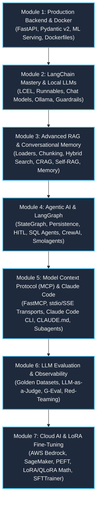

# 🚀 2026 Production AI Engineering Master Roadmap

Welcome to **Version 2.0** of the **Production AI Engineering Hub**.

This unified documentation synthesizes over **150+ hours** of masterclasses from India's leading AI educators: **Nitish Singh (CampusX)** and **Krish Naik**. 

All duplicate playlists (LangChain, RAG, LangGraph, Claude Code) have been consolidated into a single, cohesive, step-by-step master progression. Every code block is broken down into guided steps with full inline comments and beginner explanations.

---

## 🗺️ The 7-Module Architecture

---

## 📚 Module Breakdown

### 1. [Module 1: Production Backend & Docker](./category/module-1-production-backend--docker)
- **Focus:** Building robust ASGI APIs, validating inputs with Pydantic, serving ML models efficiently, and containerizing with Docker.
- **Key Skills:** FastAPI, Uvicorn, Pydantic v2, Lifespan Handlers, Docker Layer Caching, Port Mapping.

### 2. [Module 2: LangChain Mastery & Local LLMs](./category/module-2-langchain-mastery--local-llms)
- **Focus:** The modern decoupled LangChain v0.3+ architecture, LangChain Expression Language (LCEL), local models with Ollama, and pipeline guardrails.
- **Key Skills:** `langchain-core`, LCEL pipe operator (`|`), `with_structured_output`, `RunnableParallel`, Ollama Llama 3, Streaming with SSE.
- **Curator Synthesis:** Combines CampusX's deep LCEL runnable mechanics with Krish Naik's hands-on deployment and guardrails.

### 3. [Module 3: Advanced RAG & Conversational Memory](./category/module-3-advanced-rag--conversational-memory)
- **Focus:** End-to-end knowledge retrieval systems, eliminating hallucinations with active evaluation, and managing multi-turn memory.
- **Key Skills:** `RecursiveCharacterTextSplitter`, FAISS, Chroma, Hybrid Search (Dense + BM25), Corrective RAG (CRAG), Self-RAG, Multimodal RAG, SQLite Memory Checkpointers.
- **Curator Synthesis:** Merges CampusX's CRAG, Self-RAG, and memory architecture with Krish Naik's complete RAG pipeline from scratch and multimodal indexing.

### 4. [Module 4: Agentic AI & LangGraph](./category/module-4-agentic-ai--langgraph)
- **Focus:** Autonomous, cyclic AI agents, state machine orchestration, human approval gates, and multi-agent frameworks.
- **Key Skills:** LangGraph `StateGraph`, Nodes, Edges, Database Persistence, Breakpoints (`interrupt_before`), Multi-Agent Subgraphs, SQL Agents, CrewAI, Smolagents.
- **Curator Synthesis:** Combines CampusX's LangGraph core mechanics and state persistence with Krish Naik's real-world database agents, CrewAI, and Smolagents.

### 5. [Module 5: Model Context Protocol (MCP) & Claude Code](./category/module-5-model-context-protocol-mcp--claude-code)
- **Focus:** The open USB-C standard for connecting AI models to enterprise data, and agentic terminal coding with Claude Code.
- **Key Skills:** FastMCP, stdio & SSE transports, Custom MCP Clients, Claude Code CLI, `CLAUDE.md` spec-driven development, Plan Mode, Custom Subagents, Hooks.
- **Curator Synthesis:** Blends CampusX's comprehensive MCP trilogy and spec-driven guidelines with Krish Naik's practical Claude Code agent workflows.

### 6. [Module 6: LLM Evaluation & Observability](./category/module-6-llm-evaluation--observability)
- **Focus:** Rigorous, continuous quality control for non-deterministic AI pipelines.
- **Key Skills:** Golden Datasets, LLM-as-a-Judge with calibrated rubrics, Hit Rate@K, Mean Reciprocal Rank (MRR), G-Eval Chain-of-Thought, Red-Teaming & Safety Benchmarks.

### 7. [Module 7: Cloud AI & LoRA Fine-Tuning](./category/module-7-cloud-ai--lora-fine-tuning)
- **Focus:** Enterprise cloud deployments and parameter-efficient model fine-tuning.
- **Key Skills:** AWS Bedrock serverless foundation models, Bedrock Knowledge Bases, Amazon SageMaker TGI endpoints, LoRA/QLoRA mathematical decomposition, Hugging Face TRL `SFTTrainer`, Multi-LoRA serving with `vLLM`.
